# 📊 Fluxogramas de Processo - ERP PLANAC

Diagramas visuais dos principais processos do sistema.

---

## Índice de Fluxogramas

| # | Fluxo | Módulo | Status |
|---|-------|--------|--------|
| 1 | Venda Completa (com entregas fracionadas) | Comercial | ✅ |
| 2 | Orçamento (mesclar/desmembrar) | Comercial | ✅ |
| 3 | Uso de Crédito na Venda | Comercial | ✅ |
| 4 | Devolução de Venda | Comercial | ✅ |
| 5 | Troca de Venda | Comercial | ✅ |
| 6 | Consignação | Comercial | ✅ |
| 7 | Compra Completa | Compras | ✅ |
| 8 | Fluxo Financeiro (Recebimento) | Financeiro | ✅ |
| 9 | E-commerce B2B | E-commerce | ✅ |
| 10 | E-commerce B2C | E-commerce | ✅ |
| 11 | Entrega com Rastreamento GPS | Expedição | ✅ |
| 12 | Garantia de Produtos | Comercial | ✅ |
| 13 | Produção (PCP) | Compras | ✅ |
| 14 | Inventário | Estoque | ✅ |
| 15 | RH - Admissão | RH | ✅ |
| 16 | RH - Folha de Pagamento | RH | ✅ |
| 17 | RH - Férias | RH | ✅ |
| 18 | Contratos | Contratos | ✅ |
| 19 | Precificação | Custos | ✅ |
| 20 | Bonificação | Comercial | ✅ |
| 21 | Limite de Crédito | Financeiro | ✅ |
| 22 | Cobrança (Régua) | Financeiro | ✅ |
| 23 | Transferência entre Filiais | Estoque | ✅ |
| 24 | PDV (Ponto de Venda) | Comercial | ✅ |
| 25 | Importação de NF-e | Compras | ✅ |

---

## 1. Fluxo de Venda Completa

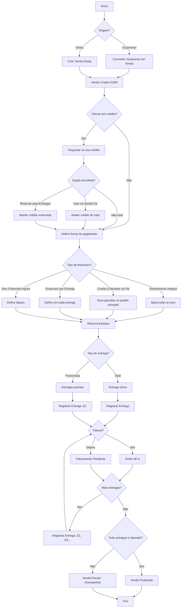

---

## 2. Fluxo de Orçamento (Mesclar/Desmembrar)

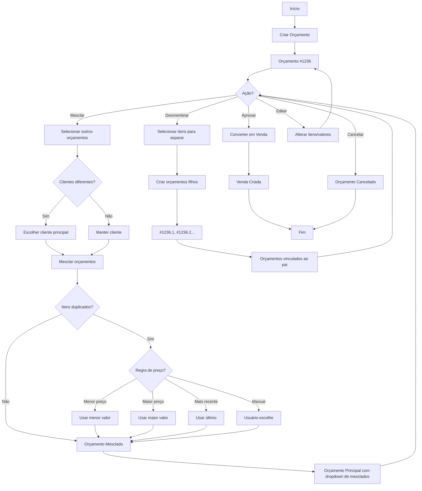

---

## 3. Fluxo de Uso de Crédito na Venda

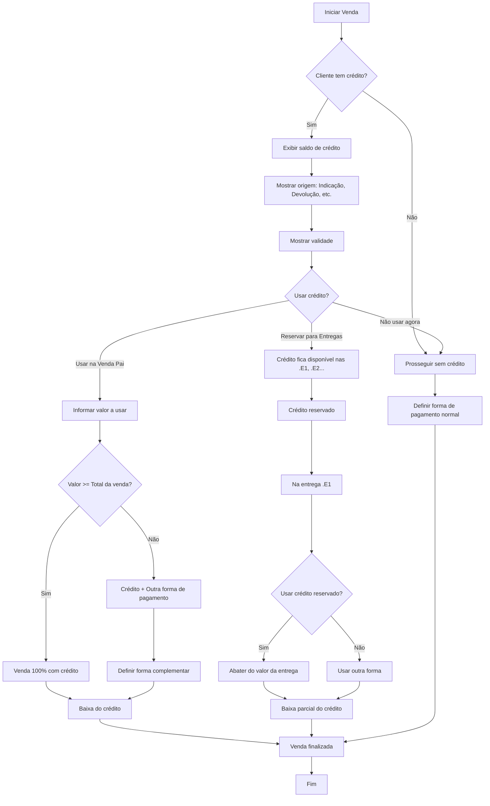

---

## 4. Fluxo de Devolução de Venda

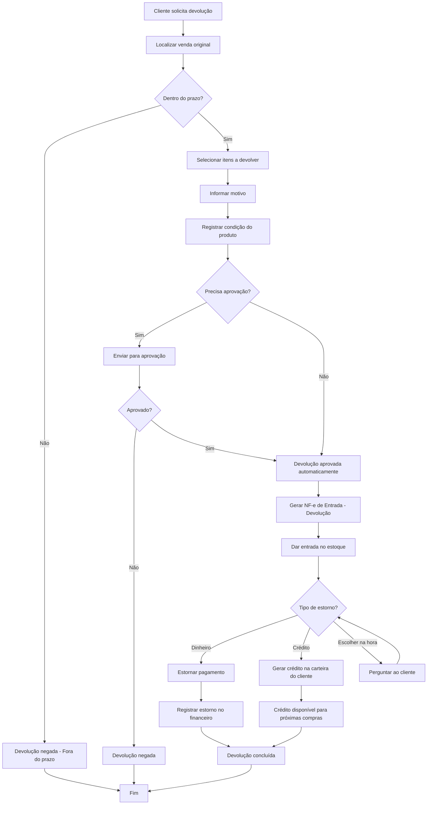

---

## 5. Fluxo de Troca de Venda

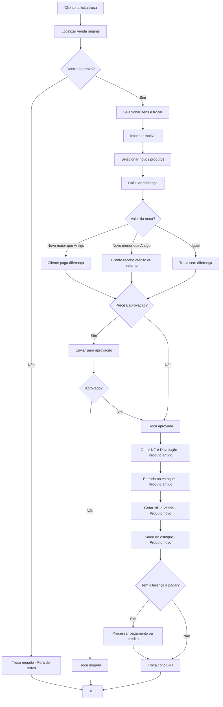

---

## 6. Fluxo de Consignação

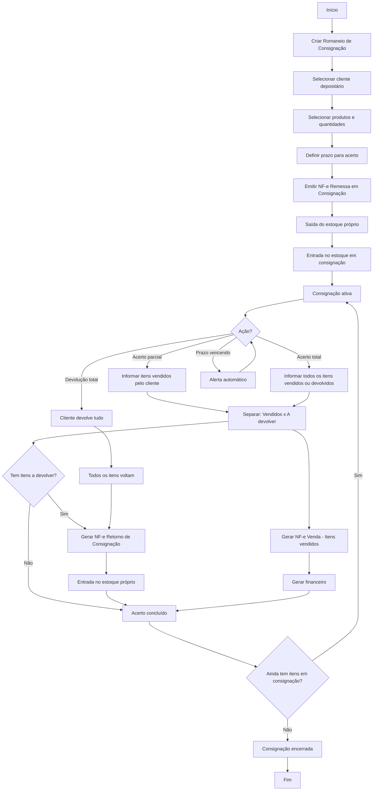

---

## 7. Fluxo de Compra Completa

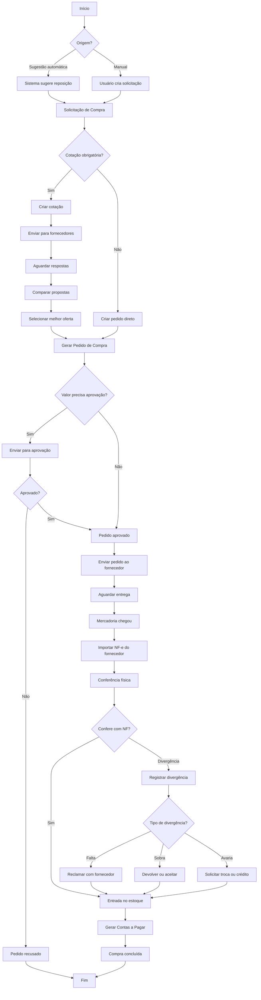

---

## 8. Fluxo Financeiro - Recebimento

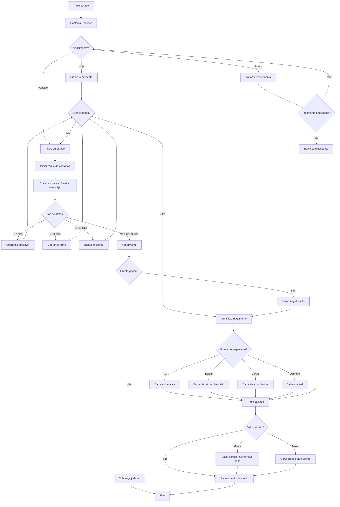

---

## 9. Fluxo E-commerce B2B

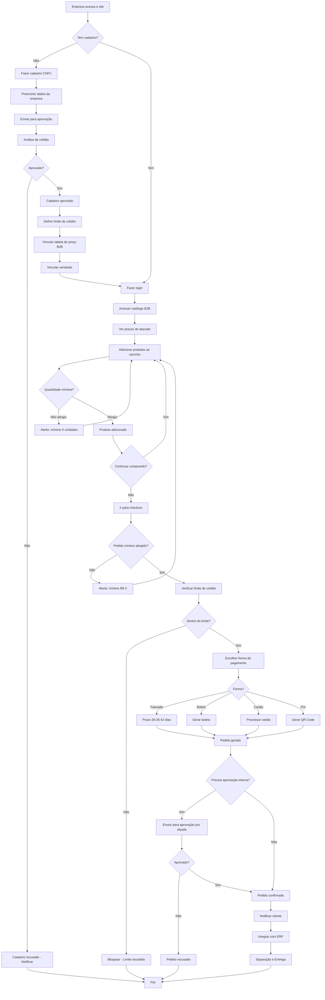

---

## 10. Fluxo E-commerce B2C

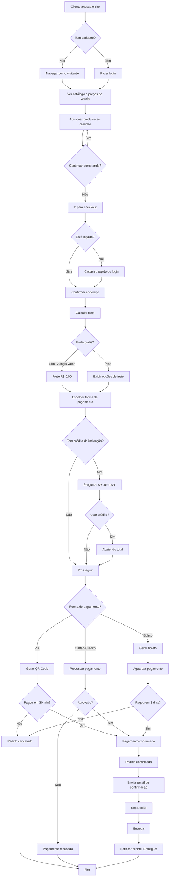

---

## 11. Fluxo de Entrega com Rastreamento GPS

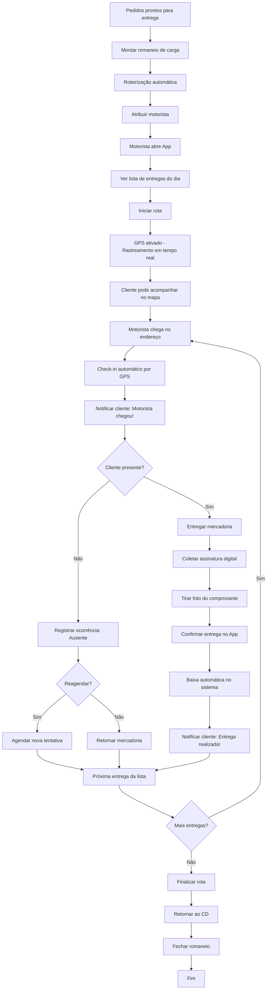

---

## 12. Fluxo de Garantia de Produtos

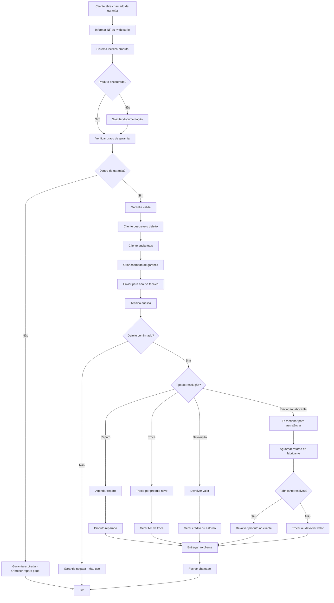

---

## 13. Fluxo de Produção (PCP)

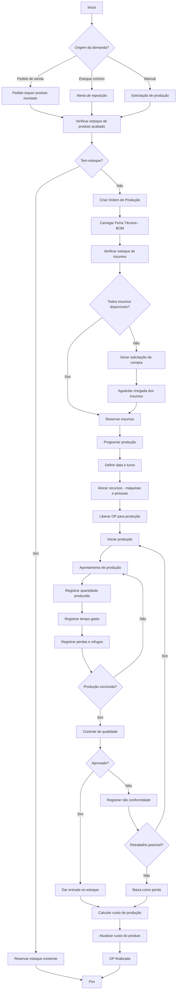

---

## 14. Fluxo de Inventário

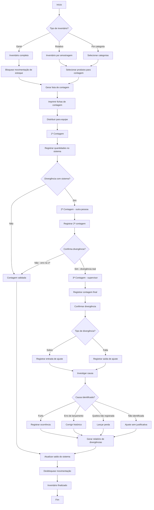

---

## 15. Fluxo de RH - Admissão

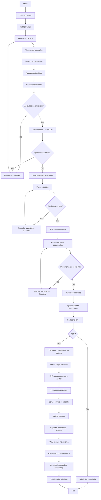

---

## 16. Fluxo de RH - Folha de Pagamento

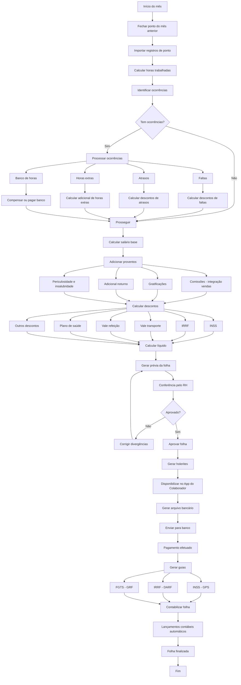

---

## 17. Fluxo de RH - Férias

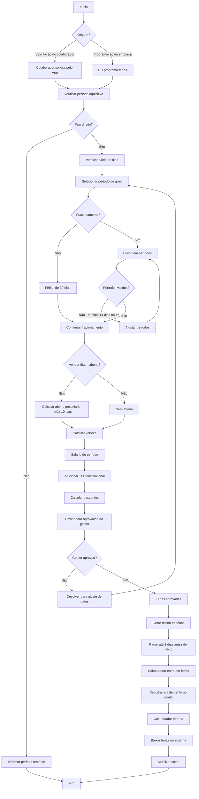

---

## 18. Fluxo de Contratos

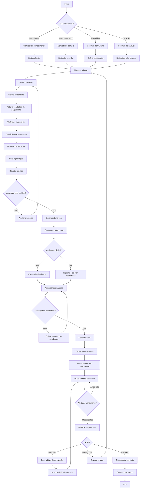

---

## 19. Fluxo de Precificação

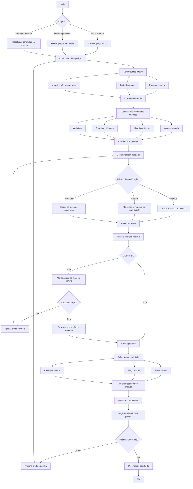

---

## 20. Fluxo de Bonificação (Venda)

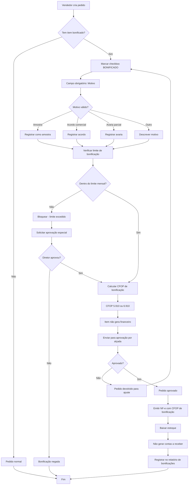

---

## 21. Fluxo de Limite de Crédito

```mermaid
flowchart TD
    A[Cliente faz pedido] --> B[Verificar limite de crédito]
    
    B --> C[Obter limite aprovado]
    C --> D[Calcular saldo utilizado]
    
    D --> D1[Pedidos em aberto não faturados]
    D --> D2[Títulos a vencer]
    D --> D3[Títulos vencidos]
    
    D1 --> E[Saldo comprometido total]
    D2 --> E
    D3 --> E
    
    E --> F[Calcular limite disponível]
    F --> G[Limite aprovado - Saldo comprometido]
    
    G --> H{Pedido cabe no limite?}
    
    H -->|Sim| I[Pedido liberado]
    H -->|Não| J[Pedido bloqueado por limite]
    
    J --> K{Tem títulos vencidos?}
    K -->|Sim| L[Alerta: cliente inadimplente]
    K -->|Não| M[Apenas limite excedido]
    
    L --> N[Bloquear até regularização]
    M --> O{Solicitar aumento?}
    
    O -->|Não| P[Cliente deve pagar ou reduzir pedido]
    O -->|Sim| Q[Enviar para análise de crédito]
    
    Q --> R[Analisar histórico do cliente]
    R --> S[Verificar score de crédito]
    S --> T[Consultar Serasa e SPC]
    
    T --> U{Aprovar aumento?}
    U -->|Não| V[Manter limite atual]
    U -->|Sim| W[Definir novo limite]
    
    W --> X[Atualizar cadastro do cliente]
    X --> Y[Notificar vendedor]
    
    Y --> Z[Reprocessar pedido bloqueado]
    Z --> H
    
    V --> P
    N --> AA[Fim]
    P --> AA
    I --> AA
```

---

## 22. Fluxo de Cobrança (Régua)

```mermaid
flowchart TD
    A[Título vencido] --> B[Entrar na régua de cobrança]
    
    B --> C{Dias de atraso?}
    
    C -->|1 dia| D[Cobrança D+1]
    C -->|3 dias| E[Cobrança D+3]
    C -->|7 dias| F[Cobrança D+7]
    C -->|15 dias| G[Cobrança D+15]
    C -->|30 dias| H[Cobrança D+30]
    C -->|45 dias| I[Cobrança D+45]
    C -->|60 dias| J[Cobrança D+60]
    
    D --> K[Enviar lembrete amigável]
    K --> K1[Email: Seu boleto venceu ontem]
    K --> K2[WhatsApp: Lembrete de pagamento]
    
    E --> L[Segundo lembrete]
    L --> L1[Email com 2ª via do boleto]
    
    F --> M[Cobrança mais firme]
    M --> M1[Email: Regularize seu pagamento]
    M --> M2[WhatsApp: Evite negativação]
    
    G --> N[Notificação de bloqueio iminente]
    N --> N1[Email: Cadastro será bloqueado em 15 dias]
    
    H --> O[Bloquear cliente]
    O --> O1[Impedir novas vendas]
    O --> O2[Notificar vendedor responsável]
    
    I --> P[Aviso de negativação]
    P --> P1[Email: Última chance antes do Serasa]
    
    J --> Q[Negativar cliente]
    Q --> Q1[Incluir no Serasa e SPC]
    Q --> Q2[Registrar no sistema]
    
    K1 --> R{Cliente pagou?}
    K2 --> R
    L1 --> R
    M1 --> R
    M2 --> R
    N1 --> R
    O1 --> R
    O2 --> R
    P1 --> R
    
    R -->|Sim| S[Baixar título]
    R -->|Não| C
    
    S --> T{Estava negativado?}
    T -->|Sim| U[Baixar negativação]
    T -->|Não| V[Título quitado]
    
    U --> W{Estava bloqueado?}
    V --> W
    
    W -->|Sim| X[Desbloquear cliente]
    W -->|Não| Y[Fim]
    
    X --> Y
    Q1 --> Z[Iniciar cobrança judicial]
    Q2 --> Z
    Z --> Y
```

---

## 23. Fluxo de Transferência entre Filiais

```mermaid
flowchart TD
    A[Início] --> B{Motivo?}
    
    B -->|Solicitação de filial| C[Filial destino solicita produtos]
    B -->|Balanceamento de estoque| D[Sistema sugere transferência]
    B -->|Venda de outra filial| E[Pedido requer estoque de outra filial]
    
    C --> F[Criar solicitação de transferência]
    D --> F
    E --> F
    
    F --> G[Selecionar produtos e quantidades]
    G --> H[Definir filial origem]
    H --> I[Definir filial destino]
    
    I --> J[Verificar estoque na origem]
    J --> K{Tem estoque?}
    
    K -->|Não| L[Solicitação negada - sem estoque]
    K -->|Sim| M[Reservar estoque na origem]
    
    M --> N[Enviar para aprovação]
    N --> O{Aprovado?}
    
    O -->|Não| P[Solicitação cancelada]
    O -->|Sim| Q[Gerar NF-e de Transferência]
    
    Q --> R[CFOP 5.152 ou 6.152]
    R --> S[Emitir NF-e]
    
    S --> T[Baixar estoque na filial origem]
    T --> U[Separar mercadoria]
    U --> V[Despachar para filial destino]
    
    V --> W[Mercadoria em trânsito]
    W --> X[Filial destino recebe]
    
    X --> Y[Conferir mercadoria x NF]
    Y --> Z{Confere?}
    
    Z -->|Não| AA[Registrar divergência]
    Z -->|Sim| AB[Confirmar recebimento]
    
    AA --> AC[Notificar filial origem]
    AC --> AB
    
    AB --> AD[Dar entrada no estoque destino]
    AD --> AE[Vincular NF de entrada]
    
    AE --> AF[Transferência concluída]
    
    L --> AG[Fim]
    P --> AG
    AF --> AG
```

---

## 24. Fluxo do PDV (Ponto de Venda)

```mermaid
flowchart TD
    A[Abrir caixa] --> B[Informar valor de abertura]
    B --> C[Caixa aberto]
    
    C --> D[Iniciar venda]
    D --> E{Identificar cliente?}
    
    E -->|Sim| F[Buscar cliente - CPF ou CNPJ]
    E -->|Não| G[Consumidor final]
    
    F --> H{Cliente encontrado?}
    H -->|Não| I[Cadastro rápido]
    H -->|Sim| J[Carregar dados do cliente]
    
    I --> J
    G --> K[Adicionar produtos]
    J --> K
    
    K --> L[Ler código de barras ou buscar]
    L --> M[Adicionar ao carrinho]
    
    M --> N{Mais produtos?}
    N -->|Sim| K
    N -->|Não| O[Subtotal da venda]
    
    O --> P{Desconto?}
    P -->|Sim| Q[Aplicar desconto]
    P -->|Não| R[Valor final]
    
    Q --> R
    
    R --> S{Cliente tem crédito?}
    S -->|Sim| T[Perguntar se usa crédito]
    S -->|Não| U[Escolher forma de pagamento]
    
    T --> U
    
    U --> V{Forma de pagamento?}
    V -->|Dinheiro| W[Receber dinheiro]
    V -->|Cartão Crédito| X[Processar no TEF]
    V -->|Cartão Débito| Y[Processar no TEF]
    V -->|PIX| Z[Gerar QR Code]
    V -->|Múltiplas formas| AA[Combinar formas]
    
    W --> AB[Calcular troco]
    X --> AC{Aprovado?}
    Y --> AC
    Z --> AD[Aguardar confirmação]
    AA --> AE[Processar cada forma]
    
    AB --> AF[Pagamento OK]
    AC -->|Sim| AF
    AC -->|Não| AG[Tentar novamente ou outra forma]
    AD --> AF
    AE --> AF
    
    AG --> V
    
    AF --> AH[Emitir NFC-e]
    AH --> AI[Imprimir cupom]
    AI --> AJ[Abrir gaveta - se dinheiro]
    
    AJ --> AK[Venda concluída]
    AK --> AL{Continuar vendendo?}
    
    AL -->|Sim| D
    AL -->|Não| AM{Fechar caixa?}
    
    AM -->|Não| D
    AM -->|Sim| AN[Iniciar fechamento]
    
    AN --> AO[Contar dinheiro em caixa]
    AO --> AP[Informar valores por forma de pagamento]
    
    AP --> AQ{Valores conferem?}
    AQ -->|Não| AR[Registrar diferença]
    AQ -->|Sim| AS[Fechamento OK]
    
    AR --> AT{Diferença aceitável?}
    AT -->|Sim| AS
    AT -->|Não| AU[Investigar diferença]
    
    AU --> AS
    AS --> AV[Gerar relatório de fechamento]
    AV --> AW[Caixa fechado]
    
    AW --> AX[Fim]
```

---

## 25. Fluxo de Importação de NF-e (Compras)

```mermaid
flowchart TD
    A[Início] --> B{Método de importação?}
    
    B -->|Chave de acesso| C[Digitar chave de 44 dígitos]
    B -->|XML| D[Upload do arquivo XML]
    B -->|Manifesto| E[Buscar NF-e no SEFAZ]
    
    C --> F[Consultar NF-e no SEFAZ]
    D --> G[Ler arquivo XML]
    E --> H[Listar NF-e pendentes de manifestação]
    
    H --> I[Selecionar NF-e para importar]
    I --> J[Manifestar: Ciência da Operação]
    
    F --> K[Obter dados da NF-e]
    G --> K
    J --> K
    
    K --> L{NF-e válida?}
    L -->|Não| M[NF-e cancelada ou inválida]
    L -->|Sim| N[Exibir dados da NF-e]
    
    N --> O[Fornecedor]
    N --> P[Produtos]
    N --> Q[Valores e impostos]
    
    O --> R{Fornecedor cadastrado?}
    R -->|Não| S[Cadastrar fornecedor]
    R -->|Sim| T[Vincular fornecedor existente]
    
    S --> T
    
    P --> U[Para cada produto da NF]
    U --> V{Produto cadastrado?}
    
    V -->|Não| W[Cadastrar novo produto]
    V -->|Sim| X[Vincular produto existente]
    
    W --> Y[Mapear NCM e unidade]
    X --> Y
    
    Y --> Z{Mais produtos?}
    Z -->|Sim| U
    Z -->|Não| AA[Todos produtos mapeados]
    
    AA --> AB{Tem pedido de compra vinculado?}
    AB -->|Sim| AC[Vincular com pedido de compra]
    AB -->|Não| AD[Importar sem pedido]
    
    AC --> AE[Conferir quantidades pedido x NF]
    AE --> AF{Quantidades conferem?}
    
    AF -->|Não| AG[Registrar divergência]
    AF -->|Sim| AH[Conferência OK]
    
    AG --> AH
    AD --> AH
    
    AH --> AI[Dar entrada no estoque]
    AI --> AJ[Gerar contas a pagar]
    
    AJ --> AK[NF-e importada com sucesso]
    
    M --> AL[Fim]
    AK --> AL
```

---

## Legenda dos Diagramas

| Símbolo | Significado |
|---------|-------------|
| Retângulo arredondado | Início / Fim |
| Retângulo | Processo / Ação |
| Losango | Decisão |
| Seta | Fluxo / Direção |

---

## Resumo dos Fluxogramas

| # | Fluxo | Módulo | Status |
|---|-------|--------|--------|
| 1 | Venda Completa | Comercial | ✅ |
| 2 | Orçamento | Comercial | ✅ |
| 3 | Uso de Crédito | Comercial | ✅ |
| 4 | Devolução | Comercial | ✅ |
| 5 | Troca | Comercial | ✅ |
| 6 | Consignação | Comercial | ✅ |
| 7 | Compra Completa | Compras | ✅ |
| 8 | Recebimento Financeiro | Financeiro | ✅ |
| 9 | E-commerce B2B | E-commerce | ✅ |
| 10 | E-commerce B2C | E-commerce | ✅ |
| 11 | Entrega GPS | Expedição | ✅ |
| 12 | Garantia | Comercial | ✅ |
| 13 | Produção PCP | Compras | ✅ |
| 14 | Inventário | Estoque | ✅ |
| 15 | RH - Admissão | RH | ✅ |
| 16 | RH - Folha de Pagamento | RH | ✅ |
| 17 | RH - Férias | RH | ✅ |
| 18 | Contratos | Contratos | ✅ |
| 19 | Precificação | Custos | ✅ |
| 20 | Bonificação | Comercial | ✅ |
| 21 | Limite de Crédito | Financeiro | ✅ |
| 22 | Cobrança - Régua | Financeiro | ✅ |
| 23 | Transferência Filiais | Estoque | ✅ |
| 24 | PDV | Comercial | ✅ |
| 25 | Importação NF-e | Compras | ✅ |

---

**Total: 25 Fluxogramas**

Última atualização: 01/12/2025

PLANAC Distribuidora - ERP - Documentação Oficial
