# 🗄️ MODELO DE DADOS - ERP PLANAC

## Diagrama Entidade-Relacionamento (DER)

**Versão:** 1.0  
**Data:** 03/12/2025  
**Responsável:** 🗄️ DBA DEV.com  
**Revisão:** 👨‍💻 CTO DEV.com

---

## 📊 Resumo Geral

| Módulo | Tabelas | Status |
|--------|---------|--------|
| 0. Base | 3 | ✅ |
| 1. Core | 10 | ✅ |
| 2. Cadastros | 18 | ✅ |
| 3. Estoque | 16 | ✅ |
| 4. Financeiro | 13 | ✅ |
| 5. Comercial (inclui Serviços) | 35 | ✅ |
| 5.11. PCP/Produção | 5 | ✅ |
| 6. Fiscal | 10 | ✅ |
| 7. Compras | 10 | ✅ |
| 8. Expedição | 8 | ✅ |
| 9. E-commerce | 11 | ✅ |
| 10. BI | 4 | ✅ |
| 11. RH (Base) | 14 | ✅ |
| 11.7. Recrutamento | 4 | ✅ |
| 11.8. Treinamentos | 5 | ✅ |
| 11.9. Avaliação Desempenho | 6 | ✅ |
| 12. Contratos | 4 | ✅ |
| 13. Contabilidade | 5 | ✅ |
| 14. Patrimônio | 6 | ✅ |
| 17. OmniPro | 7 | ✅ |
| 21. Workflows | 5 | ✅ |
| 25. Agenda | 4 | ✅ |
| 26. Central Ajuda | 6 | ✅ |
| **TOTAL** | **207** | ✅ |

---

## 📐 Convenções

### Nomenclatura
- Tabelas: `snake_case` no plural (ex: `clientes`, `pedidos_itens`)
- Colunas: `snake_case` (ex: `created_at`, `empresa_id`)
- PKs: `id` (UUID ou autoincrement)
- FKs: `tabela_id` (ex: `cliente_id`, `empresa_id`)

### Colunas Padrão (todas as tabelas)
```sql
id              TEXT PRIMARY KEY,  -- UUID
empresa_id      TEXT NOT NULL,     -- Multi-tenant
created_at      DATETIME DEFAULT CURRENT_TIMESTAMP,
updated_at      DATETIME DEFAULT CURRENT_TIMESTAMP,
created_by      TEXT,              -- user_id
updated_by      TEXT,              -- user_id
deleted_at      DATETIME,          -- Soft delete
```

### Tipos de Dados (SQLite/D1)
| Tipo | Uso |
|------|-----|
| TEXT | Strings, UUIDs, ENUMs |
| INTEGER | Números inteiros, booleanos (0/1) |
| REAL | Decimais (preços, quantidades) |
| DATETIME | Datas e timestamps |
| BLOB | Binários (raramente usado) |

---

# 📦 MÓDULO 0: BASE

## Diagrama

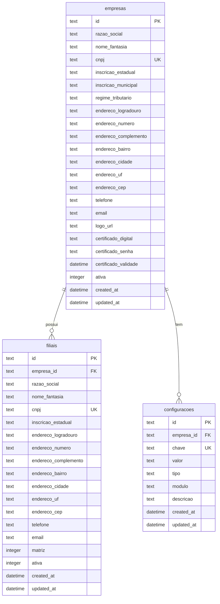
```mermaid
erDiagram
    empresas ||--o{ filiais : possui
    empresas ||--o{ configuracoes : tem
    
    empresas {
        text id PK
        text razao_social
        text nome_fantasia
        text cnpj UK
        text inscricao_estadual
        text inscricao_municipal
        text regime_tributario
        text endereco_logradouro
        text endereco_numero
        text endereco_complemento
        text endereco_bairro
        text endereco_cidade
        text endereco_uf
        text endereco_cep
        text telefone
        text email
        text logo_url
        text certificado_digital
        text certificado_senha
        datetime certificado_validade
        integer ativa
        datetime created_at
        datetime updated_at
    }
    
    filiais {
        text id PK
        text empresa_id FK
        text razao_social
        text nome_fantasia
        text cnpj UK
        text inscricao_estadual
        text endereco_logradouro
        text endereco_numero
        text endereco_complemento
        text endereco_bairro
        text endereco_cidade
        text endereco_uf
        text endereco_cep
        text telefone
        text email
        integer matriz
        integer ativa
        datetime created_at
        datetime updated_at
    }
    
    configuracoes {
        text id PK
        text empresa_id FK
        text chave UK
        text valor
        text tipo
        text modulo
        text descricao
        datetime created_at
        datetime updated_at
    }
```

---

# 👤 MÓDULO 1: CORE (Usuários e Permissões)

## Diagrama

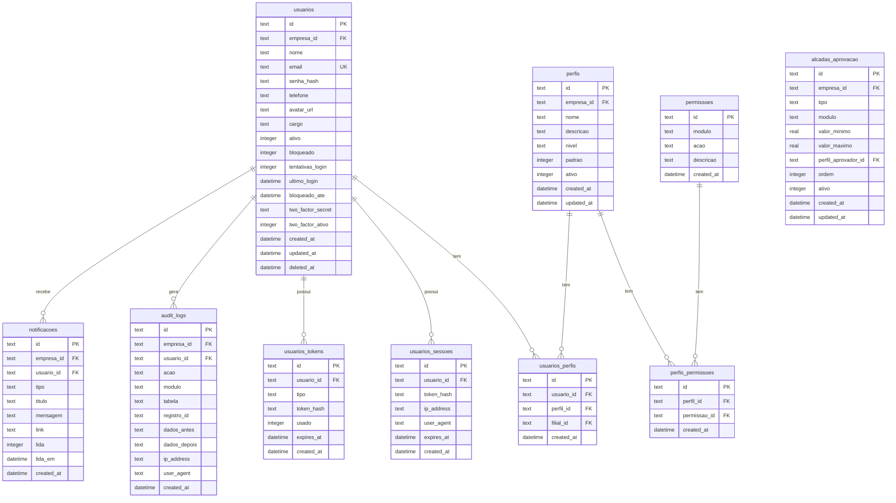
```mermaid
erDiagram
    usuarios ||--o{ usuarios_perfis : tem
    usuarios ||--o{ usuarios_sessoes : possui
    usuarios ||--o{ usuarios_tokens : possui
    perfis ||--o{ usuarios_perfis : tem
    perfis ||--o{ perfis_permissoes : tem
    permissoes ||--o{ perfis_permissoes : tem
    usuarios ||--o{ audit_logs : gera
    usuarios ||--o{ notificacoes : recebe
    
    usuarios {
        text id PK
        text empresa_id FK
        text nome
        text email UK
        text senha_hash
        text telefone
        text avatar_url
        text cargo
        integer ativo
        integer bloqueado
        integer tentativas_login
        datetime ultimo_login
        datetime bloqueado_ate
        text two_factor_secret
        integer two_factor_ativo
        datetime created_at
        datetime updated_at
        datetime deleted_at
    }
    
    perfis {
        text id PK
        text empresa_id FK
        text nome
        text descricao
        text nivel
        integer padrao
        integer ativo
        datetime created_at
        datetime updated_at
    }
    
    permissoes {
        text id PK
        text modulo
        text acao
        text descricao
        datetime created_at
    }
    
    perfis_permissoes {
        text id PK
        text perfil_id FK
        text permissao_id FK
        datetime created_at
    }
    
    usuarios_perfis {
        text id PK
        text usuario_id FK
        text perfil_id FK
        text filial_id FK
        datetime created_at
    }
    
    usuarios_sessoes {
        text id PK
        text usuario_id FK
        text token_hash
        text ip_address
        text user_agent
        datetime expires_at
        datetime created_at
    }
    
    usuarios_tokens {
        text id PK
        text usuario_id FK
        text tipo
        text token_hash
        integer usado
        datetime expires_at
        datetime created_at
    }
    
    audit_logs {
        text id PK
        text empresa_id FK
        text usuario_id FK
        text acao
        text modulo
        text tabela
        text registro_id
        text dados_antes
        text dados_depois
        text ip_address
        text user_agent
        datetime created_at
    }
    
    notificacoes {
        text id PK
        text empresa_id FK
        text usuario_id FK
        text tipo
        text titulo
        text mensagem
        text link
        integer lida
        datetime lida_em
        datetime created_at
    }
    
    alcadas_aprovacao {
        text id PK
        text empresa_id FK
        text tipo
        text modulo
        real valor_minimo
        real valor_maximo
        text perfil_aprovador_id FK
        integer ordem
        integer ativo
        datetime created_at
        datetime updated_at
    }
```

---

# 👥 MÓDULO 2: CADASTROS

## Diagrama - Clientes

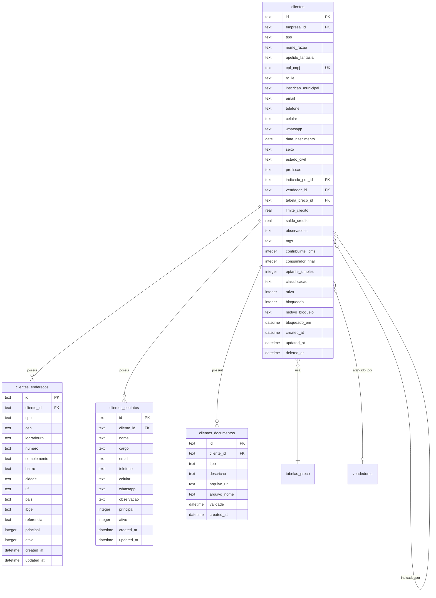
```mermaid
erDiagram
    clientes ||--o{ clientes_enderecos : possui
    clientes ||--o{ clientes_contatos : possui
    clientes ||--o{ clientes_documentos : possui
    clientes }o--|| tabelas_preco : usa
    clientes }o--o| vendedores : atendido_por
    clientes }o--o| clientes : indicado_por
    
    clientes {
        text id PK
        text empresa_id FK
        text tipo
        text nome_razao
        text apelido_fantasia
        text cpf_cnpj UK
        text rg_ie
        text inscricao_municipal
        text email
        text telefone
        text celular
        text whatsapp
        date data_nascimento
        text sexo
        text estado_civil
        text profissao
        text indicado_por_id FK
        text vendedor_id FK
        text tabela_preco_id FK
        real limite_credito
        real saldo_credito
        text observacoes
        text tags
        integer contribuinte_icms
        integer consumidor_final
        integer optante_simples
        text classificacao
        integer ativo
        integer bloqueado
        text motivo_bloqueio
        datetime bloqueado_em
        datetime created_at
        datetime updated_at
        datetime deleted_at
    }
    
    clientes_enderecos {
        text id PK
        text cliente_id FK
        text tipo
        text cep
        text logradouro
        text numero
        text complemento
        text bairro
        text cidade
        text uf
        text pais
        text ibge
        text referencia
        integer principal
        integer ativo
        datetime created_at
        datetime updated_at
    }
    
    clientes_contatos {
        text id PK
        text cliente_id FK
        text nome
        text cargo
        text email
        text telefone
        text celular
        text whatsapp
        text observacao
        integer principal
        integer ativo
        datetime created_at
        datetime updated_at
    }
    
    clientes_documentos {
        text id PK
        text cliente_id FK
        text tipo
        text descricao
        text arquivo_url
        text arquivo_nome
        datetime validade
        datetime created_at
    }
```

## Diagrama - Fornecedores e Transportadoras

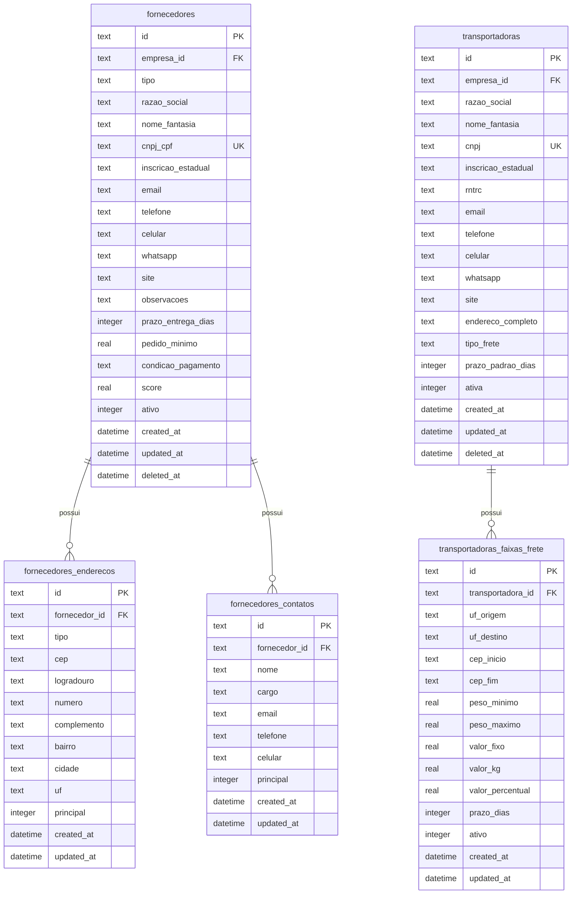
```mermaid
erDiagram
    fornecedores ||--o{ fornecedores_enderecos : possui
    fornecedores ||--o{ fornecedores_contatos : possui
    transportadoras ||--o{ transportadoras_faixas_frete : possui
    
    fornecedores {
        text id PK
        text empresa_id FK
        text tipo
        text razao_social
        text nome_fantasia
        text cnpj_cpf UK
        text inscricao_estadual
        text email
        text telefone
        text celular
        text whatsapp
        text site
        text observacoes
        integer prazo_entrega_dias
        real pedido_minimo
        text condicao_pagamento
        real score
        integer ativo
        datetime created_at
        datetime updated_at
        datetime deleted_at
    }
    
    fornecedores_enderecos {
        text id PK
        text fornecedor_id FK
        text tipo
        text cep
        text logradouro
        text numero
        text complemento
        text bairro
        text cidade
        text uf
        integer principal
        datetime created_at
        datetime updated_at
    }
    
    fornecedores_contatos {
        text id PK
        text fornecedor_id FK
        text nome
        text cargo
        text email
        text telefone
        text celular
        integer principal
        datetime created_at
        datetime updated_at
    }
    
    transportadoras {
        text id PK
        text empresa_id FK
        text razao_social
        text nome_fantasia
        text cnpj UK
        text inscricao_estadual
        text rntrc
        text email
        text telefone
        text celular
        text whatsapp
        text site
        text endereco_completo
        text tipo_frete
        integer prazo_padrao_dias
        integer ativa
        datetime created_at
        datetime updated_at
        datetime deleted_at
    }
    
    transportadoras_faixas_frete {
        text id PK
        text transportadora_id FK
        text uf_origem
        text uf_destino
        text cep_inicio
        text cep_fim
        real peso_minimo
        real peso_maximo
        real valor_fixo
        real valor_kg
        real valor_percentual
        integer prazo_dias
        integer ativo
        datetime created_at
        datetime updated_at
    }
```

## Diagrama - Vendedores e Tabelas de Preço

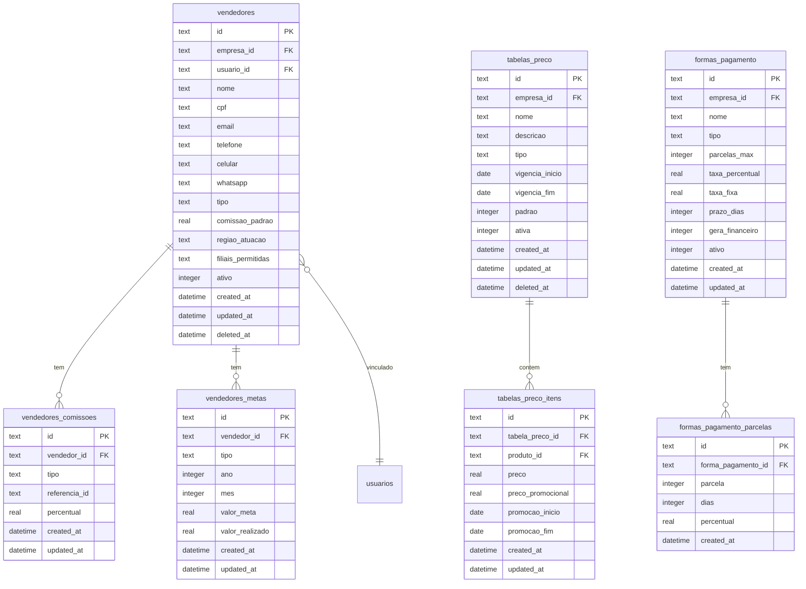
```mermaid
erDiagram
    vendedores ||--o{ vendedores_comissoes : tem
    vendedores ||--o{ vendedores_metas : tem
    vendedores }o--|| usuarios : vinculado
    tabelas_preco ||--o{ tabelas_preco_itens : contem
    formas_pagamento ||--o{ formas_pagamento_parcelas : tem
    
    vendedores {
        text id PK
        text empresa_id FK
        text usuario_id FK
        text nome
        text cpf
        text email
        text telefone
        text celular
        text whatsapp
        text tipo
        real comissao_padrao
        text regiao_atuacao
        text filiais_permitidas
        integer ativo
        datetime created_at
        datetime updated_at
        datetime deleted_at
    }
    
    vendedores_comissoes {
        text id PK
        text vendedor_id FK
        text tipo
        text referencia_id
        real percentual
        datetime created_at
        datetime updated_at
    }
    
    vendedores_metas {
        text id PK
        text vendedor_id FK
        text tipo
        integer ano
        integer mes
        real valor_meta
        real valor_realizado
        datetime created_at
        datetime updated_at
    }
    
    tabelas_preco {
        text id PK
        text empresa_id FK
        text nome
        text descricao
        text tipo
        date vigencia_inicio
        date vigencia_fim
        integer padrao
        integer ativa
        datetime created_at
        datetime updated_at
        datetime deleted_at
    }
    
    tabelas_preco_itens {
        text id PK
        text tabela_preco_id FK
        text produto_id FK
        real preco
        real preco_promocional
        date promocao_inicio
        date promocao_fim
        datetime created_at
        datetime updated_at
    }
    
    formas_pagamento {
        text id PK
        text empresa_id FK
        text nome
        text tipo
        integer parcelas_max
        real taxa_percentual
        real taxa_fixa
        integer prazo_dias
        integer gera_financeiro
        integer ativo
        datetime created_at
        datetime updated_at
    }
    
    formas_pagamento_parcelas {
        text id PK
        text forma_pagamento_id FK
        integer parcela
        integer dias
        real percentual
        datetime created_at
    }
```

---

# 📦 MÓDULO 3: ESTOQUE

## Diagrama - Produtos

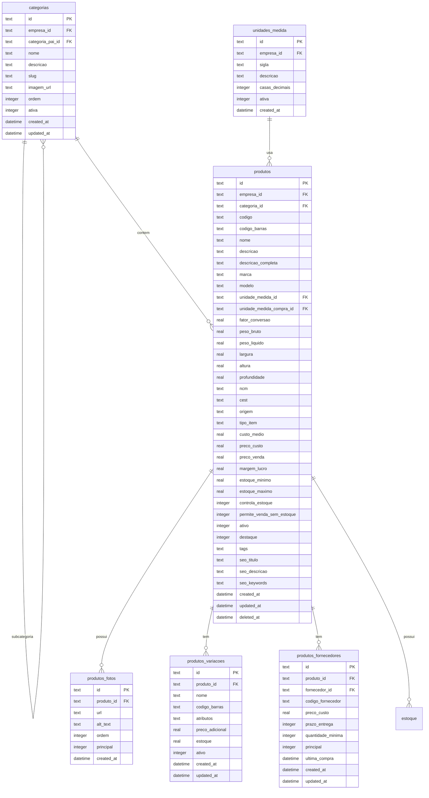
```mermaid
erDiagram
    categorias ||--o{ categorias : subcategoria
    categorias ||--o{ produtos : contem
    produtos ||--o{ produtos_fotos : possui
    produtos ||--o{ produtos_variacoes : tem
    produtos ||--o{ produtos_fornecedores : tem
    produtos ||--o{ estoque : possui
    unidades_medida ||--o{ produtos : usa
    
    categorias {
        text id PK
        text empresa_id FK
        text categoria_pai_id FK
        text nome
        text descricao
        text slug
        text imagem_url
        integer ordem
        integer ativa
        datetime created_at
        datetime updated_at
    }
    
    unidades_medida {
        text id PK
        text empresa_id FK
        text sigla
        text descricao
        integer casas_decimais
        integer ativa
        datetime created_at
    }
    
    produtos {
        text id PK
        text empresa_id FK
        text categoria_id FK
        text codigo
        text codigo_barras
        text nome
        text descricao
        text descricao_completa
        text marca
        text modelo
        text unidade_medida_id FK
        text unidade_medida_compra_id FK
        real fator_conversao
        real peso_bruto
        real peso_liquido
        real largura
        real altura
        real profundidade
        text ncm
        text cest
        text origem
        text tipo_item
        real custo_medio
        real preco_custo
        real preco_venda
        real margem_lucro
        real estoque_minimo
        real estoque_maximo
        integer controla_estoque
        integer permite_venda_sem_estoque
        integer ativo
        integer destaque
        text tags
        text seo_titulo
        text seo_descricao
        text seo_keywords
        datetime created_at
        datetime updated_at
        datetime deleted_at
    }
    
    produtos_fotos {
        text id PK
        text produto_id FK
        text url
        text alt_text
        integer ordem
        integer principal
        datetime created_at
    }
    
    produtos_variacoes {
        text id PK
        text produto_id FK
        text nome
        text codigo_barras
        text atributos
        real preco_adicional
        real estoque
        integer ativo
        datetime created_at
        datetime updated_at
    }
    
    produtos_fornecedores {
        text id PK
        text produto_id FK
        text fornecedor_id FK
        text codigo_fornecedor
        real preco_custo
        integer prazo_entrega
        integer quantidade_minima
        integer principal
        datetime ultima_compra
        datetime created_at
        datetime updated_at
    }
```

## Diagrama - Estoque e Movimentações

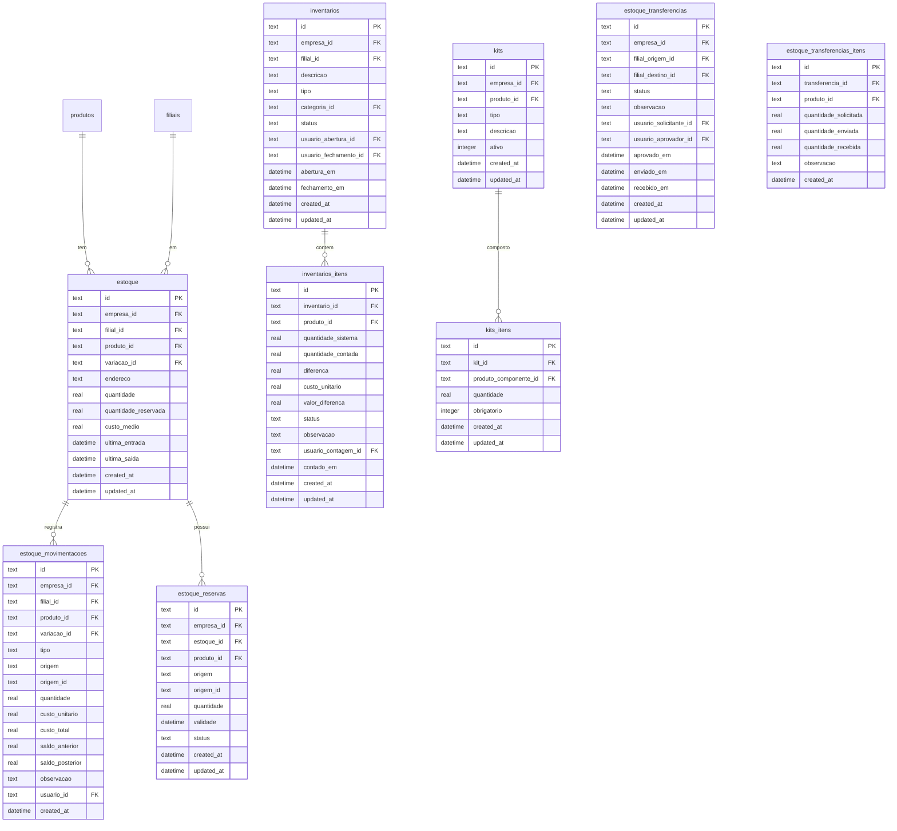
```mermaid
erDiagram
    estoque ||--o{ estoque_movimentacoes : registra
    estoque ||--o{ estoque_reservas : possui
    produtos ||--o{ estoque : tem
    filiais ||--o{ estoque : em
    inventarios ||--o{ inventarios_itens : contem
    kits ||--o{ kits_itens : composto
    
    estoque {
        text id PK
        text empresa_id FK
        text filial_id FK
        text produto_id FK
        text variacao_id FK
        text endereco
        real quantidade
        real quantidade_reservada
        real custo_medio
        datetime ultima_entrada
        datetime ultima_saida
        datetime created_at
        datetime updated_at
    }
    
    estoque_movimentacoes {
        text id PK
        text empresa_id FK
        text filial_id FK
        text produto_id FK
        text variacao_id FK
        text tipo
        text origem
        text origem_id
        real quantidade
        real custo_unitario
        real custo_total
        real saldo_anterior
        real saldo_posterior
        text observacao
        text usuario_id FK
        datetime created_at
    }
    
    estoque_reservas {
        text id PK
        text empresa_id FK
        text estoque_id FK
        text produto_id FK
        text origem
        text origem_id
        real quantidade
        datetime validade
        text status
        datetime created_at
        datetime updated_at
    }
    
    estoque_transferencias {
        text id PK
        text empresa_id FK
        text filial_origem_id FK
        text filial_destino_id FK
        text status
        text observacao
        text usuario_solicitante_id FK
        text usuario_aprovador_id FK
        datetime aprovado_em
        datetime enviado_em
        datetime recebido_em
        datetime created_at
        datetime updated_at
    }
    
    estoque_transferencias_itens {
        text id PK
        text transferencia_id FK
        text produto_id FK
        real quantidade_solicitada
        real quantidade_enviada
        real quantidade_recebida
        text observacao
        datetime created_at
    }
    
    inventarios {
        text id PK
        text empresa_id FK
        text filial_id FK
        text descricao
        text tipo
        text categoria_id FK
        text status
        text usuario_abertura_id FK
        text usuario_fechamento_id FK
        datetime abertura_em
        datetime fechamento_em
        datetime created_at
        datetime updated_at
    }
    
    inventarios_itens {
        text id PK
        text inventario_id FK
        text produto_id FK
        real quantidade_sistema
        real quantidade_contada
        real diferenca
        real custo_unitario
        real valor_diferenca
        text status
        text observacao
        text usuario_contagem_id FK
        datetime contado_em
        datetime created_at
        datetime updated_at
    }
    
    kits {
        text id PK
        text empresa_id FK
        text produto_id FK
        text tipo
        text descricao
        integer ativo
        datetime created_at
        datetime updated_at
    }
    
    kits_itens {
        text id PK
        text kit_id FK
        text produto_componente_id FK
        real quantidade
        integer obrigatorio
        datetime created_at
        datetime updated_at
    }
```

---

# 💰 MÓDULO 4: FINANCEIRO

## Diagrama - Contas a Receber

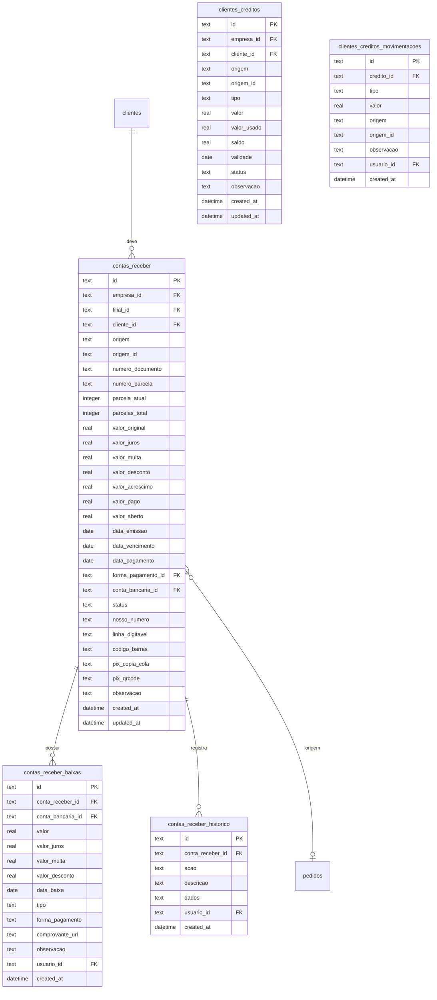
```mermaid
erDiagram
    contas_receber ||--o{ contas_receber_baixas : possui
    contas_receber ||--o{ contas_receber_historico : registra
    clientes ||--o{ contas_receber : deve
    contas_receber }o--o| pedidos : origem
    
    contas_receber {
        text id PK
        text empresa_id FK
        text filial_id FK
        text cliente_id FK
        text origem
        text origem_id
        text numero_documento
        text numero_parcela
        integer parcela_atual
        integer parcelas_total
        real valor_original
        real valor_juros
        real valor_multa
        real valor_desconto
        real valor_acrescimo
        real valor_pago
        real valor_aberto
        date data_emissao
        date data_vencimento
        date data_pagamento
        text forma_pagamento_id FK
        text conta_bancaria_id FK
        text status
        text nosso_numero
        text linha_digitavel
        text codigo_barras
        text pix_copia_cola
        text pix_qrcode
        text observacao
        datetime created_at
        datetime updated_at
    }
    
    contas_receber_baixas {
        text id PK
        text conta_receber_id FK
        text conta_bancaria_id FK
        real valor
        real valor_juros
        real valor_multa
        real valor_desconto
        date data_baixa
        text tipo
        text forma_pagamento
        text comprovante_url
        text observacao
        text usuario_id FK
        datetime created_at
    }
    
    contas_receber_historico {
        text id PK
        text conta_receber_id FK
        text acao
        text descricao
        text dados
        text usuario_id FK
        datetime created_at
    }
    
    clientes_creditos {
        text id PK
        text empresa_id FK
        text cliente_id FK
        text origem
        text origem_id
        text tipo
        real valor
        real valor_usado
        real saldo
        date validade
        text status
        text observacao
        datetime created_at
        datetime updated_at
    }
    
    clientes_creditos_movimentacoes {
        text id PK
        text credito_id FK
        text tipo
        real valor
        text origem
        text origem_id
        text observacao
        text usuario_id FK
        datetime created_at
    }
```

## Diagrama - Contas a Pagar e Bancos

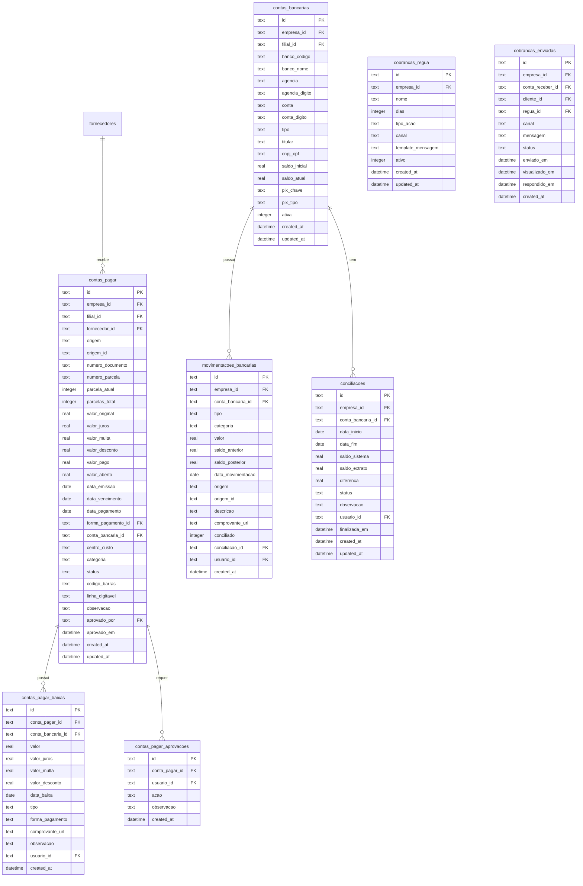
```mermaid
erDiagram
    contas_pagar ||--o{ contas_pagar_baixas : possui
    contas_pagar ||--o{ contas_pagar_aprovacoes : requer
    fornecedores ||--o{ contas_pagar : recebe
    contas_bancarias ||--o{ movimentacoes_bancarias : possui
    contas_bancarias ||--o{ conciliacoes : tem
    
    contas_pagar {
        text id PK
        text empresa_id FK
        text filial_id FK
        text fornecedor_id FK
        text origem
        text origem_id
        text numero_documento
        text numero_parcela
        integer parcela_atual
        integer parcelas_total
        real valor_original
        real valor_juros
        real valor_multa
        real valor_desconto
        real valor_pago
        real valor_aberto
        date data_emissao
        date data_vencimento
        date data_pagamento
        text forma_pagamento_id FK
        text conta_bancaria_id FK
        text centro_custo
        text categoria
        text status
        text codigo_barras
        text linha_digitavel
        text observacao
        text aprovado_por FK
        datetime aprovado_em
        datetime created_at
        datetime updated_at
    }
    
    contas_pagar_baixas {
        text id PK
        text conta_pagar_id FK
        text conta_bancaria_id FK
        real valor
        real valor_juros
        real valor_multa
        real valor_desconto
        date data_baixa
        text tipo
        text forma_pagamento
        text comprovante_url
        text observacao
        text usuario_id FK
        datetime created_at
    }
    
    contas_pagar_aprovacoes {
        text id PK
        text conta_pagar_id FK
        text usuario_id FK
        text acao
        text observacao
        datetime created_at
    }
    
    contas_bancarias {
        text id PK
        text empresa_id FK
        text filial_id FK
        text banco_codigo
        text banco_nome
        text agencia
        text agencia_digito
        text conta
        text conta_digito
        text tipo
        text titular
        text cnpj_cpf
        real saldo_inicial
        real saldo_atual
        text pix_chave
        text pix_tipo
        integer ativa
        datetime created_at
        datetime updated_at
    }
    
    movimentacoes_bancarias {
        text id PK
        text empresa_id FK
        text conta_bancaria_id FK
        text tipo
        text categoria
        real valor
        real saldo_anterior
        real saldo_posterior
        date data_movimentacao
        text origem
        text origem_id
        text descricao
        text comprovante_url
        integer conciliado
        text conciliacao_id FK
        text usuario_id FK
        datetime created_at
    }
    
    conciliacoes {
        text id PK
        text empresa_id FK
        text conta_bancaria_id FK
        date data_inicio
        date data_fim
        real saldo_sistema
        real saldo_extrato
        real diferenca
        text status
        text observacao
        text usuario_id FK
        datetime finalizada_em
        datetime created_at
        datetime updated_at
    }
    
    cobrancas_regua {
        text id PK
        text empresa_id FK
        text nome
        integer dias
        text tipo_acao
        text canal
        text template_mensagem
        integer ativo
        datetime created_at
        datetime updated_at
    }
    
    cobrancas_enviadas {
        text id PK
        text empresa_id FK
        text conta_receber_id FK
        text cliente_id FK
        text regua_id FK
        text canal
        text mensagem
        text status
        datetime enviado_em
        datetime visualizado_em
        datetime respondido_em
        datetime created_at
    }
```

---

# 🛒 MÓDULO 5: COMERCIAL

## Diagrama - CRM

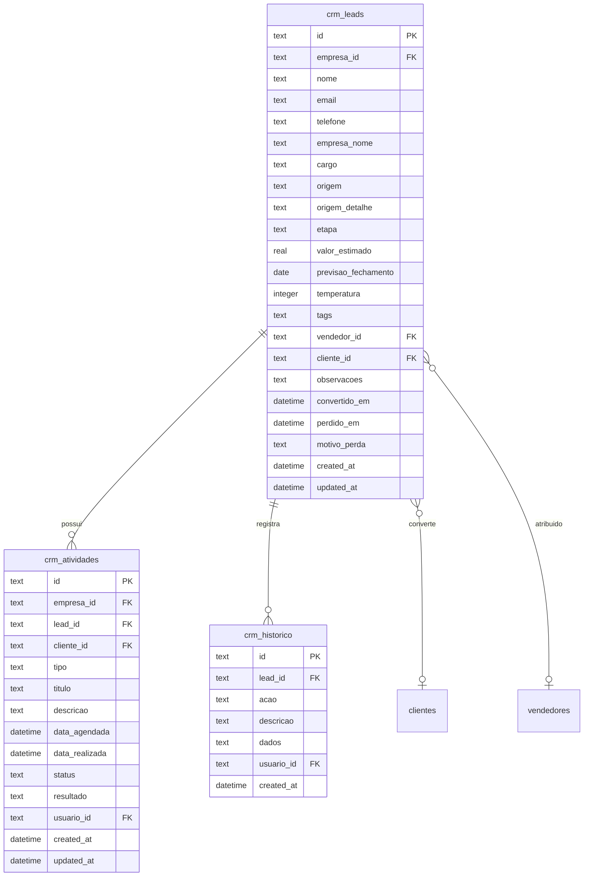
```mermaid
erDiagram
    crm_leads ||--o{ crm_atividades : possui
    crm_leads ||--o{ crm_historico : registra
    crm_leads }o--o| clientes : converte
    crm_leads }o--o| vendedores : atribuido
    
    crm_leads {
        text id PK
        text empresa_id FK
        text nome
        text email
        text telefone
        text empresa_nome
        text cargo
        text origem
        text origem_detalhe
        text etapa
        real valor_estimado
        date previsao_fechamento
        integer temperatura
        text tags
        text vendedor_id FK
        text cliente_id FK
        text observacoes
        datetime convertido_em
        datetime perdido_em
        text motivo_perda
        datetime created_at
        datetime updated_at
    }
    
    crm_atividades {
        text id PK
        text empresa_id FK
        text lead_id FK
        text cliente_id FK
        text tipo
        text titulo
        text descricao
        datetime data_agendada
        datetime data_realizada
        text status
        text resultado
        text usuario_id FK
        datetime created_at
        datetime updated_at
    }
    
    crm_historico {
        text id PK
        text lead_id FK
        text acao
        text descricao
        text dados
        text usuario_id FK
        datetime created_at
    }
```

## Diagrama - Orçamentos

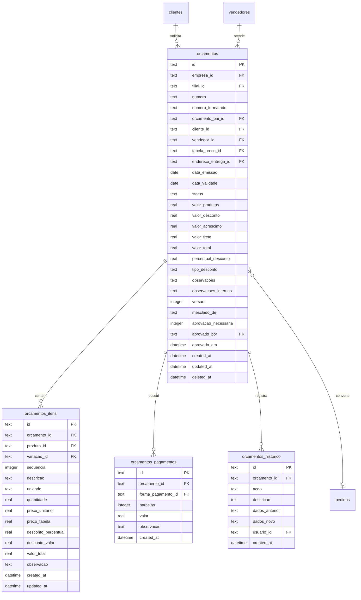
```mermaid
erDiagram
    orcamentos ||--o{ orcamentos_itens : contem
    orcamentos ||--o{ orcamentos_pagamentos : possui
    orcamentos ||--o{ orcamentos_historico : registra
    orcamentos }o--o| pedidos : converte
    clientes ||--o{ orcamentos : solicita
    vendedores ||--o{ orcamentos : atende
    
    orcamentos {
        text id PK
        text empresa_id FK
        text filial_id FK
        text numero
        text numero_formatado
        text orcamento_pai_id FK
        text cliente_id FK
        text vendedor_id FK
        text tabela_preco_id FK
        text endereco_entrega_id FK
        date data_emissao
        date data_validade
        text status
        real valor_produtos
        real valor_desconto
        real valor_acrescimo
        real valor_frete
        real valor_total
        real percentual_desconto
        text tipo_desconto
        text observacoes
        text observacoes_internas
        integer versao
        text mesclado_de
        integer aprovacao_necessaria
        text aprovado_por FK
        datetime aprovado_em
        datetime created_at
        datetime updated_at
        datetime deleted_at
    }
    
    orcamentos_itens {
        text id PK
        text orcamento_id FK
        text produto_id FK
        text variacao_id FK
        integer sequencia
        text descricao
        text unidade
        real quantidade
        real preco_unitario
        real preco_tabela
        real desconto_percentual
        real desconto_valor
        real valor_total
        text observacao
        datetime created_at
        datetime updated_at
    }
    
    orcamentos_pagamentos {
        text id PK
        text orcamento_id FK
        text forma_pagamento_id FK
        integer parcelas
        real valor
        text observacao
        datetime created_at
    }
    
    orcamentos_historico {
        text id PK
        text orcamento_id FK
        text acao
        text descricao
        text dados_anterior
        text dados_novo
        text usuario_id FK
        datetime created_at
    }
```

## Diagrama - Pedidos de Venda

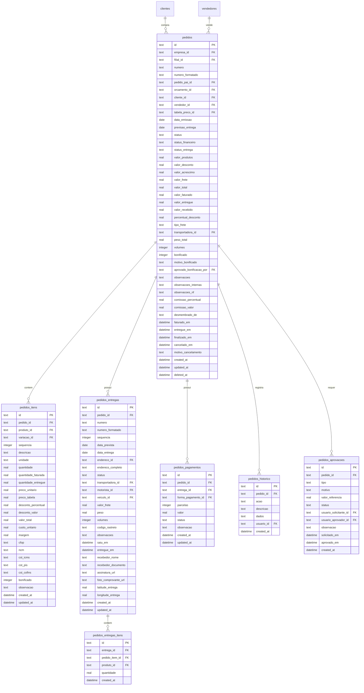
```mermaid
erDiagram
    pedidos ||--o{ pedidos_itens : contem
    pedidos ||--o{ pedidos_entregas : possui
    pedidos ||--o{ pedidos_pagamentos : possui
    pedidos ||--o{ pedidos_historico : registra
    pedidos ||--o{ pedidos_aprovacoes : requer
    pedidos_entregas ||--o{ pedidos_entregas_itens : contem
    clientes ||--o{ pedidos : compra
    vendedores ||--o{ pedidos : vende
    
    pedidos {
        text id PK
        text empresa_id FK
        text filial_id FK
        text numero
        text numero_formatado
        text pedido_pai_id FK
        text orcamento_id FK
        text cliente_id FK
        text vendedor_id FK
        text tabela_preco_id FK
        date data_emissao
        date previsao_entrega
        text status
        text status_financeiro
        text status_entrega
        real valor_produtos
        real valor_desconto
        real valor_acrescimo
        real valor_frete
        real valor_total
        real valor_faturado
        real valor_entregue
        real valor_recebido
        real percentual_desconto
        text tipo_frete
        text transportadora_id FK
        real peso_total
        integer volumes
        integer bonificado
        text motivo_bonificado
        text aprovado_bonificacao_por FK
        text observacoes
        text observacoes_internas
        text observacoes_nf
        real comissao_percentual
        real comissao_valor
        text desmembrado_de
        datetime faturado_em
        datetime entregue_em
        datetime finalizado_em
        datetime cancelado_em
        text motivo_cancelamento
        datetime created_at
        datetime updated_at
        datetime deleted_at
    }
    
    pedidos_itens {
        text id PK
        text pedido_id FK
        text produto_id FK
        text variacao_id FK
        integer sequencia
        text descricao
        text unidade
        real quantidade
        real quantidade_faturada
        real quantidade_entregue
        real preco_unitario
        real preco_tabela
        real desconto_percentual
        real desconto_valor
        real valor_total
        real custo_unitario
        real margem
        text cfop
        text ncm
        text cst_icms
        text cst_pis
        text cst_cofins
        integer bonificado
        text observacao
        datetime created_at
        datetime updated_at
    }
    
    pedidos_entregas {
        text id PK
        text pedido_id FK
        text numero
        text numero_formatado
        integer sequencia
        date data_prevista
        date data_entrega
        text endereco_id FK
        text endereco_completo
        text status
        text transportadora_id FK
        text motorista_id FK
        text veiculo_id FK
        real valor_frete
        real peso
        integer volumes
        text codigo_rastreio
        text observacoes
        datetime saiu_em
        datetime entregue_em
        text recebedor_nome
        text recebedor_documento
        text assinatura_url
        text foto_comprovante_url
        real latitude_entrega
        real longitude_entrega
        datetime created_at
        datetime updated_at
    }
    
    pedidos_entregas_itens {
        text id PK
        text entrega_id FK
        text pedido_item_id FK
        text produto_id FK
        real quantidade
        datetime created_at
    }
    
    pedidos_pagamentos {
        text id PK
        text pedido_id FK
        text entrega_id FK
        text forma_pagamento_id FK
        integer parcelas
        real valor
        text status
        text observacao
        datetime created_at
        datetime updated_at
    }
    
    pedidos_aprovacoes {
        text id PK
        text pedido_id FK
        text tipo
        text motivo
        real valor_referencia
        text status
        text usuario_solicitante_id FK
        text usuario_aprovador_id FK
        text observacao
        datetime solicitado_em
        datetime aprovado_em
        datetime created_at
    }
    
    pedidos_historico {
        text id PK
        text pedido_id FK
        text acao
        text descricao
        text dados
        text usuario_id FK
        datetime created_at
    }
```

## Diagrama - PDV

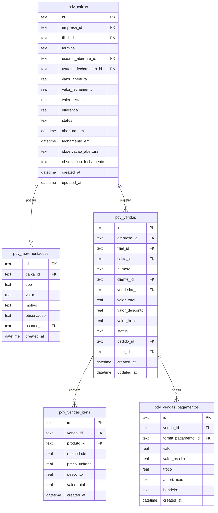
```mermaid
erDiagram
    pdv_caixas ||--o{ pdv_movimentacoes : possui
    pdv_caixas ||--o{ pdv_vendas : registra
    pdv_vendas ||--o{ pdv_vendas_itens : contem
    pdv_vendas ||--o{ pdv_vendas_pagamentos : possui
    
    pdv_caixas {
        text id PK
        text empresa_id FK
        text filial_id FK
        text terminal
        text usuario_abertura_id FK
        text usuario_fechamento_id FK
        real valor_abertura
        real valor_fechamento
        real valor_sistema
        real diferenca
        text status
        datetime abertura_em
        datetime fechamento_em
        text observacao_abertura
        text observacao_fechamento
        datetime created_at
        datetime updated_at
    }
    
    pdv_movimentacoes {
        text id PK
        text caixa_id FK
        text tipo
        real valor
        text motivo
        text observacao
        text usuario_id FK
        datetime created_at
    }
    
    pdv_vendas {
        text id PK
        text empresa_id FK
        text filial_id FK
        text caixa_id FK
        text numero
        text cliente_id FK
        text vendedor_id FK
        real valor_total
        real valor_desconto
        real valor_troco
        text status
        text pedido_id FK
        text nfce_id FK
        datetime created_at
        datetime updated_at
    }
    
    pdv_vendas_itens {
        text id PK
        text venda_id FK
        text produto_id FK
        real quantidade
        real preco_unitario
        real desconto
        real valor_total
        datetime created_at
    }
    
    pdv_vendas_pagamentos {
        text id PK
        text venda_id FK
        text forma_pagamento_id FK
        real valor
        real valor_recebido
        real troco
        text autorizacao
        text bandeira
        datetime created_at
    }
```

## Diagrama - Indicações, Devoluções, Trocas, Consignação, Garantia


```mermaid
erDiagram
    indicacoes ||--o{ indicacoes_creditos : gera
    clientes ||--o{ indicacoes : indica
    devolucoes ||--o{ devolucoes_itens : contem
    trocas ||--o{ trocas_itens_devolvidos : recebe
    trocas ||--o{ trocas_itens_novos : entrega
    consignacoes ||--o{ consignacoes_itens : contem
    garantias ||--o{ garantias_historico : registra
    
    indicacoes {
        text id PK
        text empresa_id FK
        text indicador_id FK
        text indicado_id FK
        text codigo
        text status
        real valor_geracao
        real credito_gerado
        datetime convertido_em
        datetime created_at
        datetime updated_at
    }
    
    indicacoes_creditos {
        text id PK
        text indicacao_id FK
        text indicador_id FK
        text pedido_id FK
        real valor_pedido
        real percentual
        real valor_credito
        text status
        text credito_cliente_id FK
        datetime creditado_em
        datetime created_at
    }
    
    devolucoes {
        text id PK
        text empresa_id FK
        text filial_id FK
        text numero
        text pedido_id FK
        text cliente_id FK
        text motivo
        text tipo_estorno
        real valor_total
        text status
        text aprovado_por FK
        datetime aprovado_em
        text nfe_entrada_id FK
        text credito_gerado_id FK
        text observacao
        datetime created_at
        datetime updated_at
    }
    
    devolucoes_itens {
        text id PK
        text devolucao_id FK
        text pedido_item_id FK
        text produto_id FK
        real quantidade
        real valor_unitario
        real valor_total
        text estado_produto
        text observacao
        datetime created_at
    }
    
    trocas {
        text id PK
        text empresa_id FK
        text filial_id FK
        text numero
        text pedido_original_id FK
        text cliente_id FK
        real valor_devolucao
        real valor_novos
        real diferenca
        text tipo_diferenca
        text status
        text aprovado_por FK
        datetime aprovado_em
        text observacao
        datetime created_at
        datetime updated_at
    }
    
    trocas_itens_devolvidos {
        text id PK
        text troca_id FK
        text produto_id FK
        real quantidade
        real valor_unitario
        real valor_total
        datetime created_at
    }
    
    trocas_itens_novos {
        text id PK
        text troca_id FK
        text produto_id FK
        real quantidade
        real valor_unitario
        real valor_total
        datetime created_at
    }
    
    consignacoes {
        text id PK
        text empresa_id FK
        text filial_id FK
        text numero
        text cliente_id FK
        date data_saida
        date data_retorno_previsto
        date data_acerto
        real valor_total
        real valor_vendido
        real valor_devolvido
        text status
        text observacao
        text nfe_saida_id FK
        text nfe_retorno_id FK
        datetime created_at
        datetime updated_at
    }
    
    consignacoes_itens {
        text id PK
        text consignacao_id FK
        text produto_id FK
        real quantidade_enviada
        real quantidade_vendida
        real quantidade_devolvida
        real valor_unitario
        text status
        datetime created_at
        datetime updated_at
    }
    
    garantias {
        text id PK
        text empresa_id FK
        text filial_id FK
        text numero
        text cliente_id FK
        text pedido_id FK
        text pedido_item_id FK
        text produto_id FK
        text defeito_relatado
        text analise_tecnica
        text status
        text resolucao
        text aprovado_por FK
        datetime aprovado_em
        datetime prazo_resposta
        text observacao
        datetime created_at
        datetime updated_at
    }
    
    garantias_historico {
        text id PK
        text garantia_id FK
        text status_anterior
        text status_novo
        text descricao
        text usuario_id FK
        datetime created_at
    }
    
    gamificacao_metas {
        text id PK
        text empresa_id FK
        text nome
        text tipo
        text periodo
        real valor_meta
        real pontos_premio
        text descricao
        integer ativo
        datetime created_at
        datetime updated_at
    }
    
    gamificacao_pontos {
        text id PK
        text empresa_id FK
        text vendedor_id FK
        text meta_id FK
        text origem
        text origem_id
        real valor_base
        integer pontos
        datetime created_at
    }
    
    gamificacao_premios {
        text id PK
        text empresa_id FK
        text nome
        text descricao
        integer pontos_necessarios
        text tipo
        real valor
        integer quantidade_disponivel
        integer ativo
        datetime created_at
        datetime updated_at
    }
    
    gamificacao_resgates {
        text id PK
        text empresa_id FK
        text vendedor_id FK
        text premio_id FK
        integer pontos_usados
        text status
        datetime resgatado_em
        datetime entregue_em
        datetime created_at
    }
```

---

# 🧾 MÓDULO 6: FISCAL

## Diagrama

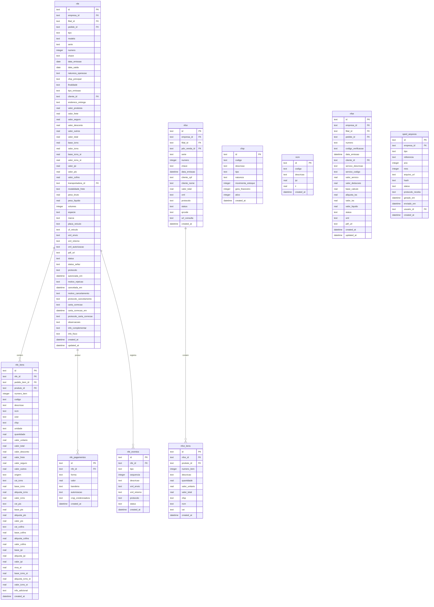
```mermaid
erDiagram
    nfe ||--o{ nfe_itens : contem
    nfe ||--o{ nfe_pagamentos : possui
    nfe ||--o{ nfe_eventos : registra
    nfce ||--o{ nfce_itens : contem
    
    cfop {
        text id PK
        text codigo
        text descricao
        text tipo
        text natureza
        integer movimenta_estoque
        integer gera_financeiro
        integer ativo
        datetime created_at
    }
    
    ncm {
        text id PK
        text codigo
        text descricao
        real ipi
        real ii
        datetime created_at
    }
    
    nfe {
        text id PK
        text empresa_id FK
        text filial_id FK
        text pedido_id FK
        text tipo
        text modelo
        text serie
        integer numero
        text chave
        date data_emissao
        date data_saida
        text natureza_operacao
        text cfop_principal
        text finalidade
        text tipo_emissao
        text cliente_id FK
        text endereco_entrega
        real valor_produtos
        real valor_frete
        real valor_seguro
        real valor_desconto
        real valor_outros
        real valor_total
        real base_icms
        real valor_icms
        real base_icms_st
        real valor_icms_st
        real valor_ipi
        real valor_pis
        real valor_cofins
        text transportadora_id FK
        text modalidade_frete
        real peso_bruto
        real peso_liquido
        integer volumes
        text especie
        text marca
        text placa_veiculo
        text uf_veiculo
        text xml_envio
        text xml_retorno
        text xml_autorizacao
        text pdf_url
        text status
        text status_sefaz
        text protocolo
        datetime autorizada_em
        text motivo_rejeicao
        datetime cancelada_em
        text motivo_cancelamento
        text protocolo_cancelamento
        text carta_correcao
        datetime carta_correcao_em
        text protocolo_carta_correcao
        text observacoes
        text info_complementar
        text info_fisco
        datetime created_at
        datetime updated_at
    }
    
    nfe_itens {
        text id PK
        text nfe_id FK
        text pedido_item_id FK
        text produto_id FK
        integer numero_item
        text codigo
        text descricao
        text ncm
        text cest
        text cfop
        text unidade
        real quantidade
        real valor_unitario
        real valor_total
        real valor_desconto
        real valor_frete
        real valor_seguro
        real valor_outros
        text origem
        text cst_icms
        real base_icms
        real aliquota_icms
        real valor_icms
        text cst_pis
        real base_pis
        real aliquota_pis
        real valor_pis
        text cst_cofins
        real base_cofins
        real aliquota_cofins
        real valor_cofins
        real base_ipi
        real aliquota_ipi
        real valor_ipi
        real mva_st
        real base_icms_st
        real aliquota_icms_st
        real valor_icms_st
        text info_adicional
        datetime created_at
    }
    
    nfe_pagamentos {
        text id PK
        text nfe_id FK
        text forma
        real valor
        text bandeira
        text autorizacao
        text cnpj_credenciadora
        datetime created_at
    }
    
    nfe_eventos {
        text id PK
        text nfe_id FK
        text tipo
        integer sequencia
        text descricao
        text xml_envio
        text xml_retorno
        text protocolo
        text status
        datetime created_at
    }
    
    nfce {
        text id PK
        text empresa_id FK
        text filial_id FK
        text pdv_venda_id FK
        text serie
        integer numero
        text chave
        datetime data_emissao
        text cliente_cpf
        text cliente_nome
        real valor_total
        text xml
        text protocolo
        text status
        text qrcode
        text url_consulta
        datetime created_at
    }
    
    nfce_itens {
        text id PK
        text nfce_id FK
        text produto_id FK
        integer numero_item
        text descricao
        real quantidade
        real valor_unitario
        real valor_total
        text cfop
        text ncm
        text cst
        datetime created_at
    }
    
    nfse {
        text id PK
        text empresa_id FK
        text filial_id FK
        text pedido_id FK
        text numero
        text codigo_verificacao
        datetime data_emissao
        text cliente_id FK
        text servico_descricao
        text servico_codigo
        real valor_servico
        real valor_deducoes
        real base_calculo
        real aliquota_iss
        real valor_iss
        real valor_liquido
        text status
        text xml
        text pdf_url
        datetime created_at
        datetime updated_at
    }
    
    sped_arquivos {
        text id PK
        text empresa_id FK
        text tipo
        text referencia
        integer ano
        integer mes
        text arquivo_url
        text hash
        text status
        text protocolo_receita
        datetime gerado_em
        datetime enviado_em
        text usuario_id FK
        datetime created_at
    }
```

---

# 📦 MÓDULO 7: COMPRAS

## Diagrama

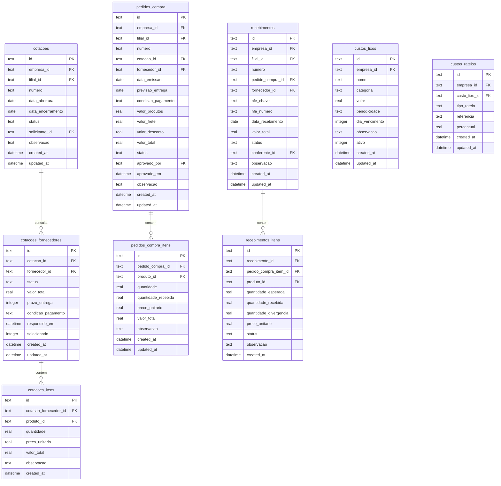
```mermaid
erDiagram
    cotacoes ||--o{ cotacoes_fornecedores : consulta
    cotacoes_fornecedores ||--o{ cotacoes_itens : contem
    pedidos_compra ||--o{ pedidos_compra_itens : contem
    recebimentos ||--o{ recebimentos_itens : contem
    
    cotacoes {
        text id PK
        text empresa_id FK
        text filial_id FK
        text numero
        date data_abertura
        date data_encerramento
        text status
        text solicitante_id FK
        text observacao
        datetime created_at
        datetime updated_at
    }
    
    cotacoes_fornecedores {
        text id PK
        text cotacao_id FK
        text fornecedor_id FK
        text status
        real valor_total
        integer prazo_entrega
        text condicao_pagamento
        datetime respondido_em
        integer selecionado
        datetime created_at
        datetime updated_at
    }
    
    cotacoes_itens {
        text id PK
        text cotacao_fornecedor_id FK
        text produto_id FK
        real quantidade
        real preco_unitario
        real valor_total
        text observacao
        datetime created_at
    }
    
    pedidos_compra {
        text id PK
        text empresa_id FK
        text filial_id FK
        text numero
        text cotacao_id FK
        text fornecedor_id FK
        date data_emissao
        date previsao_entrega
        text condicao_pagamento
        real valor_produtos
        real valor_frete
        real valor_desconto
        real valor_total
        text status
        text aprovado_por FK
        datetime aprovado_em
        text observacao
        datetime created_at
        datetime updated_at
    }
    
    pedidos_compra_itens {
        text id PK
        text pedido_compra_id FK
        text produto_id FK
        real quantidade
        real quantidade_recebida
        real preco_unitario
        real valor_total
        text observacao
        datetime created_at
        datetime updated_at
    }
    
    recebimentos {
        text id PK
        text empresa_id FK
        text filial_id FK
        text numero
        text pedido_compra_id FK
        text fornecedor_id FK
        text nfe_chave
        text nfe_numero
        date data_recebimento
        real valor_total
        text status
        text conferente_id FK
        text observacao
        datetime created_at
        datetime updated_at
    }
    
    recebimentos_itens {
        text id PK
        text recebimento_id FK
        text pedido_compra_item_id FK
        text produto_id FK
        real quantidade_esperada
        real quantidade_recebida
        real quantidade_divergencia
        real preco_unitario
        text status
        text observacao
        datetime created_at
    }
    
    custos_fixos {
        text id PK
        text empresa_id FK
        text nome
        text categoria
        real valor
        text periodicidade
        integer dia_vencimento
        text observacao
        integer ativo
        datetime created_at
        datetime updated_at
    }
    
    custos_rateios {
        text id PK
        text empresa_id FK
        text custo_fixo_id FK
        text tipo_rateio
        text referencia
        real percentual
        datetime created_at
        datetime updated_at
    }
```

---

# 🚚 MÓDULO 8: EXPEDIÇÃO

## Diagrama

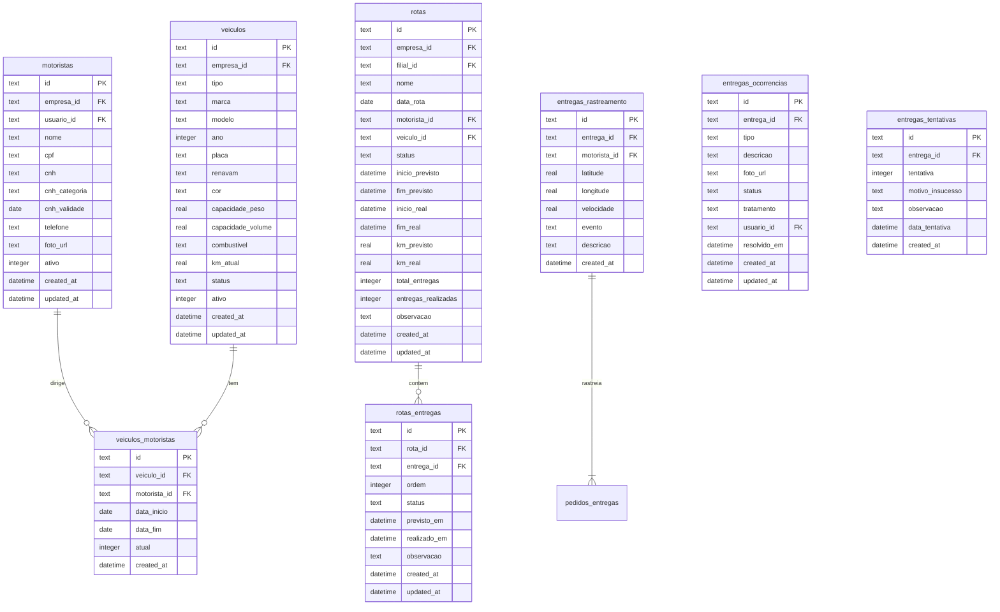
```mermaid
erDiagram
    motoristas ||--o{ veiculos_motoristas : dirige
    veiculos ||--o{ veiculos_motoristas : tem
    rotas ||--o{ rotas_entregas : contem
    entregas_rastreamento ||--|{ pedidos_entregas : rastreia
    
    motoristas {
        text id PK
        text empresa_id FK
        text usuario_id FK
        text nome
        text cpf
        text cnh
        text cnh_categoria
        date cnh_validade
        text telefone
        text foto_url
        integer ativo
        datetime created_at
        datetime updated_at
    }
    
    veiculos {
        text id PK
        text empresa_id FK
        text tipo
        text marca
        text modelo
        integer ano
        text placa
        text renavam
        text cor
        real capacidade_peso
        real capacidade_volume
        text combustivel
        real km_atual
        text status
        integer ativo
        datetime created_at
        datetime updated_at
    }
    
    veiculos_motoristas {
        text id PK
        text veiculo_id FK
        text motorista_id FK
        date data_inicio
        date data_fim
        integer atual
        datetime created_at
    }
    
    rotas {
        text id PK
        text empresa_id FK
        text filial_id FK
        text nome
        date data_rota
        text motorista_id FK
        text veiculo_id FK
        text status
        datetime inicio_previsto
        datetime fim_previsto
        datetime inicio_real
        datetime fim_real
        real km_previsto
        real km_real
        integer total_entregas
        integer entregas_realizadas
        text observacao
        datetime created_at
        datetime updated_at
    }
    
    rotas_entregas {
        text id PK
        text rota_id FK
        text entrega_id FK
        integer ordem
        text status
        datetime previsto_em
        datetime realizado_em
        text observacao
        datetime created_at
        datetime updated_at
    }
    
    entregas_rastreamento {
        text id PK
        text entrega_id FK
        text motorista_id FK
        real latitude
        real longitude
        real velocidade
        text evento
        text descricao
        datetime created_at
    }
    
    entregas_ocorrencias {
        text id PK
        text entrega_id FK
        text tipo
        text descricao
        text foto_url
        text status
        text tratamento
        text usuario_id FK
        datetime resolvido_em
        datetime created_at
        datetime updated_at
    }
    
    entregas_tentativas {
        text id PK
        text entrega_id FK
        integer tentativa
        text motivo_insucesso
        text observacao
        datetime data_tentativa
        datetime created_at
    }
```

---

# 🛒 MÓDULO 9: E-COMMERCE

## Diagrama

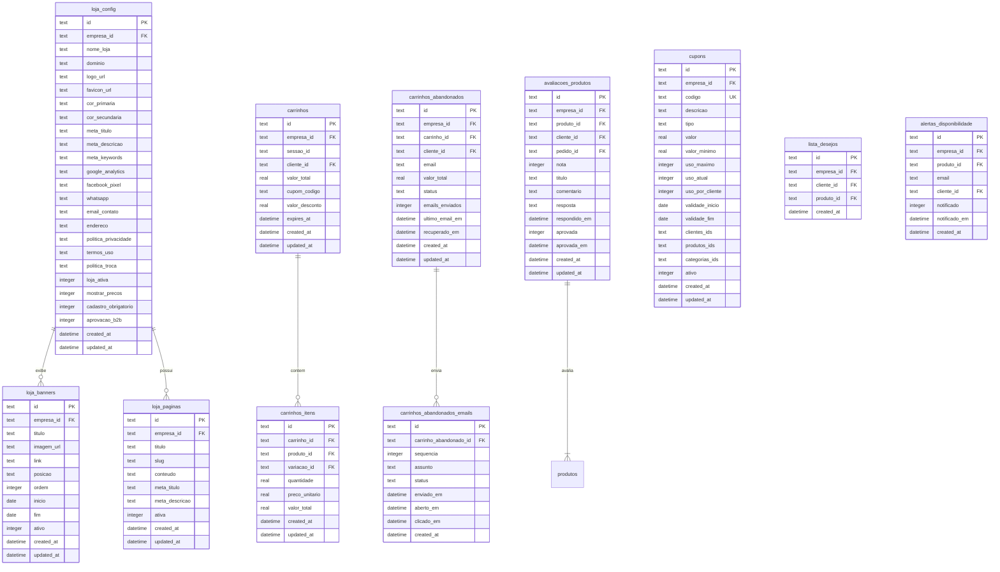
```mermaid
erDiagram
    loja_config ||--o{ loja_banners : exibe
    loja_config ||--o{ loja_paginas : possui
    carrinhos ||--o{ carrinhos_itens : contem
    carrinhos_abandonados ||--o{ carrinhos_abandonados_emails : envia
    avaliacoes_produtos ||--|{ produtos : avalia
    
    loja_config {
        text id PK
        text empresa_id FK
        text nome_loja
        text dominio
        text logo_url
        text favicon_url
        text cor_primaria
        text cor_secundaria
        text meta_titulo
        text meta_descricao
        text meta_keywords
        text google_analytics
        text facebook_pixel
        text whatsapp
        text email_contato
        text endereco
        text politica_privacidade
        text termos_uso
        text politica_troca
        integer loja_ativa
        integer mostrar_precos
        integer cadastro_obrigatorio
        integer aprovacao_b2b
        datetime created_at
        datetime updated_at
    }
    
    loja_banners {
        text id PK
        text empresa_id FK
        text titulo
        text imagem_url
        text link
        text posicao
        integer ordem
        date inicio
        date fim
        integer ativo
        datetime created_at
        datetime updated_at
    }
    
    loja_paginas {
        text id PK
        text empresa_id FK
        text titulo
        text slug
        text conteudo
        text meta_titulo
        text meta_descricao
        integer ativa
        datetime created_at
        datetime updated_at
    }
    
    carrinhos {
        text id PK
        text empresa_id FK
        text sessao_id
        text cliente_id FK
        real valor_total
        text cupom_codigo
        real valor_desconto
        datetime expires_at
        datetime created_at
        datetime updated_at
    }
    
    carrinhos_itens {
        text id PK
        text carrinho_id FK
        text produto_id FK
        text variacao_id FK
        real quantidade
        real preco_unitario
        real valor_total
        datetime created_at
        datetime updated_at
    }
    
    carrinhos_abandonados {
        text id PK
        text empresa_id FK
        text carrinho_id FK
        text cliente_id FK
        text email
        real valor_total
        text status
        integer emails_enviados
        datetime ultimo_email_em
        datetime recuperado_em
        datetime created_at
        datetime updated_at
    }
    
    carrinhos_abandonados_emails {
        text id PK
        text carrinho_abandonado_id FK
        integer sequencia
        text assunto
        text status
        datetime enviado_em
        datetime aberto_em
        datetime clicado_em
        datetime created_at
    }
    
    cupons {
        text id PK
        text empresa_id FK
        text codigo UK
        text descricao
        text tipo
        real valor
        real valor_minimo
        integer uso_maximo
        integer uso_atual
        integer uso_por_cliente
        date validade_inicio
        date validade_fim
        text clientes_ids
        text produtos_ids
        text categorias_ids
        integer ativo
        datetime created_at
        datetime updated_at
    }
    
    avaliacoes_produtos {
        text id PK
        text empresa_id FK
        text produto_id FK
        text cliente_id FK
        text pedido_id FK
        integer nota
        text titulo
        text comentario
        text resposta
        datetime respondido_em
        integer aprovada
        datetime aprovada_em
        datetime created_at
        datetime updated_at
    }
    
    lista_desejos {
        text id PK
        text empresa_id FK
        text cliente_id FK
        text produto_id FK
        datetime created_at
    }
    
    alertas_disponibilidade {
        text id PK
        text empresa_id FK
        text produto_id FK
        text email
        text cliente_id FK
        integer notificado
        datetime notificado_em
        datetime created_at
    }
```

---

# 📊 MÓDULO 10: BI

## Diagrama

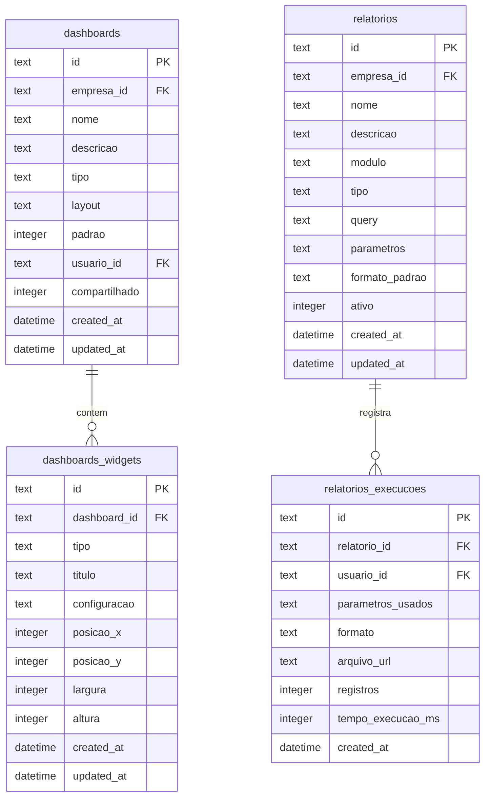
```mermaid
erDiagram
    dashboards ||--o{ dashboards_widgets : contem
    relatorios ||--o{ relatorios_execucoes : registra
    
    dashboards {
        text id PK
        text empresa_id FK
        text nome
        text descricao
        text tipo
        text layout
        integer padrao
        text usuario_id FK
        integer compartilhado
        datetime created_at
        datetime updated_at
    }
    
    dashboards_widgets {
        text id PK
        text dashboard_id FK
        text tipo
        text titulo
        text configuracao
        integer posicao_x
        integer posicao_y
        integer largura
        integer altura
        datetime created_at
        datetime updated_at
    }
    
    relatorios {
        text id PK
        text empresa_id FK
        text nome
        text descricao
        text modulo
        text tipo
        text query
        text parametros
        text formato_padrao
        integer ativo
        datetime created_at
        datetime updated_at
    }
    
    relatorios_execucoes {
        text id PK
        text relatorio_id FK
        text usuario_id FK
        text parametros_usados
        text formato
        text arquivo_url
        integer registros
        integer tempo_execucao_ms
        datetime created_at
    }
```

---

# 👥 MÓDULO 11: RH

## Diagrama

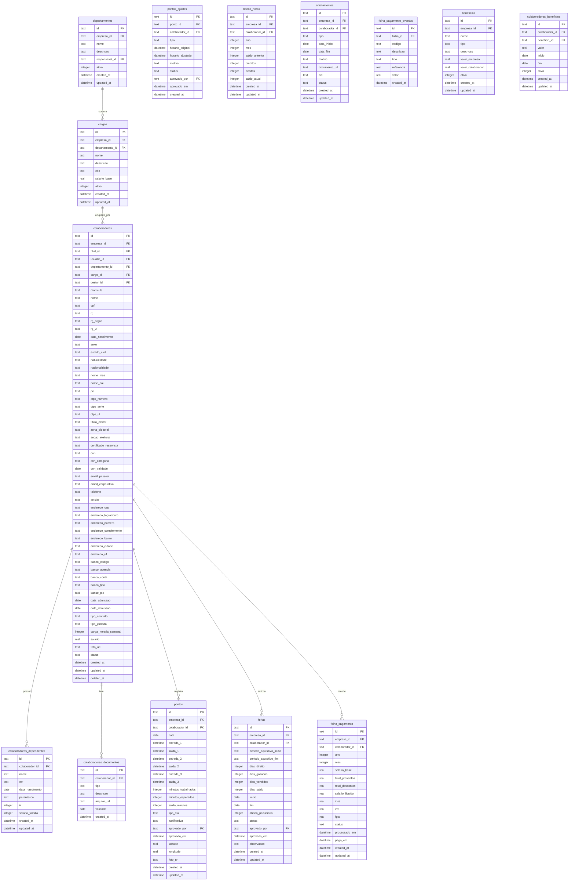
```mermaid
erDiagram
    colaboradores ||--o{ colaboradores_dependentes : possui
    colaboradores ||--o{ colaboradores_documentos : tem
    colaboradores ||--o{ pontos : registra
    colaboradores ||--o{ ferias : solicita
    colaboradores ||--o{ folha_pagamento : recebe
    departamentos ||--o{ cargos : contem
    cargos ||--o{ colaboradores : ocupado_por
    
    departamentos {
        text id PK
        text empresa_id FK
        text nome
        text descricao
        text responsavel_id FK
        integer ativo
        datetime created_at
        datetime updated_at
    }
    
    cargos {
        text id PK
        text empresa_id FK
        text departamento_id FK
        text nome
        text descricao
        text cbo
        real salario_base
        integer ativo
        datetime created_at
        datetime updated_at
    }
    
    colaboradores {
        text id PK
        text empresa_id FK
        text filial_id FK
        text usuario_id FK
        text departamento_id FK
        text cargo_id FK
        text gestor_id FK
        text matricula
        text nome
        text cpf
        text rg
        text rg_orgao
        text rg_uf
        date data_nascimento
        text sexo
        text estado_civil
        text naturalidade
        text nacionalidade
        text nome_mae
        text nome_pai
        text pis
        text ctps_numero
        text ctps_serie
        text ctps_uf
        text titulo_eleitor
        text zona_eleitoral
        text secao_eleitoral
        text certificado_reservista
        text cnh
        text cnh_categoria
        date cnh_validade
        text email_pessoal
        text email_corporativo
        text telefone
        text celular
        text endereco_cep
        text endereco_logradouro
        text endereco_numero
        text endereco_complemento
        text endereco_bairro
        text endereco_cidade
        text endereco_uf
        text banco_codigo
        text banco_agencia
        text banco_conta
        text banco_tipo
        text banco_pix
        date data_admissao
        date data_demissao
        text tipo_contrato
        text tipo_jornada
        integer carga_horaria_semanal
        real salario
        text foto_url
        text status
        datetime created_at
        datetime updated_at
        datetime deleted_at
    }
    
    colaboradores_dependentes {
        text id PK
        text colaborador_id FK
        text nome
        text cpf
        date data_nascimento
        text parentesco
        integer ir
        integer salario_familia
        datetime created_at
        datetime updated_at
    }
    
    colaboradores_documentos {
        text id PK
        text colaborador_id FK
        text tipo
        text descricao
        text arquivo_url
        date validade
        datetime created_at
    }
    
    pontos {
        text id PK
        text empresa_id FK
        text colaborador_id FK
        date data
        datetime entrada_1
        datetime saida_1
        datetime entrada_2
        datetime saida_2
        datetime entrada_3
        datetime saida_3
        integer minutos_trabalhados
        integer minutos_esperados
        integer saldo_minutos
        text tipo_dia
        text justificativa
        text aprovado_por FK
        datetime aprovado_em
        real latitude
        real longitude
        text foto_url
        datetime created_at
        datetime updated_at
    }
    
    pontos_ajustes {
        text id PK
        text ponto_id FK
        text colaborador_id FK
        text tipo
        datetime horario_original
        datetime horario_ajustado
        text motivo
        text status
        text aprovado_por FK
        datetime aprovado_em
        datetime created_at
    }
    
    banco_horas {
        text id PK
        text empresa_id FK
        text colaborador_id FK
        integer ano
        integer mes
        integer saldo_anterior
        integer creditos
        integer debitos
        integer saldo_atual
        datetime created_at
        datetime updated_at
    }
    
    ferias {
        text id PK
        text empresa_id FK
        text colaborador_id FK
        text periodo_aquisitivo_inicio
        text periodo_aquisitivo_fim
        integer dias_direito
        integer dias_gozados
        integer dias_vendidos
        integer dias_saldo
        date inicio
        date fim
        integer abono_pecuniario
        text status
        text aprovado_por FK
        datetime aprovado_em
        text observacao
        datetime created_at
        datetime updated_at
    }
    
    afastamentos {
        text id PK
        text empresa_id FK
        text colaborador_id FK
        text tipo
        date data_inicio
        date data_fim
        text motivo
        text documento_url
        text cid
        text status
        datetime created_at
        datetime updated_at
    }
    
    folha_pagamento {
        text id PK
        text empresa_id FK
        text colaborador_id FK
        integer ano
        integer mes
        real salario_base
        real total_proventos
        real total_descontos
        real salario_liquido
        real inss
        real irrf
        real fgts
        text status
        datetime processado_em
        datetime pago_em
        datetime created_at
        datetime updated_at
    }
    
    folha_pagamento_eventos {
        text id PK
        text folha_id FK
        text codigo
        text descricao
        text tipo
        real referencia
        real valor
        datetime created_at
    }
    
    beneficios {
        text id PK
        text empresa_id FK
        text nome
        text tipo
        text descricao
        real valor_empresa
        real valor_colaborador
        integer ativo
        datetime created_at
        datetime updated_at
    }
    
    colaboradores_beneficios {
        text id PK
        text colaborador_id FK
        text beneficio_id FK
        real valor
        date inicio
        date fim
        integer ativo
        datetime created_at
        datetime updated_at
    }
```

---

# 📄 MÓDULO 12: CONTRATOS

## Diagrama

```mermaid
erDiagram
    contratos ||--o{ contratos_aditivos : possui
    contratos ||--o{ contratos_documentos : anexa
    contratos ||--o{ contratos_historico : registra
    
    contratos {
        text id PK
        text empresa_id FK
        text numero
        text tipo
        text parte_tipo
        text parte_id
        text parte_nome
        text objeto
        text descricao
        date data_inicio
        date data_fim
        integer renovacao_automatica
        integer dias_aviso_vencimento
        real valor
        text periodicidade_valor
        text condicoes_pagamento
        text clausulas
        text arquivo_url
        text status
        text assinatura_digital_id
        datetime assinado_em
        text observacoes
        datetime created_at
        datetime updated_at
        datetime deleted_at
    }
    
    contratos_aditivos {
        text id PK
        text contrato_id FK
        text numero
        text tipo
        text descricao
        date data_aditivo
        date novo_fim
        real novo_valor
        text clausulas_alteradas
        text arquivo_url
        text status
        datetime created_at
        datetime updated_at
    }
    
    contratos_documentos {
        text id PK
        text contrato_id FK
        text tipo
        text descricao
        text arquivo_url
        datetime created_at
    }
    
    contratos_historico {
        text id PK
        text contrato_id FK
        text acao
        text descricao
        text usuario_id FK
        datetime created_at
    }
```

---

# 🔧 MÓDULO 5.9: SERVIÇOS (Ordens de Serviço)

## Diagrama

```mermaid
erDiagram
    ordens_servico ||--o{ ordens_servico_itens : contem
    ordens_servico ||--o{ ordens_servico_historico : registra
    ordens_servico }o--|| clientes : atende
    ordens_servico }o--o| pedidos : vinculado
    
    ordens_servico {
        text id PK
        text empresa_id FK
        text filial_id FK
        text numero
        text cliente_id FK
        text pedido_id FK
        text vendedor_id FK
        text tecnico_id FK
        text tipo
        text prioridade
        text titulo
        text descricao
        text equipamento
        text numero_serie
        text defeito_relatado
        text diagnostico
        text solucao
        date data_abertura
        date data_previsao
        date data_inicio
        date data_conclusao
        real valor_mao_obra
        real valor_pecas
        real valor_deslocamento
        real valor_desconto
        real valor_total
        text status
        text aprovado_por FK
        datetime aprovado_em
        text observacoes
        text observacoes_internas
        datetime created_at
        datetime updated_at
        datetime deleted_at
    }
    
    ordens_servico_itens {
        text id PK
        text ordem_servico_id FK
        text tipo
        text produto_id FK
        text descricao
        real quantidade
        real valor_unitario
        real valor_total
        datetime created_at
        datetime updated_at
    }
    
    ordens_servico_historico {
        text id PK
        text ordem_servico_id FK
        text status_anterior
        text status_novo
        text descricao
        text usuario_id FK
        datetime created_at
    }
```

---

# 📊 MÓDULO 13: CONTABILIDADE

## Diagrama

```mermaid
erDiagram
    contabil_plano_contas ||--o{ contabil_plano_contas : subconta
    contabil_plano_contas ||--o{ contabil_lancamentos : movimenta
    contabil_lancamentos ||--o{ contabil_lancamentos_itens : contem
    
    contabil_plano_contas {
        text id PK
        text empresa_id FK
        text conta_pai_id FK
        text codigo
        text descricao
        text tipo
        text natureza
        integer nivel
        integer analitica
        integer ativa
        datetime created_at
        datetime updated_at
    }
    
    contabil_lancamentos {
        text id PK
        text empresa_id FK
        text numero
        date data_lancamento
        date data_competencia
        text historico
        text origem
        text origem_id
        text tipo
        text status
        text usuario_id FK
        datetime created_at
        datetime updated_at
    }
    
    contabil_lancamentos_itens {
        text id PK
        text lancamento_id FK
        text conta_id FK
        text tipo
        real valor
        text historico_complementar
        text centro_custo
        datetime created_at
    }
    
    contabil_fechamentos {
        text id PK
        text empresa_id FK
        integer ano
        integer mes
        text status
        text usuario_abertura_id FK
        text usuario_fechamento_id FK
        datetime aberto_em
        datetime fechado_em
        text observacao
        datetime created_at
        datetime updated_at
    }
    
    contabil_dre {
        text id PK
        text empresa_id FK
        integer ano
        integer mes
        real receita_bruta
        real deducoes
        real receita_liquida
        real custo_mercadorias
        real lucro_bruto
        real despesas_operacionais
        real resultado_operacional
        real resultado_financeiro
        real resultado_antes_ir
        real provisao_ir_csll
        real lucro_liquido
        datetime gerado_em
        datetime created_at
    }
```

---

# 🏢 MÓDULO 14: PATRIMÔNIO

## Diagrama

```mermaid
erDiagram
    patrimonio_categorias ||--o{ patrimonio_bens : categoriza
    patrimonio_bens ||--o{ patrimonio_depreciacoes : deprecia
    patrimonio_bens ||--o{ patrimonio_movimentacoes : movimenta
    patrimonio_bens ||--o{ patrimonio_manutencoes : mantem
    
    patrimonio_categorias {
        text id PK
        text empresa_id FK
        text nome
        text descricao
        real taxa_depreciacao_anual
        integer vida_util_meses
        text conta_contabil_id FK
        text conta_depreciacao_id FK
        integer ativa
        datetime created_at
        datetime updated_at
    }
    
    patrimonio_bens {
        text id PK
        text empresa_id FK
        text filial_id FK
        text categoria_id FK
        text numero_patrimonio UK
        text descricao
        text marca
        text modelo
        text numero_serie
        text fornecedor_id FK
        text nota_fiscal
        date data_aquisicao
        real valor_aquisicao
        real valor_residual
        real valor_atual
        real depreciacao_acumulada
        text localizacao
        text responsavel_id FK
        text centro_custo
        text status
        date data_baixa
        text motivo_baixa
        real valor_baixa
        text observacoes
        text foto_url
        datetime created_at
        datetime updated_at
        datetime deleted_at
    }
    
    patrimonio_depreciacoes {
        text id PK
        text bem_id FK
        integer ano
        integer mes
        real valor_base
        real taxa
        real valor_depreciacao
        real depreciacao_acumulada
        real valor_residual
        text lancamento_contabil_id FK
        datetime created_at
    }
    
    patrimonio_movimentacoes {
        text id PK
        text bem_id FK
        text tipo
        text filial_origem_id FK
        text filial_destino_id FK
        text localizacao_origem
        text localizacao_destino
        text responsavel_origem_id FK
        text responsavel_destino_id FK
        text motivo
        text observacao
        text usuario_id FK
        datetime created_at
    }
    
    patrimonio_manutencoes {
        text id PK
        text bem_id FK
        text tipo
        text descricao
        text fornecedor_id FK
        date data_manutencao
        real valor
        text nota_fiscal
        text observacao
        datetime created_at
        datetime updated_at
    }
    
    patrimonio_seguros {
        text id PK
        text empresa_id FK
        text bem_id FK
        text seguradora
        text numero_apolice
        real valor_segurado
        real valor_premio
        date vigencia_inicio
        date vigencia_fim
        text cobertura
        text observacao
        integer ativo
        datetime created_at
        datetime updated_at
    }
```

---

# 🏭 MÓDULO 5.11: PCP (Produção)

## Diagrama

```mermaid
erDiagram
    producao_ordens ||--o{ producao_ordens_itens : contem
    producao_ordens ||--o{ producao_etapas : possui
    producao_etapas ||--o{ producao_apontamentos : registra
    produtos ||--o{ producao_ordens : produz
    
    producao_ordens {
        text id PK
        text empresa_id FK
        text filial_id FK
        text numero
        text produto_id FK
        real quantidade
        real quantidade_produzida
        text unidade
        date data_abertura
        date data_previsao
        date data_inicio
        date data_conclusao
        text prioridade
        text status
        text pedido_id FK
        real custo_previsto
        real custo_real
        text observacoes
        text usuario_abertura_id FK
        text usuario_fechamento_id FK
        datetime created_at
        datetime updated_at
    }
    
    producao_ordens_itens {
        text id PK
        text ordem_id FK
        text produto_id FK
        text tipo
        real quantidade_prevista
        real quantidade_consumida
        real custo_unitario
        text lote
        datetime created_at
        datetime updated_at
    }
    
    producao_etapas {
        text id PK
        text ordem_id FK
        integer sequencia
        text descricao
        text centro_trabalho
        real tempo_previsto_minutos
        real tempo_real_minutos
        text status
        datetime inicio_previsto
        datetime fim_previsto
        datetime inicio_real
        datetime fim_real
        text responsavel_id FK
        text observacao
        datetime created_at
        datetime updated_at
    }
    
    producao_apontamentos {
        text id PK
        text etapa_id FK
        text colaborador_id FK
        datetime inicio
        datetime fim
        real quantidade_produzida
        real quantidade_refugo
        text motivo_refugo
        text observacao
        datetime created_at
    }
    
    producao_centros_trabalho {
        text id PK
        text empresa_id FK
        text codigo
        text nome
        text descricao
        real capacidade_hora
        real custo_hora
        text responsavel_id FK
        integer ativo
        datetime created_at
        datetime updated_at
    }
```

---

# 👥 MÓDULO 27.7: RECRUTAMENTO E SELEÇÃO

## Diagrama

```mermaid
erDiagram
    vagas ||--o{ candidatos : recebe
    candidatos ||--o{ entrevistas : participa
    candidatos ||--o{ candidatos_historico : registra
    vagas }o--|| cargos : para
    
    vagas {
        text id PK
        text empresa_id FK
        text filial_id FK
        text cargo_id FK
        text departamento_id FK
        text titulo
        text descricao
        text requisitos
        text beneficios
        text tipo_contrato
        text regime
        real salario_de
        real salario_ate
        integer quantidade
        date data_abertura
        date data_encerramento
        text status
        text responsavel_id FK
        integer publica
        text url_externa
        datetime created_at
        datetime updated_at
    }
    
    candidatos {
        text id PK
        text empresa_id FK
        text vaga_id FK
        text nome
        text email
        text telefone
        text celular
        text whatsapp
        text cpf
        date data_nascimento
        text endereco_cidade
        text endereco_uf
        text linkedin
        text curriculo_url
        text foto_url
        text pretensao_salarial
        text disponibilidade
        text origem
        text etapa
        integer nota
        text observacoes
        text colaborador_id FK
        datetime contratado_em
        datetime created_at
        datetime updated_at
    }
    
    entrevistas {
        text id PK
        text candidato_id FK
        text tipo
        datetime data_hora
        text local
        text link_video
        text entrevistador_id FK
        text status
        integer nota
        text parecer
        text pontos_fortes
        text pontos_atencao
        integer aprovado
        datetime created_at
        datetime updated_at
    }
    
    candidatos_historico {
        text id PK
        text candidato_id FK
        text etapa_anterior
        text etapa_nova
        text descricao
        text usuario_id FK
        datetime created_at
    }
```

---

# 📚 MÓDULO 27.8: TREINAMENTOS

## Diagrama

```mermaid
erDiagram
    treinamentos ||--o{ treinamentos_turmas : possui
    treinamentos_turmas ||--o{ treinamentos_participantes : tem
    treinamentos_participantes ||--o{ certificados : gera
    
    treinamentos {
        text id PK
        text empresa_id FK
        text codigo
        text nome
        text descricao
        text tipo
        text modalidade
        integer carga_horaria
        text conteudo_programatico
        text pre_requisitos
        text instrutor_padrao
        integer obrigatorio
        integer validade_meses
        text categoria
        integer ativo
        datetime created_at
        datetime updated_at
    }
    
    treinamentos_turmas {
        text id PK
        text treinamento_id FK
        text codigo
        date data_inicio
        date data_fim
        text horario
        text local
        text instrutor_id FK
        text instrutor_externo
        integer vagas
        integer inscritos
        real custo_total
        text status
        text observacoes
        datetime created_at
        datetime updated_at
    }
    
    treinamentos_participantes {
        text id PK
        text turma_id FK
        text colaborador_id FK
        text status
        real nota
        real frequencia
        integer aprovado
        text observacao
        datetime inscrito_em
        datetime concluido_em
        datetime created_at
        datetime updated_at
    }
    
    certificados {
        text id PK
        text empresa_id FK
        text participante_id FK
        text colaborador_id FK
        text treinamento_id FK
        text codigo UK
        date data_emissao
        date data_validade
        text arquivo_url
        text hash_validacao
        datetime created_at
    }
    
    treinamentos_necessidades {
        text id PK
        text empresa_id FK
        text colaborador_id FK
        text treinamento_id FK
        text solicitante_id FK
        text justificativa
        text prioridade
        text status
        text aprovado_por FK
        datetime aprovado_em
        datetime created_at
        datetime updated_at
    }
```

---

# 📈 MÓDULO 27.9: AVALIAÇÃO DE DESEMPENHO

## Diagrama

```mermaid
erDiagram
    avaliacoes_ciclos ||--o{ avaliacoes : contem
    avaliacoes ||--o{ avaliacoes_respostas : possui
    avaliacoes_modelos ||--o{ avaliacoes_criterios : define
    avaliacoes_criterios ||--o{ avaliacoes_respostas : responde
    
    avaliacoes_ciclos {
        text id PK
        text empresa_id FK
        text nome
        text descricao
        integer ano
        text tipo
        date data_inicio
        date data_fim
        date prazo_autoavaliacao
        date prazo_gestor
        date prazo_calibracao
        text status
        datetime created_at
        datetime updated_at
    }
    
    avaliacoes_modelos {
        text id PK
        text empresa_id FK
        text nome
        text descricao
        text tipo
        integer ativo
        datetime created_at
        datetime updated_at
    }
    
    avaliacoes_criterios {
        text id PK
        text modelo_id FK
        text categoria
        text descricao
        text tipo_resposta
        real peso
        integer ordem
        integer obrigatorio
        datetime created_at
        datetime updated_at
    }
    
    avaliacoes {
        text id PK
        text empresa_id FK
        text ciclo_id FK
        text modelo_id FK
        text colaborador_id FK
        text avaliador_id FK
        text tipo
        text status
        real nota_final
        text classificacao
        text feedback_geral
        text pontos_fortes
        text pontos_melhoria
        text plano_desenvolvimento
        datetime autoavaliacao_em
        datetime avaliacao_gestor_em
        datetime calibrado_em
        datetime feedback_em
        datetime created_at
        datetime updated_at
    }
    
    avaliacoes_respostas {
        text id PK
        text avaliacao_id FK
        text criterio_id FK
        text tipo_avaliador
        real nota
        text comentario
        datetime created_at
        datetime updated_at
    }
    
    avaliacoes_metas_pdi {
        text id PK
        text avaliacao_id FK
        text colaborador_id FK
        text tipo
        text descricao
        text indicador
        text meta
        date prazo
        text status
        text resultado
        datetime concluido_em
        datetime created_at
        datetime updated_at
    }
```

---

# 📅 MÓDULO 25: AGENDA E CALENDÁRIO

## Diagrama

```mermaid
erDiagram
    agenda_eventos ||--o{ agenda_participantes : tem
    agenda_eventos ||--o{ agenda_lembretes : possui
    
    agenda_eventos {
        text id PK
        text empresa_id FK
        text titulo
        text descricao
        text tipo
        datetime data_inicio
        datetime data_fim
        integer dia_inteiro
        text local
        text link_virtual
        text cor
        text recorrencia
        text recorrencia_config
        text criador_id FK
        text cliente_id FK
        text lead_id FK
        text origem
        text origem_id
        text status
        integer privado
        datetime created_at
        datetime updated_at
    }
    
    agenda_participantes {
        text id PK
        text evento_id FK
        text usuario_id FK
        text email_externo
        text nome_externo
        text status
        text resposta
        datetime respondido_em
        datetime created_at
    }
    
    agenda_lembretes {
        text id PK
        text evento_id FK
        text usuario_id FK
        integer minutos_antes
        text tipo
        integer enviado
        datetime enviado_em
        datetime created_at
    }
    
    agenda_disponibilidade {
        text id PK
        text empresa_id FK
        text usuario_id FK
        integer dia_semana
        time hora_inicio
        time hora_fim
        integer ativo
        datetime created_at
        datetime updated_at
    }
```

---

# 🎧 MÓDULO 26: CENTRAL DE AJUDA E TICKETS

## Diagrama

```mermaid
erDiagram
    ajuda_categorias ||--o{ ajuda_categorias : subcategoria
    ajuda_categorias ||--o{ ajuda_artigos : contem
    ajuda_artigos ||--o{ ajuda_artigos_avaliacoes : avaliado
    tickets ||--o{ tickets_mensagens : possui
    tickets ||--o{ tickets_historico : registra
    
    ajuda_categorias {
        text id PK
        text empresa_id FK
        text categoria_pai_id FK
        text nome
        text descricao
        text icone
        integer ordem
        integer publica
        integer ativa
        datetime created_at
        datetime updated_at
    }
    
    ajuda_artigos {
        text id PK
        text empresa_id FK
        text categoria_id FK
        text titulo
        text slug
        text conteudo
        text tags
        integer visualizacoes
        integer publica
        integer destaque
        text autor_id FK
        datetime publicado_em
        datetime created_at
        datetime updated_at
    }
    
    ajuda_artigos_avaliacoes {
        text id PK
        text artigo_id FK
        text usuario_id FK
        integer util
        text comentario
        datetime created_at
    }
    
    tickets {
        text id PK
        text empresa_id FK
        text numero UK
        text assunto
        text descricao
        text categoria
        text prioridade
        text status
        text cliente_id FK
        text solicitante_id FK
        text atribuido_id FK
        text canal
        datetime primeira_resposta_em
        datetime resolvido_em
        datetime fechado_em
        integer avaliacao_nota
        text avaliacao_comentario
        datetime created_at
        datetime updated_at
    }
    
    tickets_mensagens {
        text id PK
        text ticket_id FK
        text autor_id FK
        text tipo
        text mensagem
        text anexos
        integer interno
        datetime created_at
    }
    
    tickets_historico {
        text id PK
        text ticket_id FK
        text campo
        text valor_anterior
        text valor_novo
        text usuario_id FK
        datetime created_at
    }
```

---

# 💬 MÓDULO 17: OMNIPRO (Atendimento Multicanal)

## Diagrama

```mermaid
erDiagram
    omni_canais ||--o{ omni_conversas : recebe
    omni_conversas ||--o{ omni_mensagens : possui
    omni_templates ||--o{ omni_mensagens : usa
    
    omni_canais {
        text id PK
        text empresa_id FK
        text tipo
        text nome
        text identificador
        text token
        text webhook_url
        text configuracoes
        integer ativo
        datetime created_at
        datetime updated_at
    }
    
    omni_conversas {
        text id PK
        text empresa_id FK
        text canal_id FK
        text cliente_id FK
        text contato_externo
        text nome_contato
        text atendente_id FK
        text departamento
        text status
        text etiquetas
        datetime iniciada_em
        datetime ultima_mensagem_em
        datetime finalizada_em
        text motivo_finalizacao
        integer avaliacao_nota
        text avaliacao_comentario
        datetime created_at
        datetime updated_at
    }
    
    omni_mensagens {
        text id PK
        text conversa_id FK
        text direcao
        text tipo
        text conteudo
        text midia_url
        text midia_tipo
        text template_id FK
        text status
        text id_externo
        datetime enviada_em
        datetime entregue_em
        datetime lida_em
        text erro
        datetime created_at
    }
    
    omni_templates {
        text id PK
        text empresa_id FK
        text canal_tipo
        text nome
        text categoria
        text idioma
        text conteudo
        text variaveis
        text botoes
        text status_aprovacao
        text id_externo
        integer ativo
        datetime created_at
        datetime updated_at
    }
    
    omni_respostas_rapidas {
        text id PK
        text empresa_id FK
        text titulo
        text atalho
        text conteudo
        text categoria
        text usuario_id FK
        integer compartilhada
        integer ativa
        datetime created_at
        datetime updated_at
    }
    
    omni_filas {
        text id PK
        text empresa_id FK
        text nome
        text descricao
        text departamento
        text atendentes_ids
        integer tempo_max_espera
        text mensagem_espera
        integer ativa
        datetime created_at
        datetime updated_at
    }
    
    omni_horarios {
        text id PK
        text empresa_id FK
        text nome
        integer dia_semana
        time hora_inicio
        time hora_fim
        text mensagem_fora_horario
        integer ativo
        datetime created_at
        datetime updated_at
    }
```

---

# ⚡ MÓDULO 21: WORKFLOWS E AUTOMAÇÕES

## Diagrama

```mermaid
erDiagram
    workflows ||--o{ workflows_etapas : possui
    workflows ||--o{ workflows_execucoes : executa
    workflows_execucoes ||--o{ workflows_execucoes_logs : registra
    
    workflows {
        text id PK
        text empresa_id FK
        text nome
        text descricao
        text gatilho_tipo
        text gatilho_config
        text modulo
        text entidade
        integer ativo
        text criado_por FK
        datetime created_at
        datetime updated_at
    }
    
    workflows_etapas {
        text id PK
        text workflow_id FK
        integer ordem
        text tipo
        text nome
        text descricao
        text acao
        text configuracao
        text condicao
        integer ativo
        datetime created_at
        datetime updated_at
    }
    
    workflows_execucoes {
        text id PK
        text workflow_id FK
        text entidade_id
        text status
        text dados_entrada
        text dados_saida
        datetime iniciado_em
        datetime finalizado_em
        text erro
        datetime created_at
    }
    
    workflows_execucoes_logs {
        text id PK
        text execucao_id FK
        text etapa_id FK
        integer ordem
        text status
        text entrada
        text saida
        text erro
        integer duracao_ms
        datetime created_at
    }
    
    workflows_agendamentos {
        text id PK
        text empresa_id FK
        text workflow_id FK
        text nome
        text cron_expression
        text ultimo_status
        datetime ultima_execucao
        datetime proxima_execucao
        integer ativo
        datetime created_at
        datetime updated_at
    }
```

---

# 📋 ÍNDICE DE TABELAS POR MÓDULO

## Módulo 0: Base (3 tabelas)
- empresas
- filiais
- configuracoes

## Módulo 1: Core (10 tabelas)
- usuarios
- perfis
- permissoes
- perfis_permissoes
- usuarios_perfis
- usuarios_sessoes
- usuarios_tokens
- audit_logs
- notificacoes
- alcadas_aprovacao

## Módulo 2: Cadastros (18 tabelas)
- clientes
- clientes_enderecos
- clientes_contatos
- clientes_documentos
- fornecedores
- fornecedores_enderecos
- fornecedores_contatos
- transportadoras
- transportadoras_faixas_frete
- vendedores
- vendedores_comissoes
- vendedores_metas
- tabelas_preco
- tabelas_preco_itens
- formas_pagamento
- formas_pagamento_parcelas

## Módulo 3: Estoque (16 tabelas)
- categorias
- unidades_medida
- produtos
- produtos_fotos
- produtos_variacoes
- produtos_fornecedores
- estoque
- estoque_movimentacoes
- estoque_reservas
- estoque_transferencias
- estoque_transferencias_itens
- inventarios
- inventarios_itens
- kits
- kits_itens

## Módulo 4: Financeiro (13 tabelas)
- contas_receber
- contas_receber_baixas
- contas_receber_historico
- clientes_creditos
- clientes_creditos_movimentacoes
- contas_pagar
- contas_pagar_baixas
- contas_pagar_aprovacoes
- contas_bancarias
- movimentacoes_bancarias
- conciliacoes
- cobrancas_regua
- cobrancas_enviadas

## Módulo 5: Comercial (35 tabelas)
### 5.1-5.8 - CRM, Orçamentos, Vendas, PDV
- crm_leads
- crm_atividades
- crm_historico
- orcamentos
- orcamentos_itens
- orcamentos_pagamentos
- orcamentos_historico
- pedidos
- pedidos_itens
- pedidos_entregas
- pedidos_entregas_itens
- pedidos_pagamentos
- pedidos_aprovacoes
- pedidos_historico
- pdv_caixas
- pdv_movimentacoes
- pdv_vendas
- pdv_vendas_itens
- pdv_vendas_pagamentos
### 5.6-5.8 - Indicações, Devolução, Troca
- indicacoes
- indicacoes_creditos
- devolucoes
- devolucoes_itens
- trocas
- trocas_itens_devolvidos
- trocas_itens_novos
### 5.9 - Serviços
- ordens_servico
- ordens_servico_itens
- ordens_servico_historico
### 5.10-5.12 - Consignação, Garantia, Gamificação
- consignacoes
- consignacoes_itens
- garantias
- garantias_historico
- gamificacao_metas
- gamificacao_pontos
- gamificacao_premios
- gamificacao_resgates

## Módulo 5.11: PCP/Produção (5 tabelas)
- producao_ordens
- producao_ordens_itens
- producao_etapas
- producao_apontamentos
- producao_centros_trabalho

## Módulo 6: Fiscal (10 tabelas)
- cfop
- ncm
- nfe
- nfe_itens
- nfe_pagamentos
- nfe_eventos
- nfce
- nfce_itens
- nfse
- sped_arquivos

## Módulo 7: Compras (10 tabelas)
- cotacoes
- cotacoes_fornecedores
- cotacoes_itens
- pedidos_compra
- pedidos_compra_itens
- recebimentos
- recebimentos_itens
- custos_fixos
- custos_rateios

## Módulo 8: Expedição (8 tabelas)
- motoristas
- veiculos
- veiculos_motoristas
- rotas
- rotas_entregas
- entregas_rastreamento
- entregas_ocorrencias
- entregas_tentativas

## Módulo 9: E-commerce (11 tabelas)
- loja_config
- loja_banners
- loja_paginas
- carrinhos
- carrinhos_itens
- carrinhos_abandonados
- carrinhos_abandonados_emails
- cupons
- avaliacoes_produtos
- lista_desejos
- alertas_disponibilidade

## Módulo 10: BI (4 tabelas)
- dashboards
- dashboards_widgets
- relatorios
- relatorios_execucoes

## Módulo 11: RH - Base (14 tabelas)
- departamentos
- cargos
- colaboradores
- colaboradores_dependentes
- colaboradores_documentos
- pontos
- pontos_ajustes
- banco_horas
- ferias
- afastamentos
- folha_pagamento
- folha_pagamento_eventos
- beneficios
- colaboradores_beneficios

## Módulo 11.7: RH - Recrutamento (4 tabelas)
- vagas
- candidatos
- entrevistas
- candidatos_historico

## Módulo 11.8: RH - Treinamentos (5 tabelas)
- treinamentos
- treinamentos_turmas
- treinamentos_participantes
- certificados
- treinamentos_necessidades

## Módulo 11.9: RH - Avaliação de Desempenho (6 tabelas)
- avaliacoes_ciclos
- avaliacoes_modelos
- avaliacoes_criterios
- avaliacoes
- avaliacoes_respostas
- avaliacoes_metas_pdi

## Módulo 12: Contratos (4 tabelas)
- contratos
- contratos_aditivos
- contratos_documentos
- contratos_historico

## Módulo 13: Contabilidade (4 tabelas)
- contabil_plano_contas
- contabil_lancamentos
- contabil_lancamentos_itens
- contabil_fechamentos
- contabil_dre

## Módulo 14: Patrimônio (6 tabelas)
- patrimonio_categorias
- patrimonio_bens
- patrimonio_depreciacoes
- patrimonio_movimentacoes
- patrimonio_manutencoes
- patrimonio_seguros

## Módulo 17: OmniPro (7 tabelas)
- omni_canais
- omni_conversas
- omni_mensagens
- omni_templates
- omni_respostas_rapidas
- omni_filas
- omni_horarios

## Módulo 21: Workflows (5 tabelas)
- workflows
- workflows_etapas
- workflows_execucoes
- workflows_execucoes_logs
- workflows_agendamentos

## Módulo 25: Agenda (4 tabelas)
- agenda_eventos
- agenda_participantes
- agenda_lembretes
- agenda_disponibilidade

## Módulo 26: Central de Ajuda (6 tabelas)
- ajuda_categorias
- ajuda_artigos
- ajuda_artigos_avaliacoes
- tickets
- tickets_mensagens
- tickets_historico

---

## 📊 ESTATÍSTICAS FINAIS

| Métrica | Valor |
|---------|-------|
| **Total de Tabelas** | **180** |
| **Módulos** | 18 |
| **Maior Módulo** | Comercial (35 tabelas) |
| **Campos WhatsApp** | ✅ clientes, fornecedores, transportadoras, vendedores, candidatos |

---

*Modelo de Dados v1.1 - COMPLETO*  
*🗄️ DBA DEV.com*  
*03/12/2024*
