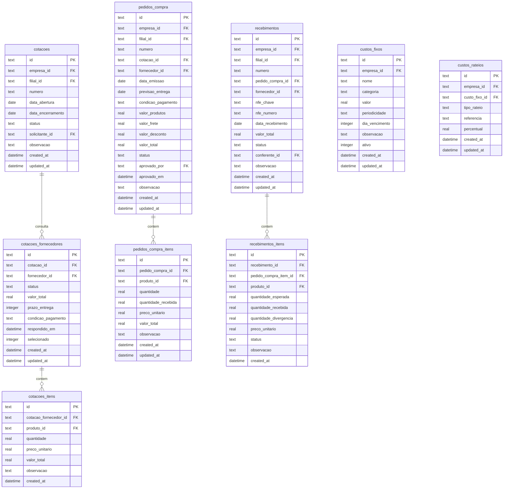
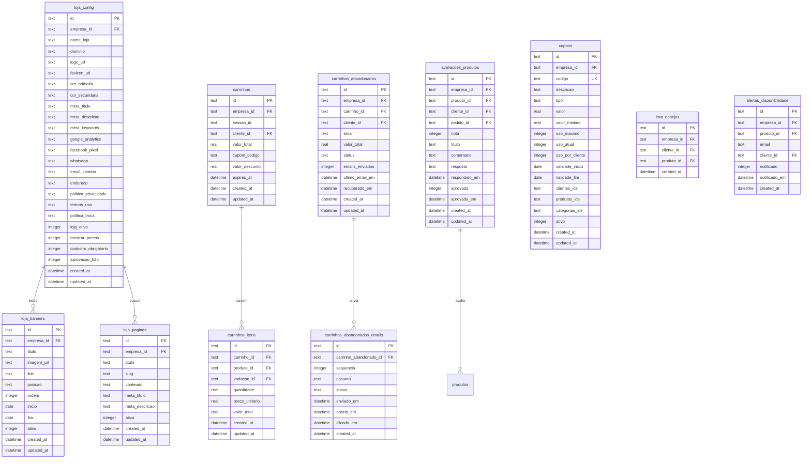

# 🗄️ MODELO DE DADOS - ERP PLANAC

## Diagrama Entidade-Relacionamento (DER)

**Versão:** 1.0  
**Data:** 03/12/2025  
**Responsável:** 🗄️ DBA DEV.com  
**Revisão:** 👨‍💻 CTO DEV.com

---

## 📊 Resumo Geral

| Módulo | Tabelas | Status |
|--------|---------|--------|
| 0. Base | 3 | ✅ |
| 1. Core | 10 | ✅ |
| 2. Cadastros | 18 | ✅ |
| 3. Estoque | 16 | ✅ |
| 4. Financeiro | 13 | ✅ |
| 5. Comercial (inclui Serviços) | 35 | ✅ |
| 5.11. PCP/Produção | 5 | ✅ |
| 6. Fiscal | 10 | ✅ |
| 7. Compras | 10 | ✅ |
| 8. Expedição | 8 | ✅ |
| 9. E-commerce | 11 | ✅ |
| 10. BI | 4 | ✅ |
| 11. RH (Base) | 14 | ✅ |
| 11.7. Recrutamento | 4 | ✅ |
| 11.8. Treinamentos | 5 | ✅ |
| 11.9. Avaliação Desempenho | 6 | ✅ |
| 12. Contratos | 4 | ✅ |
| 13. Contabilidade | 5 | ✅ |
| 14. Patrimônio | 6 | ✅ |
| 17. OmniPro | 7 | ✅ |
| 21. Workflows | 5 | ✅ |
| 25. Agenda | 4 | ✅ |
| 26. Central Ajuda | 6 | ✅ |
| **TOTAL** | **207** | ✅ |

---

## 📐 Convenções

### Nomenclatura
- Tabelas: `snake_case` no plural (ex: `clientes`, `pedidos_itens`)
- Colunas: `snake_case` (ex: `created_at`, `empresa_id`)
- PKs: `id` (UUID ou autoincrement)
- FKs: `tabela_id` (ex: `cliente_id`, `empresa_id`)

### Colunas Padrão (todas as tabelas)
```sql
id              TEXT PRIMARY KEY,  -- UUID
empresa_id      TEXT NOT NULL,     -- Multi-tenant
created_at      DATETIME DEFAULT CURRENT_TIMESTAMP,
updated_at      DATETIME DEFAULT CURRENT_TIMESTAMP,
created_by      TEXT,              -- user_id
updated_by      TEXT,              -- user_id
deleted_at      DATETIME,          -- Soft delete
```

### Tipos de Dados (SQLite/D1)
| Tipo | Uso |
|------|-----|
| TEXT | Strings, UUIDs, ENUMs |
| INTEGER | Números inteiros, booleanos (0/1) |
| REAL | Decimais (preços, quantidades) |
| DATETIME | Datas e timestamps |
| BLOB | Binários (raramente usado) |

---

# 📦 MÓDULO 0: BASE

## Diagrama


---

# 👤 MÓDULO 1: CORE (Usuários e Permissões)

## Diagrama


---

# 👥 MÓDULO 2: CADASTROS

## Diagrama - Clientes


## Diagrama - Fornecedores e Transportadoras


## Diagrama - Vendedores e Tabelas de Preço


---

# 📦 MÓDULO 3: ESTOQUE

## Diagrama - Produtos


## Diagrama - Estoque e Movimentações


---

# 💰 MÓDULO 4: FINANCEIRO

## Diagrama - Contas a Receber


## Diagrama - Contas a Pagar e Bancos


---

# 🛒 MÓDULO 5: COMERCIAL

## Diagrama - CRM


## Diagrama - Orçamentos


## Diagrama - Pedidos de Venda


## Diagrama - PDV


## Diagrama - Indicações, Devoluções, Trocas, Consignação, Garantia


---

# 🧾 MÓDULO 6: FISCAL

## Diagrama


---

# 📦 MÓDULO 7: COMPRAS

## Diagrama



---

# 🚚 MÓDULO 8: EXPEDIÇÃO

## Diagrama


---

# 🛒 MÓDULO 9: E-COMMERCE

## Diagrama



---

# 📊 MÓDULO 10: BI

## Diagrama


---

# 👥 MÓDULO 11: RH

## Diagrama


---

# 📄 MÓDULO 12: CONTRATOS

## Diagrama

```mermaid
erDiagram
    contratos ||--o{ contratos_aditivos : possui
    contratos ||--o{ contratos_documentos : anexa
    contratos ||--o{ contratos_historico : registra
    
    contratos {
        text id PK
        text empresa_id FK
        text numero
        text tipo
        text parte_tipo
        text parte_id
        text parte_nome
        text objeto
        text descricao
        date data_inicio
        date data_fim
        integer renovacao_automatica
        integer dias_aviso_vencimento
        real valor
        text periodicidade_valor
        text condicoes_pagamento
        text clausulas
        text arquivo_url
        text status
        text assinatura_digital_id
        datetime assinado_em
        text observacoes
        datetime created_at
        datetime updated_at
        datetime deleted_at
    }
    
    contratos_aditivos {
        text id PK
        text contrato_id FK
        text numero
        text tipo
        text descricao
        date data_aditivo
        date novo_fim
        real novo_valor
        text clausulas_alteradas
        text arquivo_url
        text status
        datetime created_at
        datetime updated_at
    }
    
    contratos_documentos {
        text id PK
        text contrato_id FK
        text tipo
        text descricao
        text arquivo_url
        datetime created_at
    }
    
    contratos_historico {
        text id PK
        text contrato_id FK
        text acao
        text descricao
        text usuario_id FK
        datetime created_at
    }
```

---

# 🔧 MÓDULO 5.9: SERVIÇOS (Ordens de Serviço)

## Diagrama

```mermaid
erDiagram
    ordens_servico ||--o{ ordens_servico_itens : contem
    ordens_servico ||--o{ ordens_servico_historico : registra
    ordens_servico }o--|| clientes : atende
    ordens_servico }o--o| pedidos : vinculado
    
    ordens_servico {
        text id PK
        text empresa_id FK
        text filial_id FK
        text numero
        text cliente_id FK
        text pedido_id FK
        text vendedor_id FK
        text tecnico_id FK
        text tipo
        text prioridade
        text titulo
        text descricao
        text equipamento
        text numero_serie
        text defeito_relatado
        text diagnostico
        text solucao
        date data_abertura
        date data_previsao
        date data_inicio
        date data_conclusao
        real valor_mao_obra
        real valor_pecas
        real valor_deslocamento
        real valor_desconto
        real valor_total
        text status
        text aprovado_por FK
        datetime aprovado_em
        text observacoes
        text observacoes_internas
        datetime created_at
        datetime updated_at
        datetime deleted_at
    }
    
    ordens_servico_itens {
        text id PK
        text ordem_servico_id FK
        text tipo
        text produto_id FK
        text descricao
        real quantidade
        real valor_unitario
        real valor_total
        datetime created_at
        datetime updated_at
    }
    
    ordens_servico_historico {
        text id PK
        text ordem_servico_id FK
        text status_anterior
        text status_novo
        text descricao
        text usuario_id FK
        datetime created_at
    }
```

---

# 📊 MÓDULO 13: CONTABILIDADE

## Diagrama

```mermaid
erDiagram
    contabil_plano_contas ||--o{ contabil_plano_contas : subconta
    contabil_plano_contas ||--o{ contabil_lancamentos : movimenta
    contabil_lancamentos ||--o{ contabil_lancamentos_itens : contem
    
    contabil_plano_contas {
        text id PK
        text empresa_id FK
        text conta_pai_id FK
        text codigo
        text descricao
        text tipo
        text natureza
        integer nivel
        integer analitica
        integer ativa
        datetime created_at
        datetime updated_at
    }
    
    contabil_lancamentos {
        text id PK
        text empresa_id FK
        text numero
        date data_lancamento
        date data_competencia
        text historico
        text origem
        text origem_id
        text tipo
        text status
        text usuario_id FK
        datetime created_at
        datetime updated_at
    }
    
    contabil_lancamentos_itens {
        text id PK
        text lancamento_id FK
        text conta_id FK
        text tipo
        real valor
        text historico_complementar
        text centro_custo
        datetime created_at
    }
    
    contabil_fechamentos {
        text id PK
        text empresa_id FK
        integer ano
        integer mes
        text status
        text usuario_abertura_id FK
        text usuario_fechamento_id FK
        datetime aberto_em
        datetime fechado_em
        text observacao
        datetime created_at
        datetime updated_at
    }
    
    contabil_dre {
        text id PK
        text empresa_id FK
        integer ano
        integer mes
        real receita_bruta
        real deducoes
        real receita_liquida
        real custo_mercadorias
        real lucro_bruto
        real despesas_operacionais
        real resultado_operacional
        real resultado_financeiro
        real resultado_antes_ir
        real provisao_ir_csll
        real lucro_liquido
        datetime gerado_em
        datetime created_at
    }
```

---

# 🏢 MÓDULO 14: PATRIMÔNIO

## Diagrama

```mermaid
erDiagram
    patrimonio_categorias ||--o{ patrimonio_bens : categoriza
    patrimonio_bens ||--o{ patrimonio_depreciacoes : deprecia
    patrimonio_bens ||--o{ patrimonio_movimentacoes : movimenta
    patrimonio_bens ||--o{ patrimonio_manutencoes : mantem
    
    patrimonio_categorias {
        text id PK
        text empresa_id FK
        text nome
        text descricao
        real taxa_depreciacao_anual
        integer vida_util_meses
        text conta_contabil_id FK
        text conta_depreciacao_id FK
        integer ativa
        datetime created_at
        datetime updated_at
    }
    
    patrimonio_bens {
        text id PK
        text empresa_id FK
        text filial_id FK
        text categoria_id FK
        text numero_patrimonio UK
        text descricao
        text marca
        text modelo
        text numero_serie
        text fornecedor_id FK
        text nota_fiscal
        date data_aquisicao
        real valor_aquisicao
        real valor_residual
        real valor_atual
        real depreciacao_acumulada
        text localizacao
        text responsavel_id FK
        text centro_custo
        text status
        date data_baixa
        text motivo_baixa
        real valor_baixa
        text observacoes
        text foto_url
        datetime created_at
        datetime updated_at
        datetime deleted_at
    }
    
    patrimonio_depreciacoes {
        text id PK
        text bem_id FK
        integer ano
        integer mes
        real valor_base
        real taxa
        real valor_depreciacao
        real depreciacao_acumulada
        real valor_residual
        text lancamento_contabil_id FK
        datetime created_at
    }
    
    patrimonio_movimentacoes {
        text id PK
        text bem_id FK
        text tipo
        text filial_origem_id FK
        text filial_destino_id FK
        text localizacao_origem
        text localizacao_destino
        text responsavel_origem_id FK
        text responsavel_destino_id FK
        text motivo
        text observacao
        text usuario_id FK
        datetime created_at
    }
    
    patrimonio_manutencoes {
        text id PK
        text bem_id FK
        text tipo
        text descricao
        text fornecedor_id FK
        date data_manutencao
        real valor
        text nota_fiscal
        text observacao
        datetime created_at
        datetime updated_at
    }
    
    patrimonio_seguros {
        text id PK
        text empresa_id FK
        text bem_id FK
        text seguradora
        text numero_apolice
        real valor_segurado
        real valor_premio
        date vigencia_inicio
        date vigencia_fim
        text cobertura
        text observacao
        integer ativo
        datetime created_at
        datetime updated_at
    }
```

---

# 🏭 MÓDULO 5.11: PCP (Produção)

## Diagrama

```mermaid
erDiagram
    producao_ordens ||--o{ producao_ordens_itens : contem
    producao_ordens ||--o{ producao_etapas : possui
    producao_etapas ||--o{ producao_apontamentos : registra
    produtos ||--o{ producao_ordens : produz
    
    producao_ordens {
        text id PK
        text empresa_id FK
        text filial_id FK
        text numero
        text produto_id FK
        real quantidade
        real quantidade_produzida
        text unidade
        date data_abertura
        date data_previsao
        date data_inicio
        date data_conclusao
        text prioridade
        text status
        text pedido_id FK
        real custo_previsto
        real custo_real
        text observacoes
        text usuario_abertura_id FK
        text usuario_fechamento_id FK
        datetime created_at
        datetime updated_at
    }
    
    producao_ordens_itens {
        text id PK
        text ordem_id FK
        text produto_id FK
        text tipo
        real quantidade_prevista
        real quantidade_consumida
        real custo_unitario
        text lote
        datetime created_at
        datetime updated_at
    }
    
    producao_etapas {
        text id PK
        text ordem_id FK
        integer sequencia
        text descricao
        text centro_trabalho
        real tempo_previsto_minutos
        real tempo_real_minutos
        text status
        datetime inicio_previsto
        datetime fim_previsto
        datetime inicio_real
        datetime fim_real
        text responsavel_id FK
        text observacao
        datetime created_at
        datetime updated_at
    }
    
    producao_apontamentos {
        text id PK
        text etapa_id FK
        text colaborador_id FK
        datetime inicio
        datetime fim
        real quantidade_produzida
        real quantidade_refugo
        text motivo_refugo
        text observacao
        datetime created_at
    }
    
    producao_centros_trabalho {
        text id PK
        text empresa_id FK
        text codigo
        text nome
        text descricao
        real capacidade_hora
        real custo_hora
        text responsavel_id FK
        integer ativo
        datetime created_at
        datetime updated_at
    }
```

---

# 👥 MÓDULO 27.7: RECRUTAMENTO E SELEÇÃO

## Diagrama

```mermaid
erDiagram
    vagas ||--o{ candidatos : recebe
    candidatos ||--o{ entrevistas : participa
    candidatos ||--o{ candidatos_historico : registra
    vagas }o--|| cargos : para
    
    vagas {
        text id PK
        text empresa_id FK
        text filial_id FK
        text cargo_id FK
        text departamento_id FK
        text titulo
        text descricao
        text requisitos
        text beneficios
        text tipo_contrato
        text regime
        real salario_de
        real salario_ate
        integer quantidade
        date data_abertura
        date data_encerramento
        text status
        text responsavel_id FK
        integer publica
        text url_externa
        datetime created_at
        datetime updated_at
    }
    
    candidatos {
        text id PK
        text empresa_id FK
        text vaga_id FK
        text nome
        text email
        text telefone
        text celular
        text whatsapp
        text cpf
        date data_nascimento
        text endereco_cidade
        text endereco_uf
        text linkedin
        text curriculo_url
        text foto_url
        text pretensao_salarial
        text disponibilidade
        text origem
        text etapa
        integer nota
        text observacoes
        text colaborador_id FK
        datetime contratado_em
        datetime created_at
        datetime updated_at
    }
    
    entrevistas {
        text id PK
        text candidato_id FK
        text tipo
        datetime data_hora
        text local
        text link_video
        text entrevistador_id FK
        text status
        integer nota
        text parecer
        text pontos_fortes
        text pontos_atencao
        integer aprovado
        datetime created_at
        datetime updated_at
    }
    
    candidatos_historico {
        text id PK
        text candidato_id FK
        text etapa_anterior
        text etapa_nova
        text descricao
        text usuario_id FK
        datetime created_at
    }
```

---

# 📚 MÓDULO 27.8: TREINAMENTOS

## Diagrama

```mermaid
erDiagram
    treinamentos ||--o{ treinamentos_turmas : possui
    treinamentos_turmas ||--o{ treinamentos_participantes : tem
    treinamentos_participantes ||--o{ certificados : gera
    
    treinamentos {
        text id PK
        text empresa_id FK
        text codigo
        text nome
        text descricao
        text tipo
        text modalidade
        integer carga_horaria
        text conteudo_programatico
        text pre_requisitos
        text instrutor_padrao
        integer obrigatorio
        integer validade_meses
        text categoria
        integer ativo
        datetime created_at
        datetime updated_at
    }
    
    treinamentos_turmas {
        text id PK
        text treinamento_id FK
        text codigo
        date data_inicio
        date data_fim
        text horario
        text local
        text instrutor_id FK
        text instrutor_externo
        integer vagas
        integer inscritos
        real custo_total
        text status
        text observacoes
        datetime created_at
        datetime updated_at
    }
    
    treinamentos_participantes {
        text id PK
        text turma_id FK
        text colaborador_id FK
        text status
        real nota
        real frequencia
        integer aprovado
        text observacao
        datetime inscrito_em
        datetime concluido_em
        datetime created_at
        datetime updated_at
    }
    
    certificados {
        text id PK
        text empresa_id FK
        text participante_id FK
        text colaborador_id FK
        text treinamento_id FK
        text codigo UK
        date data_emissao
        date data_validade
        text arquivo_url
        text hash_validacao
        datetime created_at
    }
    
    treinamentos_necessidades {
        text id PK
        text empresa_id FK
        text colaborador_id FK
        text treinamento_id FK
        text solicitante_id FK
        text justificativa
        text prioridade
        text status
        text aprovado_por FK
        datetime aprovado_em
        datetime created_at
        datetime updated_at
    }
```

---

# 📈 MÓDULO 27.9: AVALIAÇÃO DE DESEMPENHO

## Diagrama

```mermaid
erDiagram
    avaliacoes_ciclos ||--o{ avaliacoes : contem
    avaliacoes ||--o{ avaliacoes_respostas : possui
    avaliacoes_modelos ||--o{ avaliacoes_criterios : define
    avaliacoes_criterios ||--o{ avaliacoes_respostas : responde
    
    avaliacoes_ciclos {
        text id PK
        text empresa_id FK
        text nome
        text descricao
        integer ano
        text tipo
        date data_inicio
        date data_fim
        date prazo_autoavaliacao
        date prazo_gestor
        date prazo_calibracao
        text status
        datetime created_at
        datetime updated_at
    }
    
    avaliacoes_modelos {
        text id PK
        text empresa_id FK
        text nome
        text descricao
        text tipo
        integer ativo
        datetime created_at
        datetime updated_at
    }
    
    avaliacoes_criterios {
        text id PK
        text modelo_id FK
        text categoria
        text descricao
        text tipo_resposta
        real peso
        integer ordem
        integer obrigatorio
        datetime created_at
        datetime updated_at
    }
    
    avaliacoes {
        text id PK
        text empresa_id FK
        text ciclo_id FK
        text modelo_id FK
        text colaborador_id FK
        text avaliador_id FK
        text tipo
        text status
        real nota_final
        text classificacao
        text feedback_geral
        text pontos_fortes
        text pontos_melhoria
        text plano_desenvolvimento
        datetime autoavaliacao_em
        datetime avaliacao_gestor_em
        datetime calibrado_em
        datetime feedback_em
        datetime created_at
        datetime updated_at
    }
    
    avaliacoes_respostas {
        text id PK
        text avaliacao_id FK
        text criterio_id FK
        text tipo_avaliador
        real nota
        text comentario
        datetime created_at
        datetime updated_at
    }
    
    avaliacoes_metas_pdi {
        text id PK
        text avaliacao_id FK
        text colaborador_id FK
        text tipo
        text descricao
        text indicador
        text meta
        date prazo
        text status
        text resultado
        datetime concluido_em
        datetime created_at
        datetime updated_at
    }
```

---

# 📅 MÓDULO 25: AGENDA E CALENDÁRIO

## Diagrama

```mermaid
erDiagram
    agenda_eventos ||--o{ agenda_participantes : tem
    agenda_eventos ||--o{ agenda_lembretes : possui
    
    agenda_eventos {
        text id PK
        text empresa_id FK
        text titulo
        text descricao
        text tipo
        datetime data_inicio
        datetime data_fim
        integer dia_inteiro
        text local
        text link_virtual
        text cor
        text recorrencia
        text recorrencia_config
        text criador_id FK
        text cliente_id FK
        text lead_id FK
        text origem
        text origem_id
        text status
        integer privado
        datetime created_at
        datetime updated_at
    }
    
    agenda_participantes {
        text id PK
        text evento_id FK
        text usuario_id FK
        text email_externo
        text nome_externo
        text status
        text resposta
        datetime respondido_em
        datetime created_at
    }
    
    agenda_lembretes {
        text id PK
        text evento_id FK
        text usuario_id FK
        integer minutos_antes
        text tipo
        integer enviado
        datetime enviado_em
        datetime created_at
    }
    
    agenda_disponibilidade {
        text id PK
        text empresa_id FK
        text usuario_id FK
        integer dia_semana
        time hora_inicio
        time hora_fim
        integer ativo
        datetime created_at
        datetime updated_at
    }
```

---

# 🎧 MÓDULO 26: CENTRAL DE AJUDA E TICKETS

## Diagrama

```mermaid
erDiagram
    ajuda_categorias ||--o{ ajuda_categorias : subcategoria
    ajuda_categorias ||--o{ ajuda_artigos : contem
    ajuda_artigos ||--o{ ajuda_artigos_avaliacoes : avaliado
    tickets ||--o{ tickets_mensagens : possui
    tickets ||--o{ tickets_historico : registra
    
    ajuda_categorias {
        text id PK
        text empresa_id FK
        text categoria_pai_id FK
        text nome
        text descricao
        text icone
        integer ordem
        integer publica
        integer ativa
        datetime created_at
        datetime updated_at
    }
    
    ajuda_artigos {
        text id PK
        text empresa_id FK
        text categoria_id FK
        text titulo
        text slug
        text conteudo
        text tags
        integer visualizacoes
        integer publica
        integer destaque
        text autor_id FK
        datetime publicado_em
        datetime created_at
        datetime updated_at
    }
    
    ajuda_artigos_avaliacoes {
        text id PK
        text artigo_id FK
        text usuario_id FK
        integer util
        text comentario
        datetime created_at
    }
    
    tickets {
        text id PK
        text empresa_id FK
        text numero UK
        text assunto
        text descricao
        text categoria
        text prioridade
        text status
        text cliente_id FK
        text solicitante_id FK
        text atribuido_id FK
        text canal
        datetime primeira_resposta_em
        datetime resolvido_em
        datetime fechado_em
        integer avaliacao_nota
        text avaliacao_comentario
        datetime created_at
        datetime updated_at
    }
    
    tickets_mensagens {
        text id PK
        text ticket_id FK
        text autor_id FK
        text tipo
        text mensagem
        text anexos
        integer interno
        datetime created_at
    }
    
    tickets_historico {
        text id PK
        text ticket_id FK
        text campo
        text valor_anterior
        text valor_novo
        text usuario_id FK
        datetime created_at
    }
```

---

# 💬 MÓDULO 17: OMNIPRO (Atendimento Multicanal)

## Diagrama

```mermaid
erDiagram
    omni_canais ||--o{ omni_conversas : recebe
    omni_conversas ||--o{ omni_mensagens : possui
    omni_templates ||--o{ omni_mensagens : usa
    
    omni_canais {
        text id PK
        text empresa_id FK
        text tipo
        text nome
        text identificador
        text token
        text webhook_url
        text configuracoes
        integer ativo
        datetime created_at
        datetime updated_at
    }
    
    omni_conversas {
        text id PK
        text empresa_id FK
        text canal_id FK
        text cliente_id FK
        text contato_externo
        text nome_contato
        text atendente_id FK
        text departamento
        text status
        text etiquetas
        datetime iniciada_em
        datetime ultima_mensagem_em
        datetime finalizada_em
        text motivo_finalizacao
        integer avaliacao_nota
        text avaliacao_comentario
        datetime created_at
        datetime updated_at
    }
    
    omni_mensagens {
        text id PK
        text conversa_id FK
        text direcao
        text tipo
        text conteudo
        text midia_url
        text midia_tipo
        text template_id FK
        text status
        text id_externo
        datetime enviada_em
        datetime entregue_em
        datetime lida_em
        text erro
        datetime created_at
    }
    
    omni_templates {
        text id PK
        text empresa_id FK
        text canal_tipo
        text nome
        text categoria
        text idioma
        text conteudo
        text variaveis
        text botoes
        text status_aprovacao
        text id_externo
        integer ativo
        datetime created_at
        datetime updated_at
    }
    
    omni_respostas_rapidas {
        text id PK
        text empresa_id FK
        text titulo
        text atalho
        text conteudo
        text categoria
        text usuario_id FK
        integer compartilhada
        integer ativa
        datetime created_at
        datetime updated_at
    }
    
    omni_filas {
        text id PK
        text empresa_id FK
        text nome
        text descricao
        text departamento
        text atendentes_ids
        integer tempo_max_espera
        text mensagem_espera
        integer ativa
        datetime created_at
        datetime updated_at
    }
    
    omni_horarios {
        text id PK
        text empresa_id FK
        text nome
        integer dia_semana
        time hora_inicio
        time hora_fim
        text mensagem_fora_horario
        integer ativo
        datetime created_at
        datetime updated_at
    }
```

---

# ⚡ MÓDULO 21: WORKFLOWS E AUTOMAÇÕES

## Diagrama

```mermaid
erDiagram
    workflows ||--o{ workflows_etapas : possui
    workflows ||--o{ workflows_execucoes : executa
    workflows_execucoes ||--o{ workflows_execucoes_logs : registra
    
    workflows {
        text id PK
        text empresa_id FK
        text nome
        text descricao
        text gatilho_tipo
        text gatilho_config
        text modulo
        text entidade
        integer ativo
        text criado_por FK
        datetime created_at
        datetime updated_at
    }
    
    workflows_etapas {
        text id PK
        text workflow_id FK
        integer ordem
        text tipo
        text nome
        text descricao
        text acao
        text configuracao
        text condicao
        integer ativo
        datetime created_at
        datetime updated_at
    }
    
    workflows_execucoes {
        text id PK
        text workflow_id FK
        text entidade_id
        text status
        text dados_entrada
        text dados_saida
        datetime iniciado_em
        datetime finalizado_em
        text erro
        datetime created_at
    }
    
    workflows_execucoes_logs {
        text id PK
        text execucao_id FK
        text etapa_id FK
        integer ordem
        text status
        text entrada
        text saida
        text erro
        integer duracao_ms
        datetime created_at
    }
    
    workflows_agendamentos {
        text id PK
        text empresa_id FK
        text workflow_id FK
        text nome
        text cron_expression
        text ultimo_status
        datetime ultima_execucao
        datetime proxima_execucao
        integer ativo
        datetime created_at
        datetime updated_at
    }
```

---

# 📋 ÍNDICE DE TABELAS POR MÓDULO

## Módulo 0: Base (3 tabelas)
- empresas
- filiais
- configuracoes

## Módulo 1: Core (10 tabelas)
- usuarios
- perfis
- permissoes
- perfis_permissoes
- usuarios_perfis
- usuarios_sessoes
- usuarios_tokens
- audit_logs
- notificacoes
- alcadas_aprovacao

## Módulo 2: Cadastros (18 tabelas)
- clientes
- clientes_enderecos
- clientes_contatos
- clientes_documentos
- fornecedores
- fornecedores_enderecos
- fornecedores_contatos
- transportadoras
- transportadoras_faixas_frete
- vendedores
- vendedores_comissoes
- vendedores_metas
- tabelas_preco
- tabelas_preco_itens
- formas_pagamento
- formas_pagamento_parcelas

## Módulo 3: Estoque (16 tabelas)
- categorias
- unidades_medida
- produtos
- produtos_fotos
- produtos_variacoes
- produtos_fornecedores
- estoque
- estoque_movimentacoes
- estoque_reservas
- estoque_transferencias
- estoque_transferencias_itens
- inventarios
- inventarios_itens
- kits
- kits_itens

## Módulo 4: Financeiro (13 tabelas)
- contas_receber
- contas_receber_baixas
- contas_receber_historico
- clientes_creditos
- clientes_creditos_movimentacoes
- contas_pagar
- contas_pagar_baixas
- contas_pagar_aprovacoes
- contas_bancarias
- movimentacoes_bancarias
- conciliacoes
- cobrancas_regua
- cobrancas_enviadas

## Módulo 5: Comercial (35 tabelas)
### 5.1-5.8 - CRM, Orçamentos, Vendas, PDV
- crm_leads
- crm_atividades
- crm_historico
- orcamentos
- orcamentos_itens
- orcamentos_pagamentos
- orcamentos_historico
- pedidos
- pedidos_itens
- pedidos_entregas
- pedidos_entregas_itens
- pedidos_pagamentos
- pedidos_aprovacoes
- pedidos_historico
- pdv_caixas
- pdv_movimentacoes
- pdv_vendas
- pdv_vendas_itens
- pdv_vendas_pagamentos
### 5.6-5.8 - Indicações, Devolução, Troca
- indicacoes
- indicacoes_creditos
- devolucoes
- devolucoes_itens
- trocas
- trocas_itens_devolvidos
- trocas_itens_novos
### 5.9 - Serviços
- ordens_servico
- ordens_servico_itens
- ordens_servico_historico
### 5.10-5.12 - Consignação, Garantia, Gamificação
- consignacoes
- consignacoes_itens
- garantias
- garantias_historico
- gamificacao_metas
- gamificacao_pontos
- gamificacao_premios
- gamificacao_resgates

## Módulo 5.11: PCP/Produção (5 tabelas)
- producao_ordens
- producao_ordens_itens
- producao_etapas
- producao_apontamentos
- producao_centros_trabalho

## Módulo 6: Fiscal (10 tabelas)
- cfop
- ncm
- nfe
- nfe_itens
- nfe_pagamentos
- nfe_eventos
- nfce
- nfce_itens
- nfse
- sped_arquivos

## Módulo 7: Compras (10 tabelas)
- cotacoes
- cotacoes_fornecedores
- cotacoes_itens
- pedidos_compra
- pedidos_compra_itens
- recebimentos
- recebimentos_itens
- custos_fixos
- custos_rateios

## Módulo 8: Expedição (8 tabelas)
- motoristas
- veiculos
- veiculos_motoristas
- rotas
- rotas_entregas
- entregas_rastreamento
- entregas_ocorrencias
- entregas_tentativas

## Módulo 9: E-commerce (11 tabelas)
- loja_config
- loja_banners
- loja_paginas
- carrinhos
- carrinhos_itens
- carrinhos_abandonados
- carrinhos_abandonados_emails
- cupons
- avaliacoes_produtos
- lista_desejos
- alertas_disponibilidade

## Módulo 10: BI (4 tabelas)
- dashboards
- dashboards_widgets
- relatorios
- relatorios_execucoes

## Módulo 11: RH - Base (14 tabelas)
- departamentos
- cargos
- colaboradores
- colaboradores_dependentes
- colaboradores_documentos
- pontos
- pontos_ajustes
- banco_horas
- ferias
- afastamentos
- folha_pagamento
- folha_pagamento_eventos
- beneficios
- colaboradores_beneficios

## Módulo 11.7: RH - Recrutamento (4 tabelas)
- vagas
- candidatos
- entrevistas
- candidatos_historico

## Módulo 11.8: RH - Treinamentos (5 tabelas)
- treinamentos
- treinamentos_turmas
- treinamentos_participantes
- certificados
- treinamentos_necessidades

## Módulo 11.9: RH - Avaliação de Desempenho (6 tabelas)
- avaliacoes_ciclos
- avaliacoes_modelos
- avaliacoes_criterios
- avaliacoes
- avaliacoes_respostas
- avaliacoes_metas_pdi

## Módulo 12: Contratos (4 tabelas)
- contratos
- contratos_aditivos
- contratos_documentos
- contratos_historico

## Módulo 13: Contabilidade (4 tabelas)
- contabil_plano_contas
- contabil_lancamentos
- contabil_lancamentos_itens
- contabil_fechamentos
- contabil_dre

## Módulo 14: Patrimônio (6 tabelas)
- patrimonio_categorias
- patrimonio_bens
- patrimonio_depreciacoes
- patrimonio_movimentacoes
- patrimonio_manutencoes
- patrimonio_seguros

## Módulo 17: OmniPro (7 tabelas)
- omni_canais
- omni_conversas
- omni_mensagens
- omni_templates
- omni_respostas_rapidas
- omni_filas
- omni_horarios

## Módulo 21: Workflows (5 tabelas)
- workflows
- workflows_etapas
- workflows_execucoes
- workflows_execucoes_logs
- workflows_agendamentos

## Módulo 25: Agenda (4 tabelas)
- agenda_eventos
- agenda_participantes
- agenda_lembretes
- agenda_disponibilidade

## Módulo 26: Central de Ajuda (6 tabelas)
- ajuda_categorias
- ajuda_artigos
- ajuda_artigos_avaliacoes
- tickets
- tickets_mensagens
- tickets_historico

---

## 📊 ESTATÍSTICAS FINAIS

| Métrica | Valor |
|---------|-------|
| **Total de Tabelas** | **180** |
| **Módulos** | 18 |
| **Maior Módulo** | Comercial (35 tabelas) |
| **Campos WhatsApp** | ✅ clientes, fornecedores, transportadoras, vendedores, candidatos |

---

*Modelo de Dados v1.1 - COMPLETO*  
*🗄️ DBA DEV.com*  
*03/12/2024*
