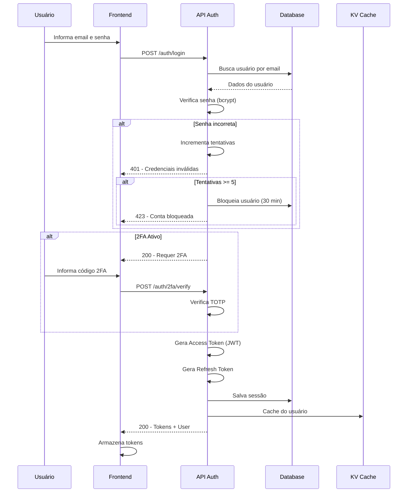
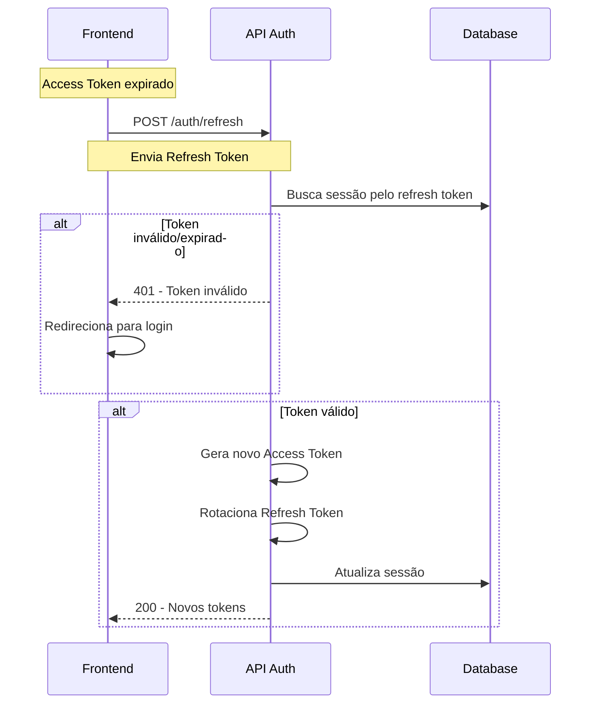
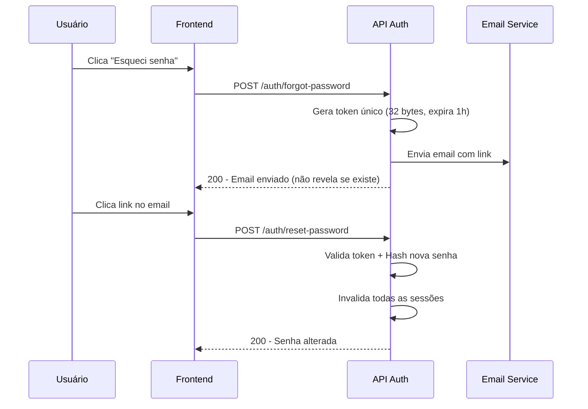
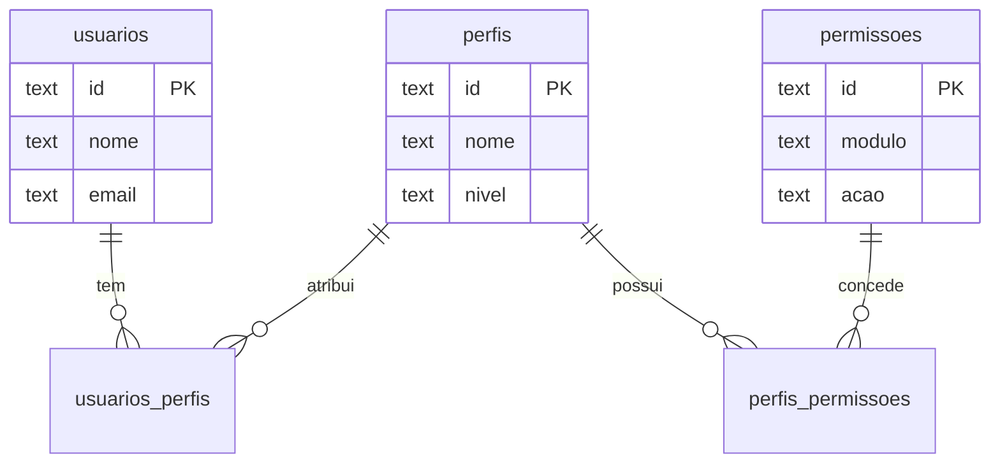

# 🔐 DOCUMENTAÇÃO DE SEGURANÇA - ERP PLANAC

## Especificação de Segurança e Proteção de Dados

**Versão:** 1.0  
**Data:** 03/12/2024  
**Responsável:** 🔐 Especialista em Segurança DEV.com  
**Revisão:** 👨‍💻 CTO DEV.com

---

## 📊 Índice

1. [Visão Geral](#1-visão-geral)
2. [Autenticação](#2-autenticação)
3. [Autorização](#3-autorização)
4. [Multi-Tenant](#4-multi-tenant)
5. [LGPD e Privacidade](#5-lgpd-e-privacidade)
6. [Criptografia](#6-criptografia)
7. [Segurança de API](#7-segurança-de-api)
8. [Audit Log](#8-audit-log)
9. [Proteção contra Ataques](#9-proteção-contra-ataques)
10. [Backup e Recuperação](#10-backup-e-recuperação)
11. [Checklist de Implementação](#11-checklist-de-implementação)

---

# 1. VISÃO GERAL

## 1.1 Princípios de Segurança

| Princípio | Descrição |
|-----------|-----------|
| **Defense in Depth** | Múltiplas camadas de segurança |
| **Least Privilege** | Mínimo acesso necessário |
| **Zero Trust** | Verificar sempre, nunca confiar |
| **Secure by Default** | Configurações seguras por padrão |
| **Privacy by Design** | Privacidade desde a concepção |

## 1.2 Arquitetura de Segurança

```
┌─────────────────────────────────────────────────────────────────┐
│                        CLIENTE (Browser/App)                     │
└─────────────────────────────────────────────────────────────────┘
                                │
                                │ HTTPS (TLS 1.3)
                                ▼
┌─────────────────────────────────────────────────────────────────┐
│                     CLOUDFLARE EDGE                              │
│  ┌─────────────┐  ┌─────────────┐  ┌─────────────┐              │
│  │   WAF       │  │  DDoS       │  │   Rate      │              │
│  │  Firewall   │  │  Protection │  │   Limiting  │              │
│  └─────────────┘  └─────────────┘  └─────────────┘              │
└─────────────────────────────────────────────────────────────────┘
                                │
                                ▼
┌─────────────────────────────────────────────────────────────────┐
│                     API GATEWAY (Worker)                         │
│  ┌─────────────┐  ┌─────────────┐  ┌─────────────┐              │
│  │   Auth      │  │   CORS      │  │   Input     │              │
│  │   Check     │  │   Headers   │  │   Validation│              │
│  └─────────────┘  └─────────────┘  └─────────────┘              │
└─────────────────────────────────────────────────────────────────┘
                                │
                                ▼
┌─────────────────────────────────────────────────────────────────┐
│                     WORKERS (Módulos)                            │
│  ┌─────────────┐  ┌─────────────┐  ┌─────────────┐              │
│  │  Permission │  │   Tenant    │  │   Audit     │              │
│  │   Check     │  │   Isolation │  │   Logging   │              │
│  └─────────────┘  └─────────────┘  └─────────────┘              │
└─────────────────────────────────────────────────────────────────┘
                                │
                                ▼
┌─────────────────────────────────────────────────────────────────┐
│                     DATABASE (D1)                                │
│  ┌─────────────┐  ┌─────────────┐  ┌─────────────┐              │
│  │  Encrypted  │  │   Row       │  │   Soft      │              │
│  │   at Rest   │  │   Level Sec │  │   Delete    │              │
│  └─────────────┘  └─────────────┘  └─────────────┘              │
└─────────────────────────────────────────────────────────────────┘
```

---

# 2. AUTENTICAÇÃO

## 2.1 Fluxo de Login



## 2.2 Estrutura do JWT (Access Token)

```json
{
  "header": {
    "alg": "HS256",
    "typ": "JWT"
  },
  "payload": {
    "sub": "user_uuid",
    "emp": "empresa_uuid",
    "fil": "filial_uuid",
    "name": "Nome do Usuário",
    "email": "user@email.com",
    "roles": ["admin", "vendedor"],
    "perms": ["vendas.criar", "vendas.editar"],
    "iat": 1701619200,
    "exp": 1701622800,
    "jti": "token_unique_id"
  }
}
```

## 2.3 Configurações de Tokens

| Parâmetro | Valor | Descrição |
|-----------|-------|-----------|
| **Access Token TTL** | 1 hora | Tempo de vida do token de acesso |
| **Refresh Token TTL** | 7 dias | Tempo de vida do token de refresh |
| **Refresh Token (Lembrar-me)** | 30 dias | Se marcar "lembrar-me" |
| **Algoritmo** | HS256 | HMAC SHA-256 |
| **Secret Key** | 256 bits | Armazenada em Secrets |

## 2.4 Refresh Token Flow



## 2.5 Autenticação de Dois Fatores (2FA)

### Especificações TOTP

| Parâmetro | Valor |
|-----------|-------|
| Algoritmo | TOTP (RFC 6238) |
| Dígitos | 6 |
| Período | 30 segundos |
| Janela de tolerância | ±1 período |
| Códigos de backup | 10 códigos únicos |

## 2.6 Recuperação de Senha



## 2.7 Políticas de Senha

| Regra | Requisito |
|-------|-----------|
| **Comprimento mínimo** | 8 caracteres |
| **Comprimento máximo** | 128 caracteres |
| **Maiúsculas** | Mínimo 1 |
| **Minúsculas** | Mínimo 1 |
| **Números** | Mínimo 1 |
| **Caracteres especiais** | Mínimo 1 (!@#$%^&*) |
| **Histórico** | Não repetir últimas 5 |
| **Bloqueio** | 5 tentativas = 30 min bloqueio |

## 2.8 Gerenciamento de Sessões

### Funcionalidades

- ✅ Ver todas as sessões ativas
- ✅ Encerrar sessão específica
- ✅ Encerrar todas as outras sessões
- ✅ Notificação de novo login
- ✅ Detecção de login suspeito (IP/dispositivo diferente)

---

# 3. AUTORIZAÇÃO

## 3.1 Modelo RBAC (Role-Based Access Control)



## 3.2 Estrutura de Permissões

### Formato: `modulo.acao`

```
Exemplos:
- clientes.visualizar
- clientes.criar
- clientes.editar
- clientes.excluir
- vendas.aprovar_desconto
- financeiro.estornar
- configuracoes.usuarios
```

## 3.3 Perfis Padrão

| Perfil | Nível | Descrição |
|--------|-------|-----------|
| **Super Admin** | 0 | Acesso total ao sistema |
| **Admin Empresa** | 1 | Admin de uma empresa específica |
| **Gerente** | 2 | Gerencia equipe e aprova operações |
| **Supervisor** | 3 | Supervisiona operações |
| **Vendedor** | 4 | Operações de venda |
| **Financeiro** | 4 | Operações financeiras |
| **Estoquista** | 4 | Operações de estoque |
| **Atendente** | 5 | Atendimento e suporte |
| **Visualizador** | 6 | Apenas visualização |

## 3.4 Matriz de Permissões

```
┌─────────────────┬────────┬────────┬────────┬────────┬────────┬────────┐
│ Módulo/Ação     │ Admin  │Gerente │Superv. │Vendedor│Financ. │Visual. │
├─────────────────┼────────┼────────┼────────┼────────┼────────┼────────┤
│ CLIENTES        │        │        │        │        │        │        │
│  visualizar     │   ✅   │   ✅   │   ✅   │   ✅   │   ✅   │   ✅   │
│  criar          │   ✅   │   ✅   │   ✅   │   ✅   │   ❌   │   ❌   │
│  editar         │   ✅   │   ✅   │   ✅   │   ✅   │   ❌   │   ❌   │
│  excluir        │   ✅   │   ✅   │   ❌   │   ❌   │   ❌   │   ❌   │
├─────────────────┼────────┼────────┼────────┼────────┼────────┼────────┤
│ VENDAS          │        │        │        │        │        │        │
│  visualizar     │   ✅   │   ✅   │   ✅   │   ✅*  │   ✅   │   ✅   │
│  criar          │   ✅   │   ✅   │   ✅   │   ✅   │   ❌   │   ❌   │
│  aprovar_desc   │   ✅   │   ✅   │   ❌   │   ❌   │   ❌   │   ❌   │
├─────────────────┼────────┼────────┼────────┼────────┼────────┼────────┤
│ FINANCEIRO      │        │        │        │        │        │        │
│  visualizar     │   ✅   │   ✅   │   ✅   │   ❌   │   ✅   │   ✅   │
│  baixar         │   ✅   │   ✅   │   ❌   │   ❌   │   ✅   │   ❌   │
│  estornar       │   ✅   │   ✅   │   ❌   │   ❌   │   ❌   │   ❌   │
├─────────────────┼────────┼────────┼────────┼────────┼────────┼────────┤
│ CONFIGURAÇÕES   │        │        │        │        │        │        │
│  visualizar     │   ✅   │   ✅   │   ❌   │   ❌   │   ❌   │   ❌   │
│  editar         │   ✅   │   ❌   │   ❌   │   ❌   │   ❌   │   ❌   │
└─────────────────┴────────┴────────┴────────┴────────┴────────┴────────┘

* = Apenas próprios registros
```

## 3.5 Verificação de Permissão (Middleware)

```typescript
// Middleware de autorização
async function checkPermission(request, requiredPermission) {
  const user = request.user;
  
  // Super Admin tem acesso total
  if (user.roles.includes('super_admin')) return true;
  
  // Verifica permissão específica
  if (user.permissions.includes(requiredPermission)) return true;
  
  // Verifica permissão curinga do módulo
  const [modulo] = requiredPermission.split('.');
  if (user.permissions.includes(`${modulo}.*`)) return true;
  
  return false;
}
```

## 3.6 Alçadas de Aprovação

| Tipo | Valor | Aprovador |
|------|-------|-----------|
| Desconto % | > 10% | Supervisor |
| Desconto % | > 20% | Gerente |
| Desconto % | > 30% | Diretor |
| Venda valor | > R$ 50.000 | Gerente |
| Venda valor | > R$ 100.000 | Diretor |
| Compra | > R$ 10.000 | Gerente |
| Bonificação | Qualquer | Gerente |

---

# 4. MULTI-TENANT

## 4.1 Estratégia de Isolamento

**Abordagem:** Row-Level Security (RLS) com `empresa_id`

```
┌────────────────────────────────────────────────────────────┐
│                    TABELA: clientes                         │
├────────────────────────────────────────────────────────────┤
│ id       │ empresa_id │ nome        │ ...                  │
├────────────────────────────────────────────────────────────┤
│ cli_001  │ emp_001    │ Cliente A1  │ ... (Empresa A)      │
│ cli_002  │ emp_001    │ Cliente A2  │ ... (Empresa A)      │
│ cli_003  │ emp_002    │ Cliente B1  │ ... (Empresa B)      │
│ cli_004  │ emp_003    │ Cliente C1  │ ... (Empresa C)      │
└────────────────────────────────────────────────────────────┘
```

## 4.2 Implementação

```typescript
// Todas as queries passam pelo tenant wrapper
class TenantQuery {
  constructor(empresaId) {
    this.empresaId = empresaId;
  }
  
  // SELECT sempre filtra por empresa
  async findMany(table, where = {}) {
    return db.query(`
      SELECT * FROM ${table}
      WHERE empresa_id = ?
      AND deleted_at IS NULL
    `, [this.empresaId]);
  }
  
  // INSERT sempre inclui empresa_id
  async create(table, data) {
    return db.query(`
      INSERT INTO ${table} (empresa_id, ...)
      VALUES (?, ...)
    `, [this.empresaId, ...]);
  }
}
```

---

# 5. LGPD E PRIVACIDADE

## 5.1 Dados Pessoais Identificados

| Categoria | Exemplos | Tabelas |
|-----------|----------|---------|
| **Identificação** | Nome, CPF, RG, CNH | clientes, colaboradores |
| **Contato** | Email, telefone, endereço | clientes_enderecos |
| **Financeiros** | Conta bancária | colaboradores |
| **Saúde** | Atestados, afastamentos | afastamentos |
| **Biométricos** | Foto, digital (ponto) | colaboradores, pontos |

## 5.2 Classificação de Sensibilidade

```
🔴 ALTO RISCO
   - Dados de saúde (atestados, CID)
   - Dados biométricos
   - Dados financeiros bancários

🟡 MÉDIO RISCO
   - CPF, RG, CNH
   - Endereço residencial
   - Salário

🟢 BAIXO RISCO
   - Nome
   - Email comercial
   - Telefone comercial
```

## 5.3 Bases Legais para Tratamento

| Base Legal | Uso no ERP |
|------------|------------|
| **Execução de contrato** | Dados de clientes para vendas |
| **Obrigação legal** | Dados fiscais, trabalhistas |
| **Legítimo interesse** | Marketing para clientes ativos |
| **Consentimento** | Newsletter, promoções |

## 5.4 Direitos do Titular

### Direito de Acesso (Art. 18, II)

```typescript
// GET /api/lgpd/meus-dados
async function exportarMeusDados(titularId) {
  return {
    dadosPessoais: await getDadosPessoais(titularId),
    enderecos: await getEnderecos(titularId),
    pedidos: await getPedidos(titularId),
    consentimentos: await getConsentimentos(titularId),
  };
}
```

### Direito de Eliminação (Art. 18, VI)

```typescript
// Anonimização de dados
async function anonimizarDados(titularId) {
  await db.update('clientes', titularId, {
    nome_razao: 'ANONIMIZADO',
    cpf_cnpj: 'ANONIMIZADO',
    email: `anonimo_${titularId}@removed.local`,
    telefone: 'ANONIMIZADO',
    anonimizado: 1,
  });
}
```

## 5.5 Retenção de Dados

| Tipo de Dado | Prazo | Base Legal |
|--------------|-------|------------|
| Notas Fiscais | 5 anos | Legislação fiscal |
| Dados trabalhistas | 5 anos após desligamento | CLT |
| Logs de acesso | 6 meses | Marco Civil |
| Dados cliente inativo | 2 anos | Legítimo interesse |

---

# 6. CRIPTOGRAFIA

## 6.1 Senhas

| Parâmetro | Valor |
|-----------|-------|
| Algoritmo | bcrypt |
| Salt rounds | 12 |
| Output | 60 caracteres |

```typescript
import bcrypt from 'bcryptjs';

// Hash de senha
async function hashPassword(password) {
  return bcrypt.hash(password, 12);
}

// Verificação
async function verifyPassword(password, hash) {
  return bcrypt.compare(password, hash);
}
```

## 6.2 Dados Sensíveis

### Campos Criptografados (AES-256-GCM)

| Tabela | Campo | Motivo |
|--------|-------|--------|
| usuarios | two_factor_secret | Segredo 2FA |
| empresas | certificado_senha | Certificado digital |
| colaboradores | pis | Dado trabalhista |
| contas_bancarias | conta, agencia | Dados bancários |

## 6.3 Dados em Trânsito/Repouso

| Camada | Proteção |
|--------|----------|
| Cliente ↔ Cloudflare | TLS 1.3 |
| Cloudflare D1 | Criptografia automática |
| Cloudflare R2 | Criptografia automática |
| Cloudflare KV | Criptografia automática |

---

# 7. SEGURANÇA DE API

## 7.1 Headers de Segurança

```typescript
// Headers obrigatórios
headers.set('X-Frame-Options', 'DENY');
headers.set('X-Content-Type-Options', 'nosniff');
headers.set('X-XSS-Protection', '1; mode=block');
headers.set('Referrer-Policy', 'strict-origin-when-cross-origin');
headers.set('Strict-Transport-Security', 'max-age=31536000; includeSubDomains');
headers.set('Content-Security-Policy', "default-src 'self'; ...");
```

## 7.2 CORS

```typescript
const ALLOWED_ORIGINS = [
  'https://app.planac.com.br',
  'https://admin.planac.com.br',
  'http://localhost:3000', // Dev only
];
```

## 7.3 Rate Limiting

| Endpoint | Limite | Janela |
|----------|--------|--------|
| `/auth/login` | 5 | 15 min |
| `/auth/forgot-password` | 3 | 1 hora |
| `/api/*` (autenticado) | 1000 | 1 min |
| `/api/*` (não autenticado) | 100 | 1 min |

## 7.4 Validação de Entrada (Zod)

```typescript
import { z } from 'zod';

const clienteSchema = z.object({
  nome_razao: z.string().min(3).max(200).trim(),
  cpf_cnpj: z.string().refine(validarCpfCnpj),
  email: z.string().email().toLowerCase().optional(),
  limite_credito: z.number().min(0).max(1000000).optional(),
});
```

---

# 8. AUDIT LOG

## 8.1 Estrutura

```sql
CREATE TABLE audit_logs (
    id TEXT PRIMARY KEY,
    empresa_id TEXT NOT NULL,
    usuario_id TEXT,
    acao TEXT NOT NULL,          -- login, criar, editar, excluir
    modulo TEXT NOT NULL,        -- clientes, vendas, financeiro
    tabela TEXT,
    registro_id TEXT,
    dados_antes TEXT,            -- JSON
    dados_depois TEXT,           -- JSON
    campos_alterados TEXT,       -- JSON array
    ip_address TEXT,
    user_agent TEXT,
    created_at DATETIME DEFAULT CURRENT_TIMESTAMP
);
```

## 8.2 Ações Auditadas

| Categoria | Ações |
|-----------|-------|
| **Autenticação** | login, logout, login_falha, senha_alterada, 2fa_ativado |
| **CRUD** | criar, visualizar, editar, excluir |
| **Financeiro** | baixa, estorno, aprovacao |
| **Estoque** | entrada, saida, ajuste, transferencia |
| **Fiscal** | nfe_emitida, nfe_cancelada |
| **Sistema** | config_alterada, permissao_alterada |

---

# 9. PROTEÇÃO CONTRA ATAQUES

## 9.1 SQL Injection

```typescript
// ❌ NUNCA
const query = `SELECT * FROM clientes WHERE nome LIKE '%${termo}%'`;

// ✅ SEMPRE usar prepared statements
const query = db.prepare('SELECT * FROM clientes WHERE nome LIKE ?');
const result = await query.bind(`%${termo}%`).all();
```

## 9.2 XSS (Cross-Site Scripting)

```typescript
// React já escapa por padrão
<div>{userInput}</div>

// Backend: sanitizar HTML
const descricao = sanitizeHtml(request.body.descricao);
```

## 9.3 CSRF

```typescript
// Double Submit Cookie
const cookieToken = getCookie(request, 'csrf_token');
const headerToken = request.headers.get('X-CSRF-Token');

if (cookieToken !== headerToken) {
  throw new ForbiddenError('Token CSRF inválido');
}
```

## 9.4 Brute Force

```typescript
// Proteção em login
const attempts = await kv.get(`login_attempts:${email}`);

if (attempts >= 5) {
  throw new TooManyRequestsError('Conta bloqueada por 30 min');
}
```

## 9.5 Upload de Arquivos

```typescript
const ALLOWED_TYPES = ['image/jpeg', 'image/png', 'application/pdf'];
const MAX_SIZE = 10 * 1024 * 1024; // 10MB

// Validar tipo MIME, tamanho, extensão e magic bytes
```

## 9.6 DDoS

**Proteção via Cloudflare:**
- ✅ WAF (Web Application Firewall)
- ✅ DDoS Protection (L3/L4/L7)
- ✅ Rate Limiting
- ✅ Bot Management

---

# 10. BACKUP E RECUPERAÇÃO

## 10.1 Estratégia de Backup

| Tipo | Frequência | Retenção |
|------|------------|----------|
| Automático D1 | Contínuo | 30 dias |
| Snapshot D1 | Diário | 90 dias |
| Export completo | Semanal | 1 ano |

## 10.2 RPO e RTO

| Métrica | Objetivo |
|---------|----------|
| **RPO** (Recovery Point Objective) | 1 hora |
| **RTO** (Recovery Time Objective) | 4 horas |

## 10.3 Procedimento de Recuperação

```
1. IDENTIFICAR O INCIDENTE
2. COMUNICAR stakeholders
3. ISOLAR (bloquear acesso se necessário)
4. RECUPERAR do backup
5. VALIDAR integridade
6. RETORNAR (liberar acesso gradualmente)
7. POST-MORTEM (documentar)
```

---

# 11. CHECKLIST DE IMPLEMENTAÇÃO

## 11.1 Autenticação
- [ ] Login com email/senha
- [ ] Hash de senha (bcrypt)
- [ ] JWT (Access Token)
- [ ] Refresh Token
- [ ] Logout
- [ ] 2FA (TOTP)
- [ ] Recuperação de senha
- [ ] Bloqueio após tentativas
- [ ] Gerenciamento de sessões

## 11.2 Autorização
- [ ] Sistema de perfis
- [ ] Sistema de permissões
- [ ] Middleware de autorização
- [ ] Alçadas de aprovação
- [ ] Restrição por filial
- [ ] Perfis padrão
- [ ] Matriz de permissões

## 11.3 Multi-Tenant
- [ ] Filtro por empresa_id
- [ ] Middleware de tenant
- [ ] Testes de isolamento

## 11.4 LGPD
- [ ] Classificar dados pessoais
- [ ] Implementar consentimento
- [ ] Exportação de dados
- [ ] Anonimização
- [ ] Política de retenção
- [ ] RIPD (Relatório de Impacto)

## 11.5 Segurança de API
- [ ] Configurar CORS
- [ ] Headers de segurança
- [ ] Rate limiting
- [ ] Validação (Zod)
- [ ] Sanitização

## 11.6 Criptografia
- [ ] bcrypt para senhas
- [ ] AES-256 para dados sensíveis
- [ ] Secrets no Cloudflare

## 11.7 Audit Log
- [ ] Tabela audit_logs
- [ ] Serviço de auditoria
- [ ] Integrar em repositórios
- [ ] Interface de consulta

## 11.8 Proteções
- [ ] Prepared statements (SQL Injection)
- [ ] Sanitizar HTML (XSS)
- [ ] Proteção CSRF
- [ ] Validar uploads
- [ ] WAF no Cloudflare

## 11.9 Backup
- [ ] Backups automáticos
- [ ] Testar restauração
- [ ] Documentar DR

---

# 📊 RESUMO

| Área | Status |
|------|--------|
| Autenticação | ✅ Documentado |
| Autorização (RBAC) | ✅ Documentado |
| Multi-Tenant | ✅ Documentado |
| LGPD | ✅ Documentado |
| Criptografia | ✅ Documentado |
| Segurança de API | ✅ Documentado |
| Audit Log | ✅ Documentado |
| Proteção contra Ataques | ✅ Documentado |
| Backup e DR | ✅ Documentado |
| Checklist | ✅ Documentado |

---

*Documentação de Segurança v1.0*  
*🔐 Especialista em Segurança DEV.com*  
*03/12/2024*
