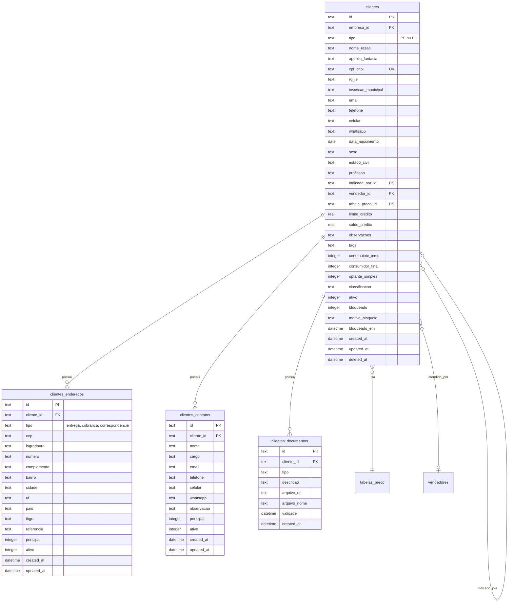

# 🗄️ Modelo de Dados - Módulo Cadastros

**Última atualização:** 26/12/2025

---

## 📊 Diagrama ER - Clientes



---

## 📊 Diagrama ER - Fornecedores


---

## 📊 Diagrama ER - Produtos


---

## 📋 Tabelas do Módulo

| Tabela | Registros | Descrição |
|--------|-----------|-----------|
| `clientes` | ~500 | Clientes PF/PJ |
| `clientes_enderecos` | ~800 | Endereços dos clientes |
| `clientes_contatos` | ~600 | Contatos dos clientes |
| `clientes_documentos` | ~200 | Documentos anexados |
| `fornecedores` | ~50 | Fornecedores |
| `fornecedores_enderecos` | ~80 | Endereços fornecedores |
| `fornecedores_contatos` | ~100 | Contatos fornecedores |
| `produtos` | ~2000 | Catálogo de produtos |
| `produtos_fotos` | ~1500 | Fotos dos produtos |
| `produtos_fornecedores` | ~3000 | Relação produto-fornecedor |
| `categorias` | ~50 | Categorias de produtos |
| `unidades_medida` | ~20 | Unidades (UN, M², KG) |
| `usuarios` | ~30 | Usuários do sistema |
| `perfis` | ~10 | Perfis de acesso |
| `empresas` | ~3 | Matriz e filiais |

---

## 🔑 Índices Importantes

```sql
-- Clientes
CREATE INDEX idx_clientes_cpf_cnpj ON clientes(cpf_cnpj);
CREATE INDEX idx_clientes_empresa ON clientes(empresa_id);
CREATE INDEX idx_clientes_vendedor ON clientes(vendedor_id);
CREATE INDEX idx_clientes_ativo ON clientes(ativo);

-- Produtos
CREATE INDEX idx_produtos_codigo ON produtos(codigo);
CREATE INDEX idx_produtos_codigo_barras ON produtos(codigo_barras);
CREATE INDEX idx_produtos_empresa ON produtos(empresa_id);
CREATE INDEX idx_produtos_categoria ON produtos(categoria_id);
CREATE INDEX idx_produtos_ativo ON produtos(ativo);

-- Fornecedores
CREATE INDEX idx_fornecedores_cnpj ON fornecedores(cnpj_cpf);
CREATE INDEX idx_fornecedores_empresa ON fornecedores(empresa_id);
```
