# Fluxogramas - Módulo Comercial

Este documento contém os fluxogramas de processo do módulo comercial.

## 1. Fluxo de Venda Completa

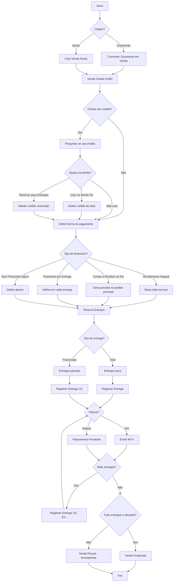

---

## 2. Fluxo de Orçamento (Mesclar/Desmembrar)

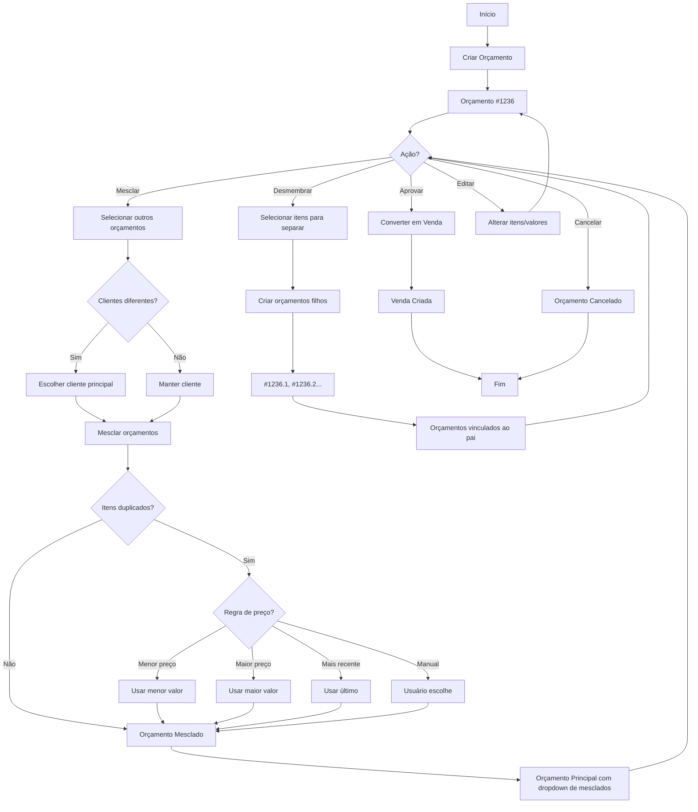

---

## 3. Fluxo de Uso de Crédito na Venda

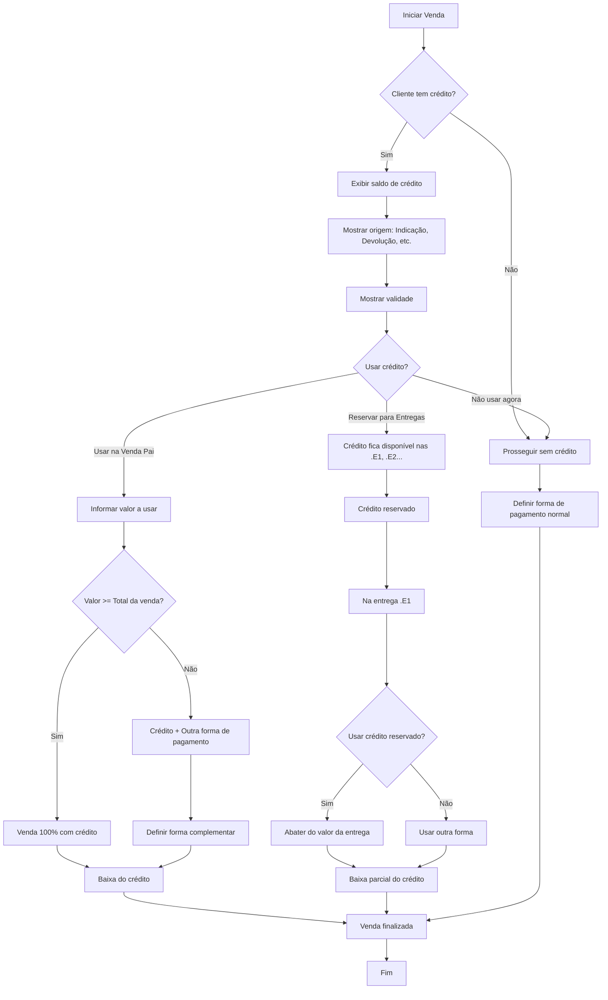

---

## 4. Fluxo de Devolução de Venda

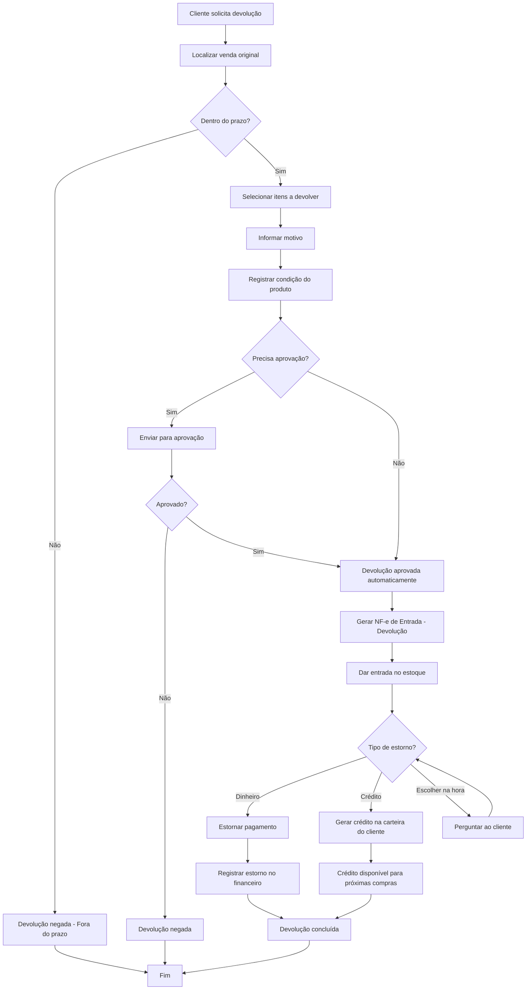

---

## 5. Fluxo de Troca de Venda

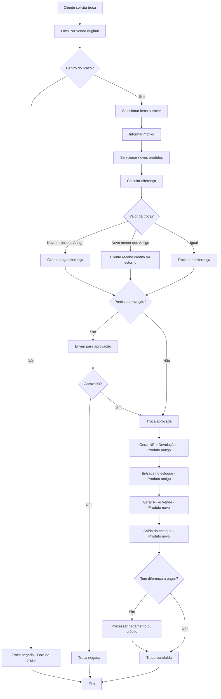

---

## 6. Fluxo de Consignação

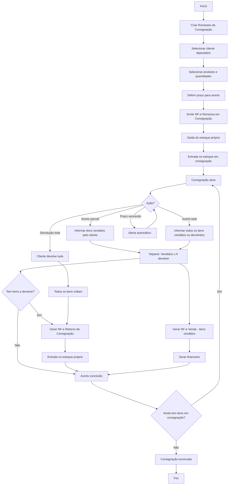

---

## 12. Fluxo de Garantia de Produtos

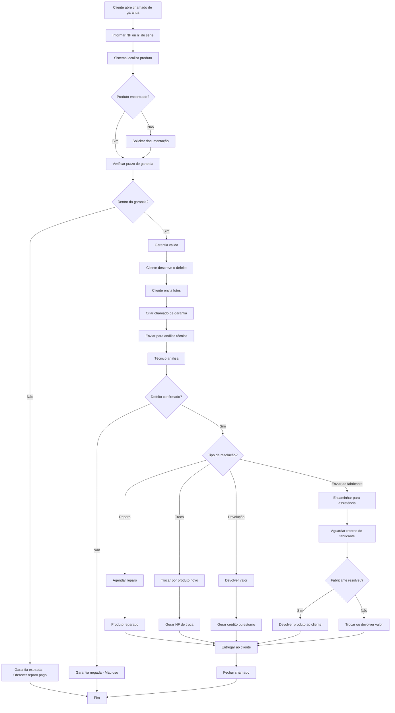

---

## 19. Fluxo de Precificação

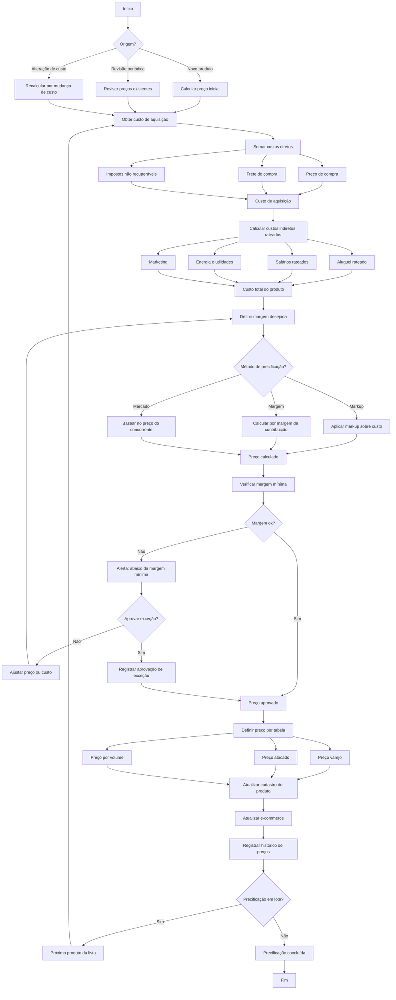

---

## 20. Fluxo de Bonificação (Venda)

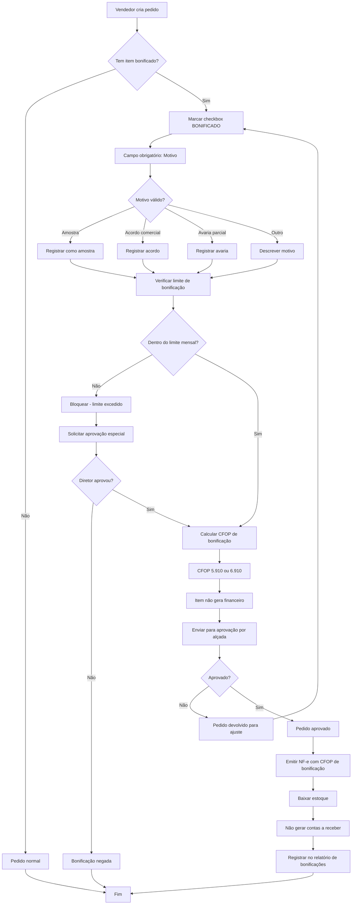

---

## 21. Fluxo de Limite de Crédito

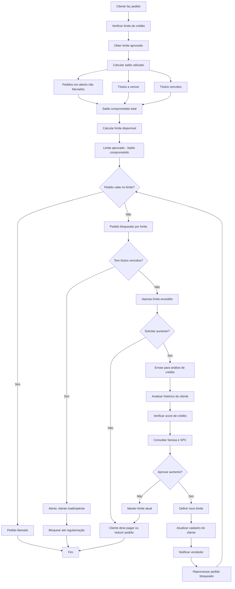

---

## 24. Fluxo do PDV (Ponto de Venda)

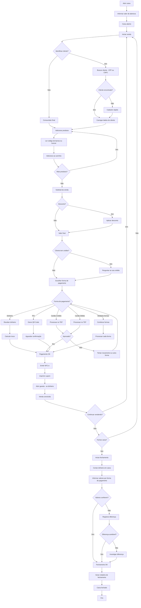

---

