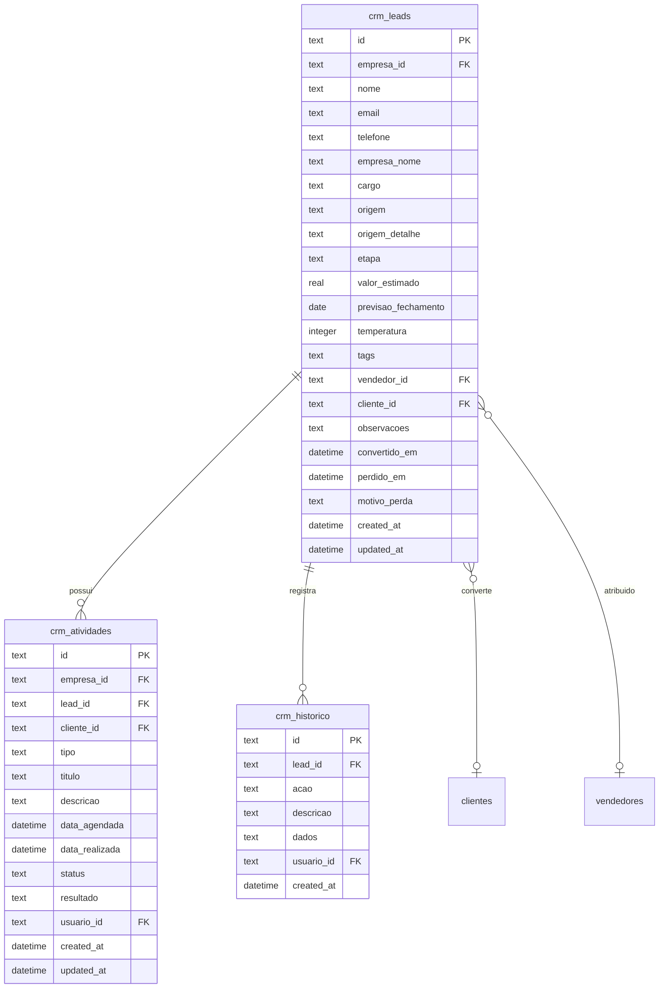
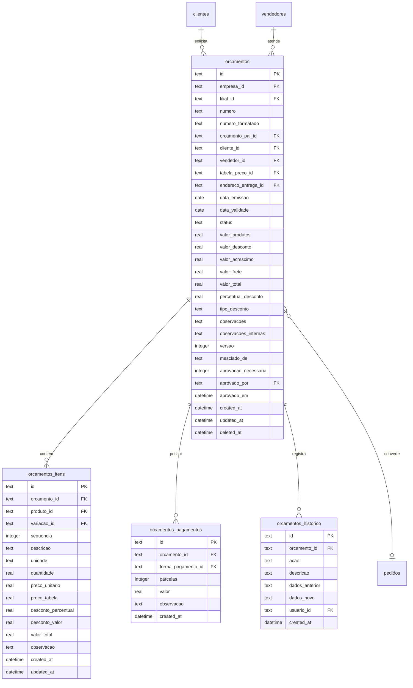
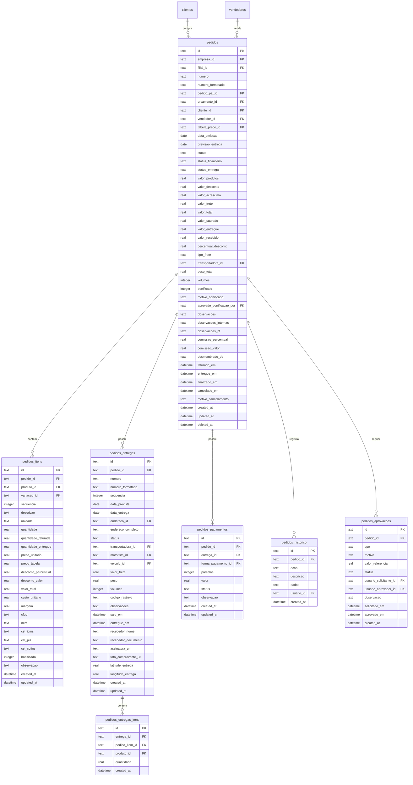
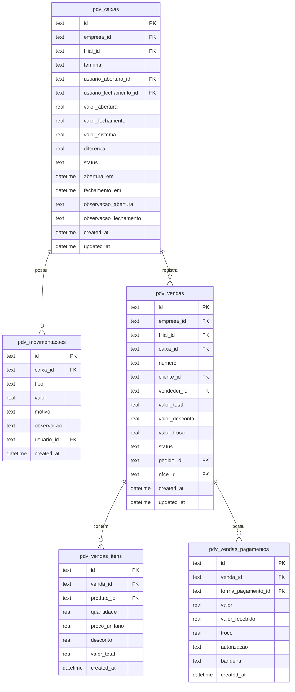

# 🛒 MÓDULO 5: COMERCIAL

## Diagrama - CRM

## Diagrama - Orçamentos

## Diagrama - Pedidos de Venda

## Diagrama - PDV

## Diagrama - Indicações, Devoluções, Trocas, Consignação, Garantia

```mermaid
erDiagram
    indicacoes ||--o{ indicacoes_creditos : gera
    clientes ||--o{ indicacoes : indica
    devolucoes ||--o{ devolucoes_itens : contem
    trocas ||--o{ trocas_itens_devolvidos : recebe
    trocas ||--o{ trocas_itens_novos : entrega
    consignacoes ||--o{ consignacoes_itens : contem
    garantias ||--o{ garantias_historico : registra
    
    indicacoes {
        text id PK
        text empresa_id FK
        text indicador_id FK
        text indicado_id FK
        text codigo
        text status
        real valor_geracao
        real credito_gerado
        datetime convertido_em
        datetime created_at
        datetime updated_at
    }
    
    indicacoes_creditos {
        text id PK
        text indicacao_id FK
        text indicador_id FK
        text pedido_id FK
        real valor_pedido
        real percentual
        real valor_credito
        text status
        text credito_cliente_id FK
        datetime creditado_em
        datetime created_at
    }
    
    devolucoes {
        text id PK
        text empresa_id FK
        text filial_id FK
        text numero
        text pedido_id FK
        text cliente_id FK
        text motivo
        text tipo_estorno
        real valor_total
        text status
        text aprovado_por FK
        datetime aprovado_em
        text nfe_entrada_id FK
        text credito_gerado_id FK
        text observacao
        datetime created_at
        datetime updated_at
    }
    
    devolucoes_itens {
        text id PK
        text devolucao_id FK
        text pedido_item_id FK
        text produto_id FK
        real quantidade
        real valor_unitario
        real valor_total
        text estado_produto
        text observacao
        datetime created_at
    }
    
    trocas {
        text id PK
        text empresa_id FK
        text filial_id FK
        text numero
        text pedido_original_id FK
        text cliente_id FK
        real valor_devolucao
        real valor_novos
        real diferenca
        text tipo_diferenca
        text status
        text aprovado_por FK
        datetime aprovado_em
        text observacao
        datetime created_at
        datetime updated_at
    }
    
    trocas_itens_devolvidos {
        text id PK
        text troca_id FK
        text produto_id FK
        real quantidade
        real valor_unitario
        real valor_total
        datetime created_at
    }
    
    trocas_itens_novos {
        text id PK
        text troca_id FK
        text produto_id FK
        real quantidade
        real valor_unitario
        real valor_total
        datetime created_at
    }
    
    consignacoes {
        text id PK
        text empresa_id FK
        text filial_id FK
        text numero
        text cliente_id FK
        date data_saida
        date data_retorno_previsto
        date data_acerto
        real valor_total
        real valor_vendido
        real valor_devolvido
        text status
        text observacao
        text nfe_saida_id FK
        text nfe_retorno_id FK
        datetime created_at
        datetime updated_at
    }
    
    consignacoes_itens {
        text id PK
        text consignacao_id FK
        text produto_id FK
        real quantidade_enviada
        real quantidade_vendida
        real quantidade_devolvida
        real valor_unitario
        text status
        datetime created_at
        datetime updated_at
    }
    
    garantias {
        text id PK
        text empresa_id FK
        text filial_id FK
        text numero
        text cliente_id FK
        text pedido_id FK
        text pedido_item_id FK
        text produto_id FK
        text defeito_relatado
        text analise_tecnica
        text status
        text resolucao
        text aprovado_por FK
        datetime aprovado_em
        datetime prazo_resposta
        text observacao
        datetime created_at
        datetime updated_at
    }
    
    garantias_historico {
        text id PK
        text garantia_id FK
        text status_anterior
        text status_novo
        text descricao
        text usuario_id FK
        datetime created_at
    }
    
    gamificacao_metas {
        text id PK
        text empresa_id FK
        text nome
        text tipo
        text periodo
        real valor_meta
        real pontos_premio
        text descricao
        integer ativo
        datetime created_at
        datetime updated_at
    }
    
    gamificacao_pontos {
        text id PK
        text empresa_id FK
        text vendedor_id FK
        text meta_id FK
        text origem
        text origem_id
        real valor_base
        integer pontos
        datetime created_at
    }
    
    gamificacao_premios {
        text id PK
        text empresa_id FK
        text nome
        text descricao
        integer pontos_necessarios
        text tipo
        real valor
        integer quantidade_disponivel
        integer ativo
        datetime created_at
        datetime updated_at
    }
    
    gamificacao_resgates {
        text id PK
        text empresa_id FK
        text vendedor_id FK
        text premio_id FK
        integer pontos_usados
        text status
        datetime resgatado_em
        datetime entregue_em
        datetime created_at
    }
```

---

