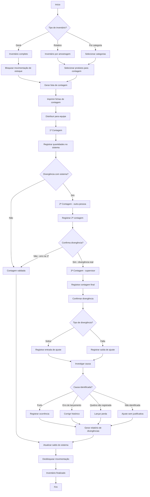

# Fluxogramas - Módulo Estoque

Este documento contém os fluxogramas de processo do módulo de estoque.

## 14. Fluxo de Inventário

```mermaid
flowchart TD
    A[Início] --> B{Tipo de inventário?}
    
    B -->|Geral| C[Inventário completo]
    B -->|Rotativo| D[Inventário por amostragem]
    B -->|Por categoria| E[Selecionar categorias]
    
    C --> F[Bloquear movimentação de estoque]
    D --> G[Selecionar produtos para contagem]
    E --> G
    
    F --> H[Gerar lista de contagem]
    G --> H
    
    H --> I[Imprimir fichas de contagem]
    I --> J[Distribuir para equipe]
    
    J --> K[1ª Contagem]
    K --> L[Registrar quantidades no sistema]
    
    L --> M{Divergência com sistema?}
    M -->|Não| N[Contagem validada]
    M -->|Sim| O[2ª Contagem - outra pessoa]
    
    O --> P[Registrar 2ª contagem]
    P --> Q{Confirma divergência?}
    
    Q -->|Não - erro na 1ª| N
    Q -->|Sim - divergência real| R[3ª Contagem - supervisor]
    
    R --> S[Registrar contagem final]
    S --> T[Confirmar divergência]
    
    T --> U{Tipo de divergência?}
    U -->|Sobra| V[Registrar entrada de ajuste]
    U -->|Falta| W[Registrar saída de ajuste]
    
    V --> X[Investigar causa]
    W --> X
    
    X --> Y{Causa identificada?}
    Y -->|Furto| Z[Registrar ocorrência]
    Y -->|Erro de lançamento| AA[Corrigir histórico]
    Y -->|Quebra não registrada| AB[Lançar perda]
    Y -->|Não identificada| AC[Ajuste sem justificativa]
    
    Z --> AD[Gerar relatório de divergências]
    AA --> AD
    AB --> AD
    AC --> AD
    
    N --> AE[Atualizar saldo do sistema]
    AD --> AE
    
    AE --> AF[Desbloquear movimentação]
    AF --> AG[Inventário finalizado]
    
    AG --> AH[Fim]
```

---

