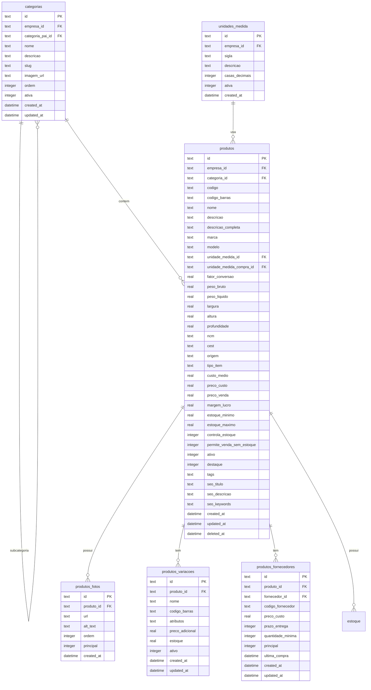
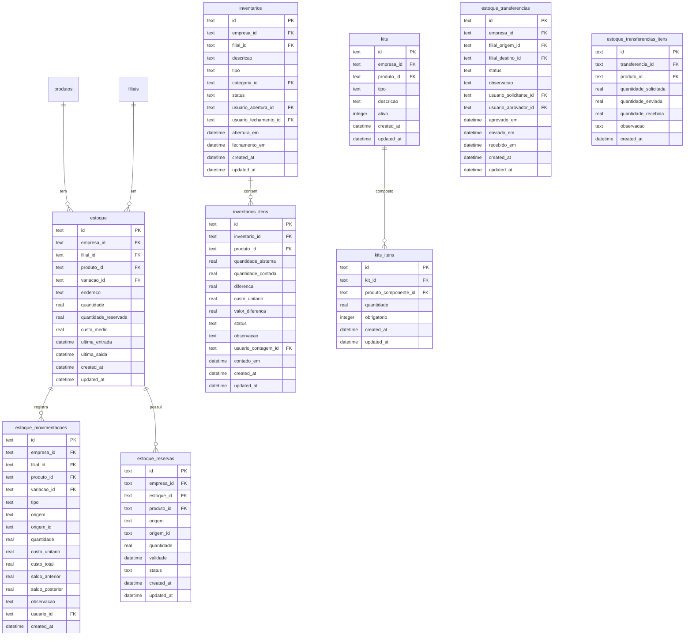

# 📦 MÓDULO 3: ESTOQUE

## Diagrama - Produtos

```mermaid
erDiagram
    categorias ||--o{ categorias : subcategoria
    categorias ||--o{ produtos : contem
    produtos ||--o{ produtos_fotos : possui
    produtos ||--o{ produtos_variacoes : tem
    produtos ||--o{ produtos_fornecedores : tem
    produtos ||--o{ estoque : possui
    unidades_medida ||--o{ produtos : usa
    
    categorias {
        text id PK
        text empresa_id FK
        text categoria_pai_id FK
        text nome
        text descricao
        text slug
        text imagem_url
        integer ordem
        integer ativa
        datetime created_at
        datetime updated_at
    }
    
    unidades_medida {
        text id PK
        text empresa_id FK
        text sigla
        text descricao
        integer casas_decimais
        integer ativa
        datetime created_at
    }
    
    produtos {
        text id PK
        text empresa_id FK
        text categoria_id FK
        text codigo
        text codigo_barras
        text nome
        text descricao
        text descricao_completa
        text marca
        text modelo
        text unidade_medida_id FK
        text unidade_medida_compra_id FK
        real fator_conversao
        real peso_bruto
        real peso_liquido
        real largura
        real altura
        real profundidade
        text ncm
        text cest
        text origem
        text tipo_item
        real custo_medio
        real preco_custo
        real preco_venda
        real margem_lucro
        real estoque_minimo
        real estoque_maximo
        integer controla_estoque
        integer permite_venda_sem_estoque
        integer ativo
        integer destaque
        text tags
        text seo_titulo
        text seo_descricao
        text seo_keywords
        datetime created_at
        datetime updated_at
        datetime deleted_at
    }
    
    produtos_fotos {
        text id PK
        text produto_id FK
        text url
        text alt_text
        integer ordem
        integer principal
        datetime created_at
    }
    
    produtos_variacoes {
        text id PK
        text produto_id FK
        text nome
        text codigo_barras
        text atributos
        real preco_adicional
        real estoque
        integer ativo
        datetime created_at
        datetime updated_at
    }
    
    produtos_fornecedores {
        text id PK
        text produto_id FK
        text fornecedor_id FK
        text codigo_fornecedor
        real preco_custo
        integer prazo_entrega
        integer quantidade_minima
        integer principal
        datetime ultima_compra
        datetime created_at
        datetime updated_at
    }
```

## Diagrama - Estoque e Movimentações

```mermaid
erDiagram
    estoque ||--o{ estoque_movimentacoes : registra
    estoque ||--o{ estoque_reservas : possui
    produtos ||--o{ estoque : tem
    filiais ||--o{ estoque : em
    inventarios ||--o{ inventarios_itens : contem
    kits ||--o{ kits_itens : composto
    
    estoque {
        text id PK
        text empresa_id FK
        text filial_id FK
        text produto_id FK
        text variacao_id FK
        text endereco
        real quantidade
        real quantidade_reservada
        real custo_medio
        datetime ultima_entrada
        datetime ultima_saida
        datetime created_at
        datetime updated_at
    }
    
    estoque_movimentacoes {
        text id PK
        text empresa_id FK
        text filial_id FK
        text produto_id FK
        text variacao_id FK
        text tipo
        text origem
        text origem_id
        real quantidade
        real custo_unitario
        real custo_total
        real saldo_anterior
        real saldo_posterior
        text observacao
        text usuario_id FK
        datetime created_at
    }
    
    estoque_reservas {
        text id PK
        text empresa_id FK
        text estoque_id FK
        text produto_id FK
        text origem
        text origem_id
        real quantidade
        datetime validade
        text status
        datetime created_at
        datetime updated_at
    }
    
    estoque_transferencias {
        text id PK
        text empresa_id FK
        text filial_origem_id FK
        text filial_destino_id FK
        text status
        text observacao
        text usuario_solicitante_id FK
        text usuario_aprovador_id FK
        datetime aprovado_em
        datetime enviado_em
        datetime recebido_em
        datetime created_at
        datetime updated_at
    }
    
    estoque_transferencias_itens {
        text id PK
        text transferencia_id FK
        text produto_id FK
        real quantidade_solicitada
        real quantidade_enviada
        real quantidade_recebida
        text observacao
        datetime created_at
    }
    
    inventarios {
        text id PK
        text empresa_id FK
        text filial_id FK
        text descricao
        text tipo
        text categoria_id FK
        text status
        text usuario_abertura_id FK
        text usuario_fechamento_id FK
        datetime abertura_em
        datetime fechamento_em
        datetime created_at
        datetime updated_at
    }
    
    inventarios_itens {
        text id PK
        text inventario_id FK
        text produto_id FK
        real quantidade_sistema
        real quantidade_contada
        real diferenca
        real custo_unitario
        real valor_diferenca
        text status
        text observacao
        text usuario_contagem_id FK
        datetime contado_em
        datetime created_at
        datetime updated_at
    }
    
    kits {
        text id PK
        text empresa_id FK
        text produto_id FK
        text tipo
        text descricao
        integer ativo
        datetime created_at
        datetime updated_at
    }
    
    kits_itens {
        text id PK
        text kit_id FK
        text produto_componente_id FK
        real quantidade
        integer obrigatorio
        datetime created_at
        datetime updated_at
    }
```

---

