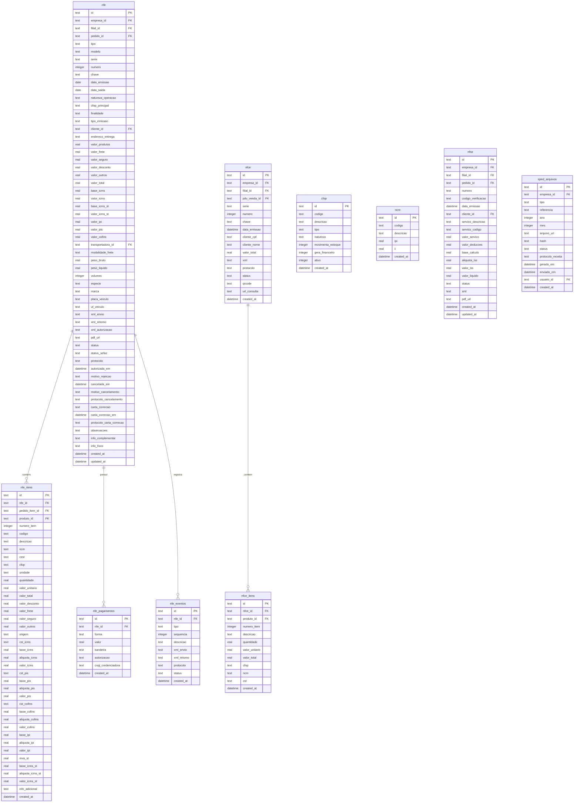

# 🧾 MÓDULO 6: FISCAL

## Diagrama

```mermaid
erDiagram
    nfe ||--o{ nfe_itens : contem
    nfe ||--o{ nfe_pagamentos : possui
    nfe ||--o{ nfe_eventos : registra
    nfce ||--o{ nfce_itens : contem
    
    cfop {
        text id PK
        text codigo
        text descricao
        text tipo
        text natureza
        integer movimenta_estoque
        integer gera_financeiro
        integer ativo
        datetime created_at
    }
    
    ncm {
        text id PK
        text codigo
        text descricao
        real ipi
        real ii
        datetime created_at
    }
    
    nfe {
        text id PK
        text empresa_id FK
        text filial_id FK
        text pedido_id FK
        text tipo
        text modelo
        text serie
        integer numero
        text chave
        date data_emissao
        date data_saida
        text natureza_operacao
        text cfop_principal
        text finalidade
        text tipo_emissao
        text cliente_id FK
        text endereco_entrega
        real valor_produtos
        real valor_frete
        real valor_seguro
        real valor_desconto
        real valor_outros
        real valor_total
        real base_icms
        real valor_icms
        real base_icms_st
        real valor_icms_st
        real valor_ipi
        real valor_pis
        real valor_cofins
        text transportadora_id FK
        text modalidade_frete
        real peso_bruto
        real peso_liquido
        integer volumes
        text especie
        text marca
        text placa_veiculo
        text uf_veiculo
        text xml_envio
        text xml_retorno
        text xml_autorizacao
        text pdf_url
        text status
        text status_sefaz
        text protocolo
        datetime autorizada_em
        text motivo_rejeicao
        datetime cancelada_em
        text motivo_cancelamento
        text protocolo_cancelamento
        text carta_correcao
        datetime carta_correcao_em
        text protocolo_carta_correcao
        text observacoes
        text info_complementar
        text info_fisco
        datetime created_at
        datetime updated_at
    }
    
    nfe_itens {
        text id PK
        text nfe_id FK
        text pedido_item_id FK
        text produto_id FK
        integer numero_item
        text codigo
        text descricao
        text ncm
        text cest
        text cfop
        text unidade
        real quantidade
        real valor_unitario
        real valor_total
        real valor_desconto
        real valor_frete
        real valor_seguro
        real valor_outros
        text origem
        text cst_icms
        real base_icms
        real aliquota_icms
        real valor_icms
        text cst_pis
        real base_pis
        real aliquota_pis
        real valor_pis
        text cst_cofins
        real base_cofins
        real aliquota_cofins
        real valor_cofins
        real base_ipi
        real aliquota_ipi
        real valor_ipi
        real mva_st
        real base_icms_st
        real aliquota_icms_st
        real valor_icms_st
        text info_adicional
        datetime created_at
    }
    
    nfe_pagamentos {
        text id PK
        text nfe_id FK
        text forma
        real valor
        text bandeira
        text autorizacao
        text cnpj_credenciadora
        datetime created_at
    }
    
    nfe_eventos {
        text id PK
        text nfe_id FK
        text tipo
        integer sequencia
        text descricao
        text xml_envio
        text xml_retorno
        text protocolo
        text status
        datetime created_at
    }
    
    nfce {
        text id PK
        text empresa_id FK
        text filial_id FK
        text pdv_venda_id FK
        text serie
        integer numero
        text chave
        datetime data_emissao
        text cliente_cpf
        text cliente_nome
        real valor_total
        text xml
        text protocolo
        text status
        text qrcode
        text url_consulta
        datetime created_at
    }
    
    nfce_itens {
        text id PK
        text nfce_id FK
        text produto_id FK
        integer numero_item
        text descricao
        real quantidade
        real valor_unitario
        real valor_total
        text cfop
        text ncm
        text cst
        datetime created_at
    }
    
    nfse {
        text id PK
        text empresa_id FK
        text filial_id FK
        text pedido_id FK
        text numero
        text codigo_verificacao
        datetime data_emissao
        text cliente_id FK
        text servico_descricao
        text servico_codigo
        real valor_servico
        real valor_deducoes
        real base_calculo
        real aliquota_iss
        real valor_iss
        real valor_liquido
        text status
        text xml
        text pdf_url
        datetime created_at
        datetime updated_at
    }
    
    sped_arquivos {
        text id PK
        text empresa_id FK
        text tipo
        text referencia
        integer ano
        integer mes
        text arquivo_url
        text hash
        text status
        text protocolo_receita
        datetime gerado_em
        datetime enviado_em
        text usuario_id FK
        datetime created_at
    }
```

---

