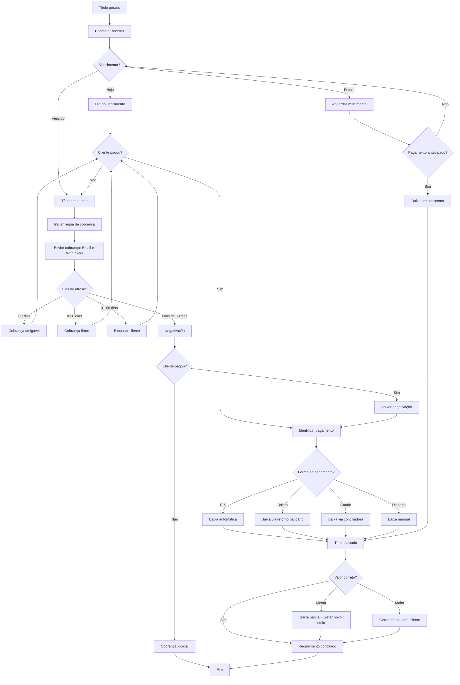
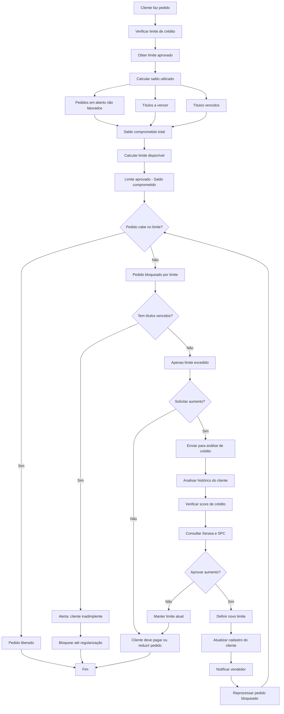
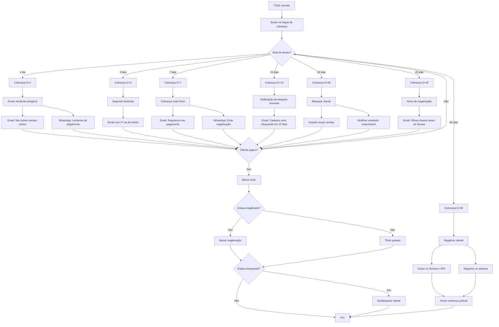

# Fluxogramas - Módulo Financeiro

Este documento contém os fluxogramas de processo do módulo financeiro.

## 8. Fluxo Financeiro - Recebimento

---

## 21. Fluxo de Limite de Crédito

---

## 22. Fluxo de Cobrança (Régua)

---

