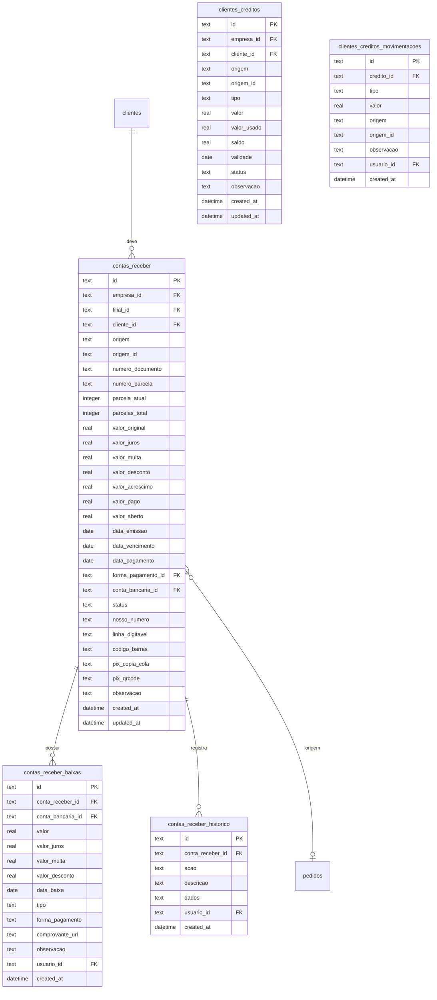
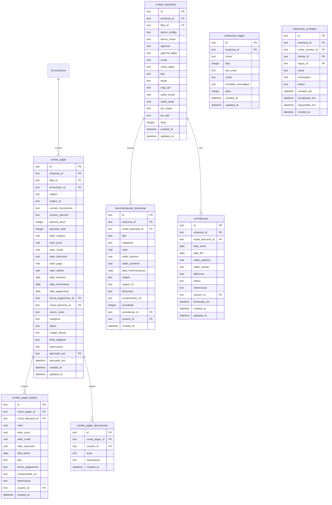

# 💰 MÓDULO 4: FINANCEIRO

## Diagrama - Contas a Receber

```mermaid
erDiagram
    contas_receber ||--o{ contas_receber_baixas : possui
    contas_receber ||--o{ contas_receber_historico : registra
    clientes ||--o{ contas_receber : deve
    contas_receber }o--o| pedidos : origem
    
    contas_receber {
        text id PK
        text empresa_id FK
        text filial_id FK
        text cliente_id FK
        text origem
        text origem_id
        text numero_documento
        text numero_parcela
        integer parcela_atual
        integer parcelas_total
        real valor_original
        real valor_juros
        real valor_multa
        real valor_desconto
        real valor_acrescimo
        real valor_pago
        real valor_aberto
        date data_emissao
        date data_vencimento
        date data_pagamento
        text forma_pagamento_id FK
        text conta_bancaria_id FK
        text status
        text nosso_numero
        text linha_digitavel
        text codigo_barras
        text pix_copia_cola
        text pix_qrcode
        text observacao
        datetime created_at
        datetime updated_at
    }
    
    contas_receber_baixas {
        text id PK
        text conta_receber_id FK
        text conta_bancaria_id FK
        real valor
        real valor_juros
        real valor_multa
        real valor_desconto
        date data_baixa
        text tipo
        text forma_pagamento
        text comprovante_url
        text observacao
        text usuario_id FK
        datetime created_at
    }
    
    contas_receber_historico {
        text id PK
        text conta_receber_id FK
        text acao
        text descricao
        text dados
        text usuario_id FK
        datetime created_at
    }
    
    clientes_creditos {
        text id PK
        text empresa_id FK
        text cliente_id FK
        text origem
        text origem_id
        text tipo
        real valor
        real valor_usado
        real saldo
        date validade
        text status
        text observacao
        datetime created_at
        datetime updated_at
    }
    
    clientes_creditos_movimentacoes {
        text id PK
        text credito_id FK
        text tipo
        real valor
        text origem
        text origem_id
        text observacao
        text usuario_id FK
        datetime created_at
    }
```

## Diagrama - Contas a Pagar e Bancos

```mermaid
erDiagram
    contas_pagar ||--o{ contas_pagar_baixas : possui
    contas_pagar ||--o{ contas_pagar_aprovacoes : requer
    fornecedores ||--o{ contas_pagar : recebe
    contas_bancarias ||--o{ movimentacoes_bancarias : possui
    contas_bancarias ||--o{ conciliacoes : tem
    
    contas_pagar {
        text id PK
        text empresa_id FK
        text filial_id FK
        text fornecedor_id FK
        text origem
        text origem_id
        text numero_documento
        text numero_parcela
        integer parcela_atual
        integer parcelas_total
        real valor_original
        real valor_juros
        real valor_multa
        real valor_desconto
        real valor_pago
        real valor_aberto
        date data_emissao
        date data_vencimento
        date data_pagamento
        text forma_pagamento_id FK
        text conta_bancaria_id FK
        text centro_custo
        text categoria
        text status
        text codigo_barras
        text linha_digitavel
        text observacao
        text aprovado_por FK
        datetime aprovado_em
        datetime created_at
        datetime updated_at
    }
    
    contas_pagar_baixas {
        text id PK
        text conta_pagar_id FK
        text conta_bancaria_id FK
        real valor
        real valor_juros
        real valor_multa
        real valor_desconto
        date data_baixa
        text tipo
        text forma_pagamento
        text comprovante_url
        text observacao
        text usuario_id FK
        datetime created_at
    }
    
    contas_pagar_aprovacoes {
        text id PK
        text conta_pagar_id FK
        text usuario_id FK
        text acao
        text observacao
        datetime created_at
    }
    
    contas_bancarias {
        text id PK
        text empresa_id FK
        text filial_id FK
        text banco_codigo
        text banco_nome
        text agencia
        text agencia_digito
        text conta
        text conta_digito
        text tipo
        text titular
        text cnpj_cpf
        real saldo_inicial
        real saldo_atual
        text pix_chave
        text pix_tipo
        integer ativa
        datetime created_at
        datetime updated_at
    }
    
    movimentacoes_bancarias {
        text id PK
        text empresa_id FK
        text conta_bancaria_id FK
        text tipo
        text categoria
        real valor
        real saldo_anterior
        real saldo_posterior
        date data_movimentacao
        text origem
        text origem_id
        text descricao
        text comprovante_url
        integer conciliado
        text conciliacao_id FK
        text usuario_id FK
        datetime created_at
    }
    
    conciliacoes {
        text id PK
        text empresa_id FK
        text conta_bancaria_id FK
        date data_inicio
        date data_fim
        real saldo_sistema
        real saldo_extrato
        real diferenca
        text status
        text observacao
        text usuario_id FK
        datetime finalizada_em
        datetime created_at
        datetime updated_at
    }
    
    cobrancas_regua {
        text id PK
        text empresa_id FK
        text nome
        integer dias
        text tipo_acao
        text canal
        text template_mensagem
        integer ativo
        datetime created_at
        datetime updated_at
    }
    
    cobrancas_enviadas {
        text id PK
        text empresa_id FK
        text conta_receber_id FK
        text cliente_id FK
        text regua_id FK
        text canal
        text mensagem
        text status
        datetime enviado_em
        datetime visualizado_em
        datetime respondido_em
        datetime created_at
    }
```

---

