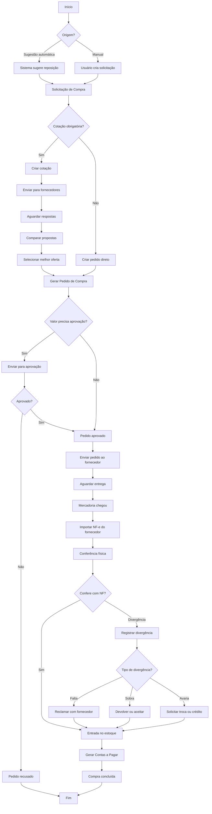
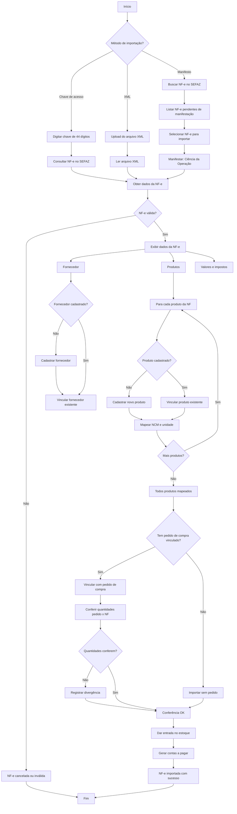

# Fluxogramas - Módulo Compras

Este documento contém os fluxogramas de processo do módulo de compras.

## 7. Fluxo de Compra Completa

```mermaid
flowchart TD
    A[Início] --> B{Origem?}
    
    B -->|Sugestão automática| C[Sistema sugere reposição]
    B -->|Manual| D[Usuário cria solicitação]
    
    C --> E[Solicitação de Compra]
    D --> E
    
    E --> F{Cotação obrigatória?}
    F -->|Sim| G[Criar cotação]
    F -->|Não| H[Criar pedido direto]
    
    G --> I[Enviar para fornecedores]
    I --> J[Aguardar respostas]
    J --> K[Comparar propostas]
    
    K --> L[Selecionar melhor oferta]
    L --> M[Gerar Pedido de Compra]
    H --> M
    
    M --> N{Valor precisa aprovação?}
    N -->|Sim| O[Enviar para aprovação]
    N -->|Não| P[Pedido aprovado]
    
    O --> Q{Aprovado?}
    Q -->|Não| R[Pedido recusado]
    Q -->|Sim| P
    
    P --> S[Enviar pedido ao fornecedor]
    S --> T[Aguardar entrega]
    
    T --> U[Mercadoria chegou]
    U --> V[Importar NF-e do fornecedor]
    
    V --> W[Conferência física]
    W --> X{Confere com NF?}
    
    X -->|Sim| Y[Entrada no estoque]
    X -->|Divergência| Z[Registrar divergência]
    
    Z --> AA{Tipo de divergência?}
    AA -->|Falta| AB[Reclamar com fornecedor]
    AA -->|Sobra| AC[Devolver ou aceitar]
    AA -->|Avaria| AD[Solicitar troca ou crédito]
    
    AB --> Y
    AC --> Y
    AD --> Y
    
    Y --> AE[Gerar Contas a Pagar]
    AE --> AF[Compra concluída]
    
    R --> AG[Fim]
    AF --> AG
```

---

## 25. Fluxo de Importação de NF-e (Compras)

```mermaid
flowchart TD
    A[Início] --> B{Método de importação?}
    
    B -->|Chave de acesso| C[Digitar chave de 44 dígitos]
    B -->|XML| D[Upload do arquivo XML]
    B -->|Manifesto| E[Buscar NF-e no SEFAZ]
    
    C --> F[Consultar NF-e no SEFAZ]
    D --> G[Ler arquivo XML]
    E --> H[Listar NF-e pendentes de manifestação]
    
    H --> I[Selecionar NF-e para importar]
    I --> J[Manifestar: Ciência da Operação]
    
    F --> K[Obter dados da NF-e]
    G --> K
    J --> K
    
    K --> L{NF-e válida?}
    L -->|Não| M[NF-e cancelada ou inválida]
    L -->|Sim| N[Exibir dados da NF-e]
    
    N --> O[Fornecedor]
    N --> P[Produtos]
    N --> Q[Valores e impostos]
    
    O --> R{Fornecedor cadastrado?}
    R -->|Não| S[Cadastrar fornecedor]
    R -->|Sim| T[Vincular fornecedor existente]
    
    S --> T
    
    P --> U[Para cada produto da NF]
    U --> V{Produto cadastrado?}
    
    V -->|Não| W[Cadastrar novo produto]
    V -->|Sim| X[Vincular produto existente]
    
    W --> Y[Mapear NCM e unidade]
    X --> Y
    
    Y --> Z{Mais produtos?}
    Z -->|Sim| U
    Z -->|Não| AA[Todos produtos mapeados]
    
    AA --> AB{Tem pedido de compra vinculado?}
    AB -->|Sim| AC[Vincular com pedido de compra]
    AB -->|Não| AD[Importar sem pedido]
    
    AC --> AE[Conferir quantidades pedido x NF]
    AE --> AF{Quantidades conferem?}
    
    AF -->|Não| AG[Registrar divergência]
    AF -->|Sim| AH[Conferência OK]
    
    AG --> AH
    AD --> AH
    
    AH --> AI[Dar entrada no estoque]
    AI --> AJ[Gerar contas a pagar]
    
    AJ --> AK[NF-e importada com sucesso]
    
    M --> AL[Fim]
    AK --> AL
```

---

