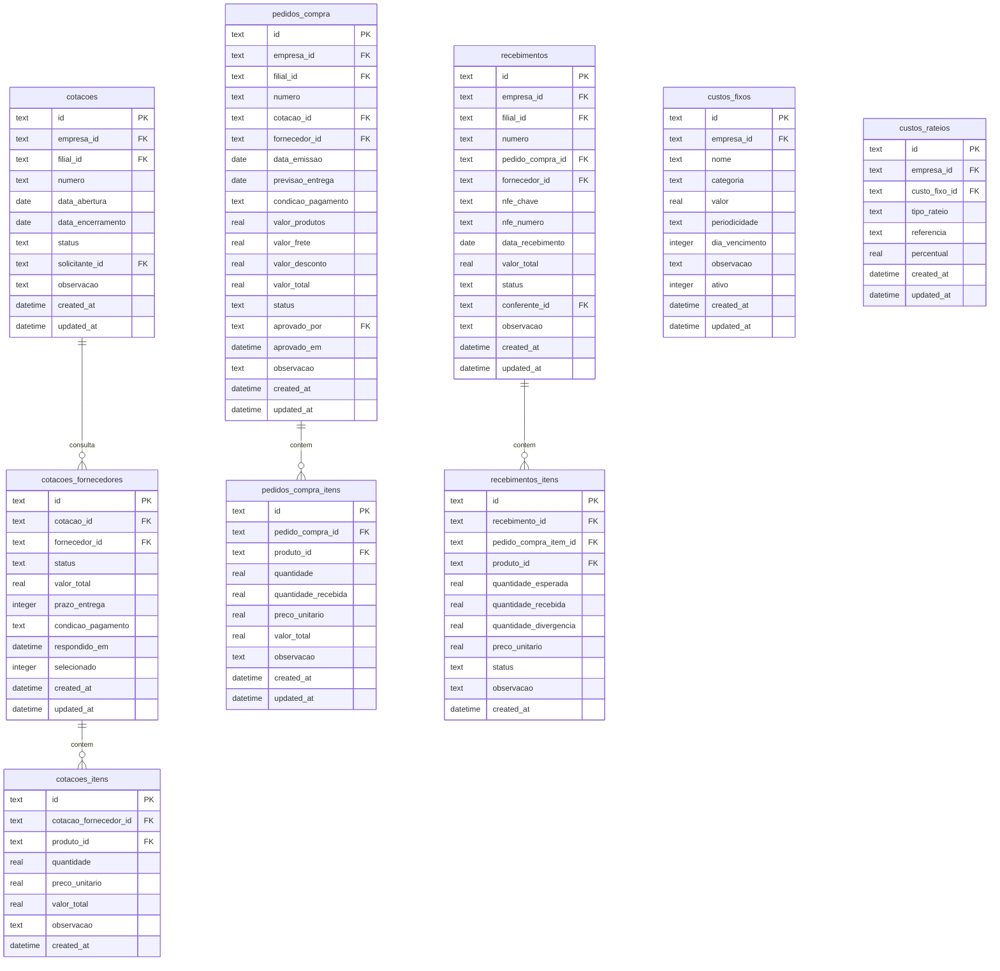

# 📦 MÓDULO 7: COMPRAS

## Diagrama

```mermaid
erDiagram
    cotacoes ||--o{ cotacoes_fornecedores : consulta
    cotacoes_fornecedores ||--o{ cotacoes_itens : contem
    pedidos_compra ||--o{ pedidos_compra_itens : contem
    recebimentos ||--o{ recebimentos_itens : contem
    
    cotacoes {
        text id PK
        text empresa_id FK
        text filial_id FK
        text numero
        date data_abertura
        date data_encerramento
        text status
        text solicitante_id FK
        text observacao
        datetime created_at
        datetime updated_at
    }
    
    cotacoes_fornecedores {
        text id PK
        text cotacao_id FK
        text fornecedor_id FK
        text status
        real valor_total
        integer prazo_entrega
        text condicao_pagamento
        datetime respondido_em
        integer selecionado
        datetime created_at
        datetime updated_at
    }
    
    cotacoes_itens {
        text id PK
        text cotacao_fornecedor_id FK
        text produto_id FK
        real quantidade
        real preco_unitario
        real valor_total
        text observacao
        datetime created_at
    }
    
    pedidos_compra {
        text id PK
        text empresa_id FK
        text filial_id FK
        text numero
        text cotacao_id FK
        text fornecedor_id FK
        date data_emissao
        date previsao_entrega
        text condicao_pagamento
        real valor_produtos
        real valor_frete
        real valor_desconto
        real valor_total
        text status
        text aprovado_por FK
        datetime aprovado_em
        text observacao
        datetime created_at
        datetime updated_at
    }
    
    pedidos_compra_itens {
        text id PK
        text pedido_compra_id FK
        text produto_id FK
        real quantidade
        real quantidade_recebida
        real preco_unitario
        real valor_total
        text observacao
        datetime created_at
        datetime updated_at
    }
    
    recebimentos {
        text id PK
        text empresa_id FK
        text filial_id FK
        text numero
        text pedido_compra_id FK
        text fornecedor_id FK
        text nfe_chave
        text nfe_numero
        date data_recebimento
        real valor_total
        text status
        text conferente_id FK
        text observacao
        datetime created_at
        datetime updated_at
    }
    
    recebimentos_itens {
        text id PK
        text recebimento_id FK
        text pedido_compra_item_id FK
        text produto_id FK
        real quantidade_esperada
        real quantidade_recebida
        real quantidade_divergencia
        real preco_unitario
        text status
        text observacao
        datetime created_at
    }
    
    custos_fixos {
        text id PK
        text empresa_id FK
        text nome
        text categoria
        real valor
        text periodicidade
        integer dia_vencimento
        text observacao
        integer ativo
        datetime created_at
        datetime updated_at
    }
    
    custos_rateios {
        text id PK
        text empresa_id FK
        text custo_fixo_id FK
        text tipo_rateio
        text referencia
        real percentual
        datetime created_at
        datetime updated_at
    }
```

---

