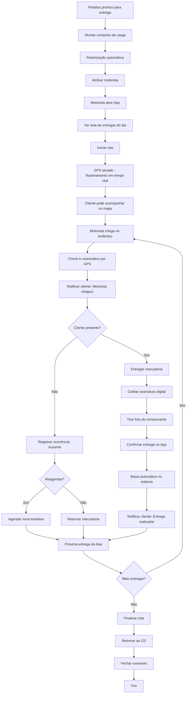
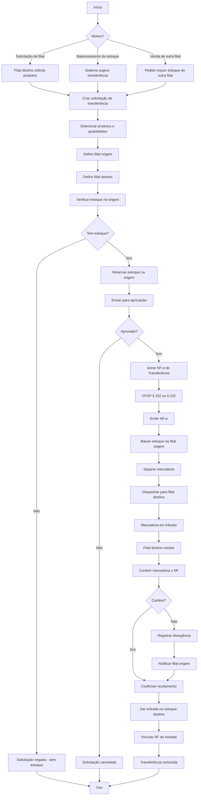

# Fluxogramas - Módulo Logística

Este documento contém os fluxogramas de processo do módulo de logística/expedição.

## 11. Fluxo de Entrega com Rastreamento GPS

---

## 23. Fluxo de Transferência entre Filiais

---

