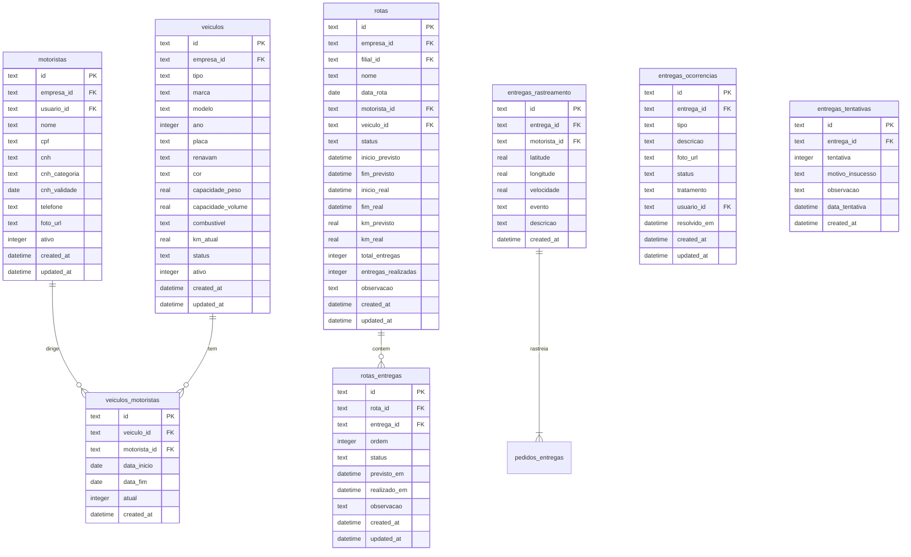

# 🚚 MÓDULO 8: EXPEDIÇÃO

## Diagrama

```mermaid
erDiagram
    motoristas ||--o{ veiculos_motoristas : dirige
    veiculos ||--o{ veiculos_motoristas : tem
    rotas ||--o{ rotas_entregas : contem
    entregas_rastreamento ||--|{ pedidos_entregas : rastreia
    
    motoristas {
        text id PK
        text empresa_id FK
        text usuario_id FK
        text nome
        text cpf
        text cnh
        text cnh_categoria
        date cnh_validade
        text telefone
        text foto_url
        integer ativo
        datetime created_at
        datetime updated_at
    }
    
    veiculos {
        text id PK
        text empresa_id FK
        text tipo
        text marca
        text modelo
        integer ano
        text placa
        text renavam
        text cor
        real capacidade_peso
        real capacidade_volume
        text combustivel
        real km_atual
        text status
        integer ativo
        datetime created_at
        datetime updated_at
    }
    
    veiculos_motoristas {
        text id PK
        text veiculo_id FK
        text motorista_id FK
        date data_inicio
        date data_fim
        integer atual
        datetime created_at
    }
    
    rotas {
        text id PK
        text empresa_id FK
        text filial_id FK
        text nome
        date data_rota
        text motorista_id FK
        text veiculo_id FK
        text status
        datetime inicio_previsto
        datetime fim_previsto
        datetime inicio_real
        datetime fim_real
        real km_previsto
        real km_real
        integer total_entregas
        integer entregas_realizadas
        text observacao
        datetime created_at
        datetime updated_at
    }
    
    rotas_entregas {
        text id PK
        text rota_id FK
        text entrega_id FK
        integer ordem
        text status
        datetime previsto_em
        datetime realizado_em
        text observacao
        datetime created_at
        datetime updated_at
    }
    
    entregas_rastreamento {
        text id PK
        text entrega_id FK
        text motorista_id FK
        real latitude
        real longitude
        real velocidade
        text evento
        text descricao
        datetime created_at
    }
    
    entregas_ocorrencias {
        text id PK
        text entrega_id FK
        text tipo
        text descricao
        text foto_url
        text status
        text tratamento
        text usuario_id FK
        datetime resolvido_em
        datetime created_at
        datetime updated_at
    }
    
    entregas_tentativas {
        text id PK
        text entrega_id FK
        integer tentativa
        text motivo_insucesso
        text observacao
        datetime data_tentativa
        datetime created_at
    }
```

---

