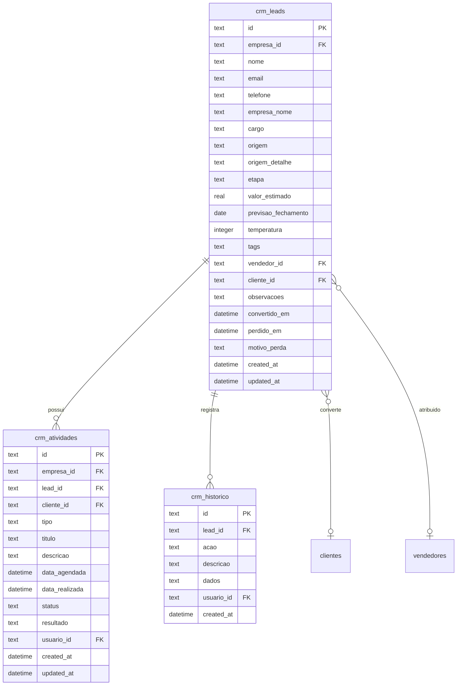

# Modelo de Dados - Módulo CRM

Este documento contém o modelo de dados do módulo CRM.

## Diagrama - CRM

```mermaid
erDiagram
    crm_leads ||--o{ crm_atividades : possui
    crm_leads ||--o{ crm_historico : registra
    crm_leads }o--o| clientes : converte
    crm_leads }o--o| vendedores : atribuido
    
    crm_leads {
        text id PK
        text empresa_id FK
        text nome
        text email
        text telefone
        text empresa_nome
        text cargo
        text origem
        text origem_detalhe
        text etapa
        real valor_estimado
        date previsao_fechamento
        integer temperatura
        text tags
        text vendedor_id FK
        text cliente_id FK
        text observacoes
        datetime convertido_em
        datetime perdido_em
        text motivo_perda
        datetime created_at
        datetime updated_at
    }
    
    crm_atividades {
        text id PK
        text empresa_id FK
        text lead_id FK
        text cliente_id FK
        text tipo
        text titulo
        text descricao
        datetime data_agendada
        datetime data_realizada
        text status
        text resultado
        text usuario_id FK
        datetime created_at
        datetime updated_at
    }
    
    crm_historico {
        text id PK
        text lead_id FK
        text acao
        text descricao
        text dados
        text usuario_id FK
        datetime created_at
    }
```

