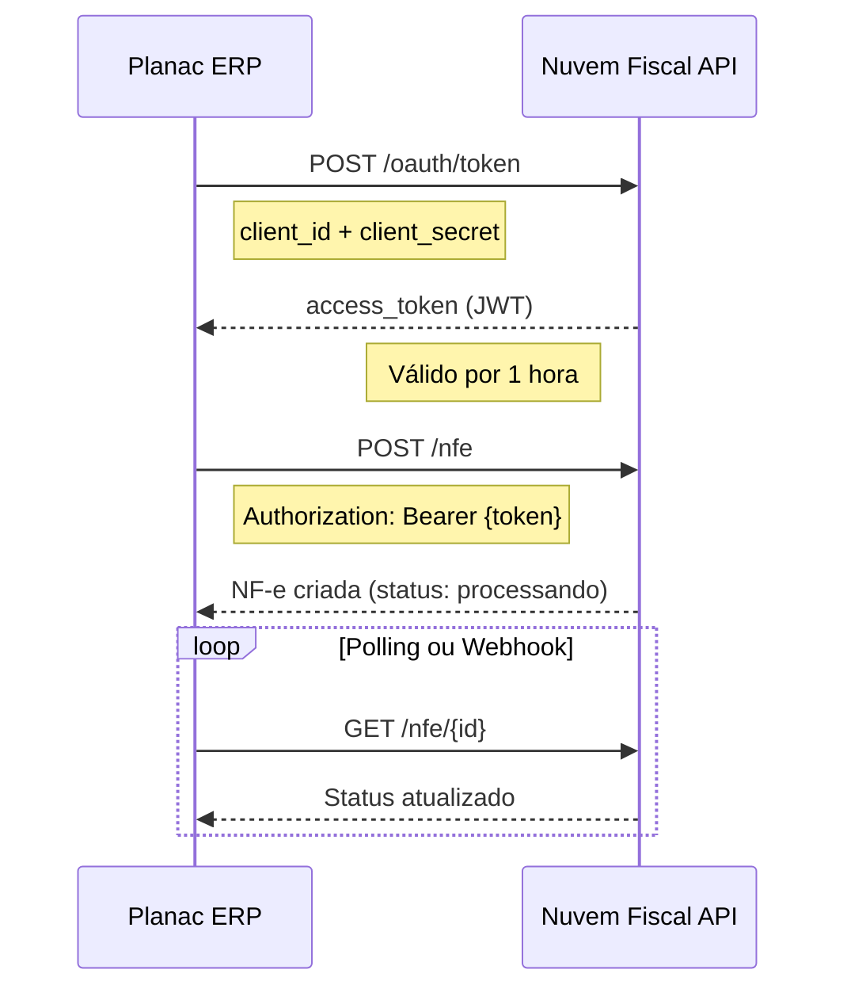

# 🔗 Integrações Externas - ERP PLANAC

Documentação completa das integrações externas do sistema.

**Status: 🟡 Em desenvolvimento**

---

## Índice

| Integração | Tipo | Status | Prioridade |
|------------|------|--------|------------|
| [1. Nuvem Fiscal](#1-nuvem-fiscal) | Fiscal | ✅ Configurado | Alta |
| [2. Outras Fiscais](#2-outras-integrações-fiscais) | Fiscal | ⏳ Pendente | Alta |
| [3. Bancárias](#3-integrações-bancárias) | Financeiro | ⏳ Pendente | Alta |
| [4. Pagamentos](#4-integrações-de-pagamentos) | Financeiro | ⏳ Pendente | Média |
| [5. Marketing](#5-integrações-de-marketing) | Marketing | ⏳ Pendente | Baixa |
| [6. E-commerce](#6-integrações-e-commerce) | Comercial | ⏳ Pendente | Média |
| [7. Consultas](#7-apis-de-consulta) | Utilitário | ⏳ Pendente | Média |

---

# 1. NUVEM FISCAL

## 1.1 Visão Geral

| Item | Descrição |
|------|-----------|
| **Fornecedor** | Nuvem Fiscal |
| **Site** | https://www.nuvemfiscal.com.br |
| **Documentação** | https://dev.nuvemfiscal.com.br/docs |
| **Tipo** | API REST |
| **Autenticação** | OAuth 2.0 (Client Credentials) |

## 1.2 Credenciais de Acesso

| Ambiente | Client ID | Client Secret |
|----------|-----------|---------------|
| **Produção** | `AJReDlHes8aBNlTzTF9X` | `3yMYNk2hzBLQihujZf0jfFyAKDRc403v4D1SBDFL` |

> ⚠️ **IMPORTANTE:** As credenciais acima são sensíveis. Em produção, devem ser armazenadas como secrets no Cloudflare Workers.

## 1.3 Endpoints Base

| Ambiente | URL |
|----------|-----|
| Produção | `https://api.nuvemfiscal.com.br` |
| Sandbox | `https://api.sandbox.nuvemfiscal.com.br` |

## 1.4 Serviços Utilizados

### NF-e (Nota Fiscal Eletrônica)

| Operação | Endpoint | Método | Descrição |
|----------|----------|--------|-----------|
| Emitir | `/nfe` | POST | Emite nova NF-e |
| Consultar | `/nfe/{id}` | GET | Consulta NF-e por ID |
| Cancelar | `/nfe/{id}/cancelamento` | POST | Cancela NF-e |
| Carta Correção | `/nfe/{id}/carta-correcao` | POST | Emite CC-e |
| Inutilizar | `/nfe/inutilizacao` | POST | Inutiliza numeração |
| Download XML | `/nfe/{id}/xml` | GET | Baixa XML da NF-e |
| Download PDF | `/nfe/{id}/pdf` | GET | Baixa DANFE em PDF |

### NFC-e (Nota Fiscal de Consumidor)

| Operação | Endpoint | Método | Descrição |
|----------|----------|--------|-----------|
| Emitir | `/nfce` | POST | Emite nova NFC-e |
| Consultar | `/nfce/{id}` | GET | Consulta NFC-e |
| Cancelar | `/nfce/{id}/cancelamento` | POST | Cancela NFC-e |
| Inutilizar | `/nfce/inutilizacao` | POST | Inutiliza numeração |

### NFS-e (Nota Fiscal de Serviço)

| Operação | Endpoint | Método | Descrição |
|----------|----------|--------|-----------|
| Emitir | `/nfse` | POST | Emite nova NFS-e |
| Consultar | `/nfse/{id}` | GET | Consulta NFS-e |
| Cancelar | `/nfse/{id}/cancelamento` | POST | Cancela NFS-e |

### CT-e (Conhecimento de Transporte)

| Operação | Endpoint | Método | Descrição |
|----------|----------|--------|-----------|
| Emitir | `/cte` | POST | Emite novo CT-e |
| Consultar | `/cte/{id}` | GET | Consulta CT-e |
| Cancelar | `/cte/{id}/cancelamento` | POST | Cancela CT-e |

### MDF-e (Manifesto de Documentos Fiscais)

| Operação | Endpoint | Método | Descrição |
|----------|----------|--------|-----------|
| Emitir | `/mdfe` | POST | Emite novo MDF-e |
| Consultar | `/mdfe/{id}` | GET | Consulta MDF-e |
| Encerrar | `/mdfe/{id}/encerramento` | POST | Encerra MDF-e |
| Cancelar | `/mdfe/{id}/cancelamento` | POST | Cancela MDF-e |

## 1.5 Fluxo de Autenticação



## 1.6 Exemplo de Código

```typescript
// src/packages/api/src/integrations/nuvemfiscal.ts

interface NuvemFiscalConfig {
  clientId: string;
  clientSecret: string;
  baseUrl: string;
}

export class NuvemFiscalClient {
  private config: NuvemFiscalConfig;
  private accessToken: string | null = null;
  private tokenExpiry: Date | null = null;

  constructor(config: NuvemFiscalConfig) {
    this.config = config;
  }

  private async authenticate(): Promise<string> {
    // Verifica se token ainda é válido
    if (this.accessToken && this.tokenExpiry && this.tokenExpiry > new Date()) {
      return this.accessToken;
    }

    const response = await fetch(`${this.config.baseUrl}/oauth/token`, {
      method: 'POST',
      headers: {
        'Content-Type': 'application/x-www-form-urlencoded',
      },
      body: new URLSearchParams({
        grant_type: 'client_credentials',
        client_id: this.config.clientId,
        client_secret: this.config.clientSecret,
        scope: 'cep cnpj nfse nfe nfce mdfe cte empresa',
      }),
    });

    if (!response.ok) {
      throw new Error(`Erro de autenticação Nuvem Fiscal: ${response.status}`);
    }

    const data = await response.json();
    this.accessToken = data.access_token;
    this.tokenExpiry = new Date(Date.now() + (data.expires_in - 60) * 1000);

    return this.accessToken;
  }

  async emitirNFe(nfe: NFeDados): Promise<NFeResponse> {
    const token = await this.authenticate();

    const response = await fetch(`${this.config.baseUrl}/nfe`, {
      method: 'POST',
      headers: {
        'Authorization': `Bearer ${token}`,
        'Content-Type': 'application/json',
      },
      body: JSON.stringify(nfe),
    });

    if (!response.ok) {
      const error = await response.json();
      throw new Error(`Erro ao emitir NF-e: ${error.message}`);
    }

    return response.json();
  }

  async consultarNFe(id: string): Promise<NFe> {
    const token = await this.authenticate();

    const response = await fetch(`${this.config.baseUrl}/nfe/${id}`, {
      headers: {
        'Authorization': `Bearer ${token}`,
      },
    });

    return response.json();
  }

  async cancelarNFe(id: string, justificativa: string): Promise<void> {
    const token = await this.authenticate();

    await fetch(`${this.config.baseUrl}/nfe/${id}/cancelamento`, {
      method: 'POST',
      headers: {
        'Authorization': `Bearer ${token}`,
        'Content-Type': 'application/json',
      },
      body: JSON.stringify({ justificativa }),
    });
  }

  // ... outros métodos
}

// Factory function para criar cliente
export function createNuvemFiscalClient(env: Env): NuvemFiscalClient {
  return new NuvemFiscalClient({
    clientId: env.NUVEM_FISCAL_CLIENT_ID,
    clientSecret: env.NUVEM_FISCAL_CLIENT_SECRET,
    baseUrl: env.NUVEM_FISCAL_URL || 'https://api.nuvemfiscal.com.br',
  });
}
```

## 1.7 Configuração no Cloudflare Workers

### Secrets a configurar (via wrangler):

```bash
# Configurar secrets de produção
wrangler secret put NUVEM_FISCAL_CLIENT_ID
# Inserir: AJReDlHes8aBNlTzTF9X

wrangler secret put NUVEM_FISCAL_CLIENT_SECRET
# Inserir: 3yMYNk2hzBLQihujZf0jfFyAKDRc403v4D1SBDFL
```

### Variáveis de ambiente (wrangler.toml):

```toml
[vars]
NUVEM_FISCAL_URL = "https://api.nuvemfiscal.com.br"

[env.development.vars]
NUVEM_FISCAL_URL = "https://api.sandbox.nuvemfiscal.com.br"
```

## 1.8 Webhooks

O Nuvem Fiscal suporta webhooks para notificação de eventos:

| Evento | Descrição |
|--------|-----------|
| `nfe.autorizada` | NF-e foi autorizada pela SEFAZ |
| `nfe.rejeitada` | NF-e foi rejeitada |
| `nfe.cancelada` | NF-e foi cancelada |
| `nfce.autorizada` | NFC-e foi autorizada |

**URL do Webhook no Planac:**
```
https://api.planac.com.br/webhooks/nuvemfiscal
```

---

# 2. OUTRAS INTEGRAÇÕES FISCAIS

| Serviço | Uso | Status |
|---------|-----|--------|
| SEFAZ (direto) | Contingência | ⏳ Pendente |
| IBPT | Tabela de impostos | ⏳ Pendente |

---

# 3. INTEGRAÇÕES BANCÁRIAS

| Banco | Tipo | Status |
|-------|------|--------|
| CNAB 240/400 | Remessa/Retorno | ⏳ Pendente |
| PIX | Cobrança | ⏳ Pendente |
| Open Banking | Saldo/Extrato | ⏳ Pendente |
| Boletos | Emissão | ⏳ Pendente |

---

# 4. INTEGRAÇÕES DE PAGAMENTOS

| Gateway | Tipo | Status |
|---------|------|--------|
| TEF | Cartões | ⏳ Pendente |
| PagSeguro | Gateway | ⏳ Pendente |
| Mercado Pago | Gateway | ⏳ Pendente |
| Stone | Adquirente | ⏳ Pendente |

---

# 5. INTEGRAÇÕES DE MARKETING

| Serviço | Uso | Status |
|---------|-----|--------|
| WhatsApp Business API | Atendimento | ⏳ Pendente |
| Google Analytics 4 | Tracking | ⏳ Pendente |
| Meta Ads | Remarketing | ⏳ Pendente |
| RD Station | CRM Marketing | ⏳ Pendente |

---

# 6. INTEGRAÇÕES E-COMMERCE

| Plataforma | Tipo | Status |
|------------|------|--------|
| Mercado Livre | Marketplace | ⏳ Pendente |
| Shopee | Marketplace | ⏳ Pendente |
| Amazon | Marketplace | ⏳ Pendente |
| VTEX | E-commerce | ⏳ Pendente |
| WooCommerce | E-commerce | ⏳ Pendente |

---

# 7. APIS DE CONSULTA

| API | Uso | Status |
|-----|-----|--------|
| ViaCEP | Consulta CEP | ⏳ Pendente |
| ReceitaWS | Consulta CNPJ | ⏳ Pendente |
| IBGE | Cidades/Estados | ⏳ Pendente |

---

**Documento atualizado em:** 06/12/2025  
**Responsável:** 🔗 Especialista em Integrações / DEV.com
