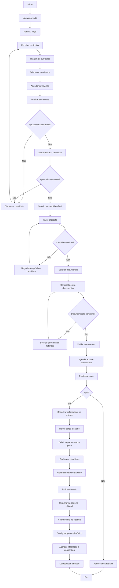
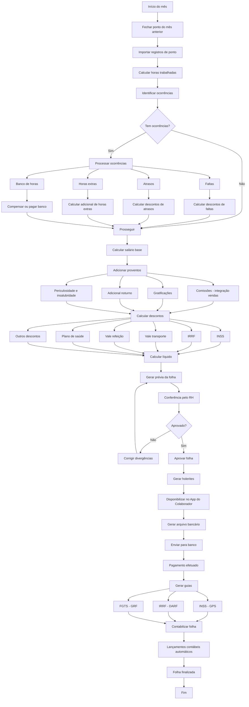
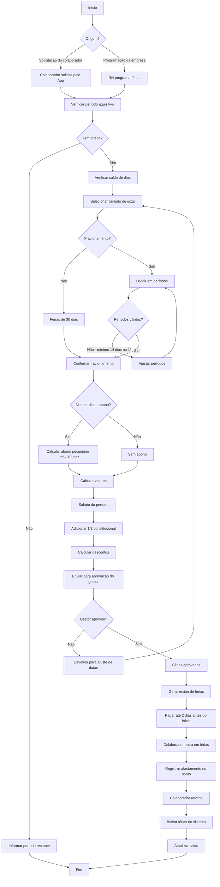

# Fluxogramas - Módulo RH

Este documento contém os fluxogramas de processo do módulo de recursos humanos.

## 15. Fluxo de RH - Admissão

---

## 16. Fluxo de RH - Folha de Pagamento

---

## 17. Fluxo de RH - Férias

---

