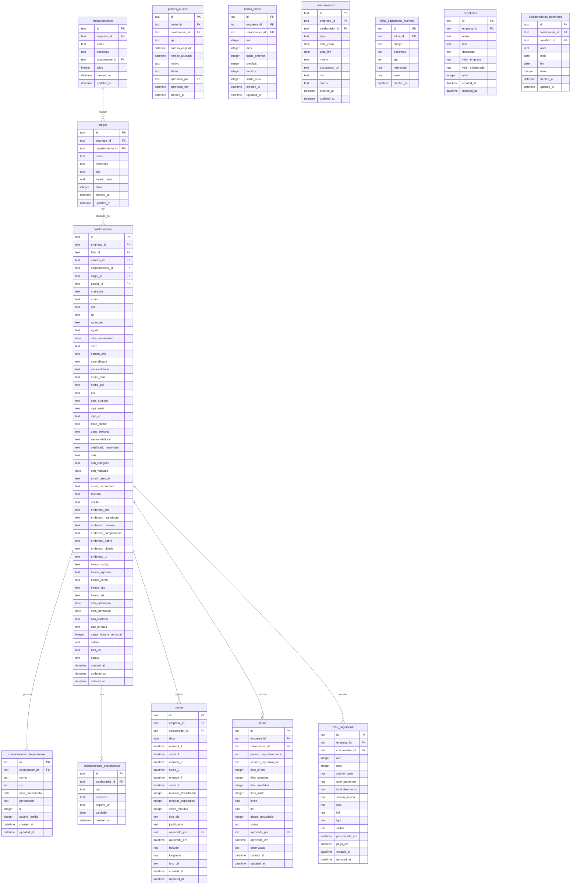

# 👥 MÓDULO 11: RH

## Diagrama

```mermaid
erDiagram
    colaboradores ||--o{ colaboradores_dependentes : possui
    colaboradores ||--o{ colaboradores_documentos : tem
    colaboradores ||--o{ pontos : registra
    colaboradores ||--o{ ferias : solicita
    colaboradores ||--o{ folha_pagamento : recebe
    departamentos ||--o{ cargos : contem
    cargos ||--o{ colaboradores : ocupado_por
    
    departamentos {
        text id PK
        text empresa_id FK
        text nome
        text descricao
        text responsavel_id FK
        integer ativo
        datetime created_at
        datetime updated_at
    }
    
    cargos {
        text id PK
        text empresa_id FK
        text departamento_id FK
        text nome
        text descricao
        text cbo
        real salario_base
        integer ativo
        datetime created_at
        datetime updated_at
    }
    
    colaboradores {
        text id PK
        text empresa_id FK
        text filial_id FK
        text usuario_id FK
        text departamento_id FK
        text cargo_id FK
        text gestor_id FK
        text matricula
        text nome
        text cpf
        text rg
        text rg_orgao
        text rg_uf
        date data_nascimento
        text sexo
        text estado_civil
        text naturalidade
        text nacionalidade
        text nome_mae
        text nome_pai
        text pis
        text ctps_numero
        text ctps_serie
        text ctps_uf
        text titulo_eleitor
        text zona_eleitoral
        text secao_eleitoral
        text certificado_reservista
        text cnh
        text cnh_categoria
        date cnh_validade
        text email_pessoal
        text email_corporativo
        text telefone
        text celular
        text endereco_cep
        text endereco_logradouro
        text endereco_numero
        text endereco_complemento
        text endereco_bairro
        text endereco_cidade
        text endereco_uf
        text banco_codigo
        text banco_agencia
        text banco_conta
        text banco_tipo
        text banco_pix
        date data_admissao
        date data_demissao
        text tipo_contrato
        text tipo_jornada
        integer carga_horaria_semanal
        real salario
        text foto_url
        text status
        datetime created_at
        datetime updated_at
        datetime deleted_at
    }
    
    colaboradores_dependentes {
        text id PK
        text colaborador_id FK
        text nome
        text cpf
        date data_nascimento
        text parentesco
        integer ir
        integer salario_familia
        datetime created_at
        datetime updated_at
    }
    
    colaboradores_documentos {
        text id PK
        text colaborador_id FK
        text tipo
        text descricao
        text arquivo_url
        date validade
        datetime created_at
    }
    
    pontos {
        text id PK
        text empresa_id FK
        text colaborador_id FK
        date data
        datetime entrada_1
        datetime saida_1
        datetime entrada_2
        datetime saida_2
        datetime entrada_3
        datetime saida_3
        integer minutos_trabalhados
        integer minutos_esperados
        integer saldo_minutos
        text tipo_dia
        text justificativa
        text aprovado_por FK
        datetime aprovado_em
        real latitude
        real longitude
        text foto_url
        datetime created_at
        datetime updated_at
    }
    
    pontos_ajustes {
        text id PK
        text ponto_id FK
        text colaborador_id FK
        text tipo
        datetime horario_original
        datetime horario_ajustado
        text motivo
        text status
        text aprovado_por FK
        datetime aprovado_em
        datetime created_at
    }
    
    banco_horas {
        text id PK
        text empresa_id FK
        text colaborador_id FK
        integer ano
        integer mes
        integer saldo_anterior
        integer creditos
        integer debitos
        integer saldo_atual
        datetime created_at
        datetime updated_at
    }
    
    ferias {
        text id PK
        text empresa_id FK
        text colaborador_id FK
        text periodo_aquisitivo_inicio
        text periodo_aquisitivo_fim
        integer dias_direito
        integer dias_gozados
        integer dias_vendidos
        integer dias_saldo
        date inicio
        date fim
        integer abono_pecuniario
        text status
        text aprovado_por FK
        datetime aprovado_em
        text observacao
        datetime created_at
        datetime updated_at
    }
    
    afastamentos {
        text id PK
        text empresa_id FK
        text colaborador_id FK
        text tipo
        date data_inicio
        date data_fim
        text motivo
        text documento_url
        text cid
        text status
        datetime created_at
        datetime updated_at
    }
    
    folha_pagamento {
        text id PK
        text empresa_id FK
        text colaborador_id FK
        integer ano
        integer mes
        real salario_base
        real total_proventos
        real total_descontos
        real salario_liquido
        real inss
        real irrf
        real fgts
        text status
        datetime processado_em
        datetime pago_em
        datetime created_at
        datetime updated_at
    }
    
    folha_pagamento_eventos {
        text id PK
        text folha_id FK
        text codigo
        text descricao
        text tipo
        real referencia
        real valor
        datetime created_at
    }
    
    beneficios {
        text id PK
        text empresa_id FK
        text nome
        text tipo
        text descricao
        real valor_empresa
        real valor_colaborador
        integer ativo
        datetime created_at
        datetime updated_at
    }
    
    colaboradores_beneficios {
        text id PK
        text colaborador_id FK
        text beneficio_id FK
        real valor
        date inicio
        date fim
        integer ativo
        datetime created_at
        datetime updated_at
    }
```

---

