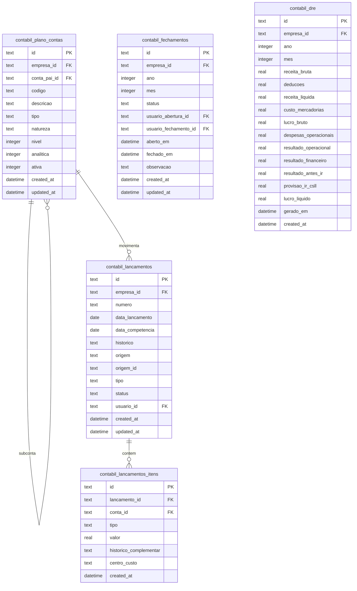

# 📊 MÓDULO 13: CONTABILIDADE

## Diagrama

```mermaid
erDiagram
    contabil_plano_contas ||--o{ contabil_plano_contas : subconta
    contabil_plano_contas ||--o{ contabil_lancamentos : movimenta
    contabil_lancamentos ||--o{ contabil_lancamentos_itens : contem
    
    contabil_plano_contas {
        text id PK
        text empresa_id FK
        text conta_pai_id FK
        text codigo
        text descricao
        text tipo
        text natureza
        integer nivel
        integer analitica
        integer ativa
        datetime created_at
        datetime updated_at
    }
    
    contabil_lancamentos {
        text id PK
        text empresa_id FK
        text numero
        date data_lancamento
        date data_competencia
        text historico
        text origem
        text origem_id
        text tipo
        text status
        text usuario_id FK
        datetime created_at
        datetime updated_at
    }
    
    contabil_lancamentos_itens {
        text id PK
        text lancamento_id FK
        text conta_id FK
        text tipo
        real valor
        text historico_complementar
        text centro_custo
        datetime created_at
    }
    
    contabil_fechamentos {
        text id PK
        text empresa_id FK
        integer ano
        integer mes
        text status
        text usuario_abertura_id FK
        text usuario_fechamento_id FK
        datetime aberto_em
        datetime fechado_em
        text observacao
        datetime created_at
        datetime updated_at
    }
    
    contabil_dre {
        text id PK
        text empresa_id FK
        integer ano
        integer mes
        real receita_bruta
        real deducoes
        real receita_liquida
        real custo_mercadorias
        real lucro_bruto
        real despesas_operacionais
        real resultado_operacional
        real resultado_financeiro
        real resultado_antes_ir
        real provisao_ir_csll
        real lucro_liquido
        datetime gerado_em
        datetime created_at
    }
```

---

