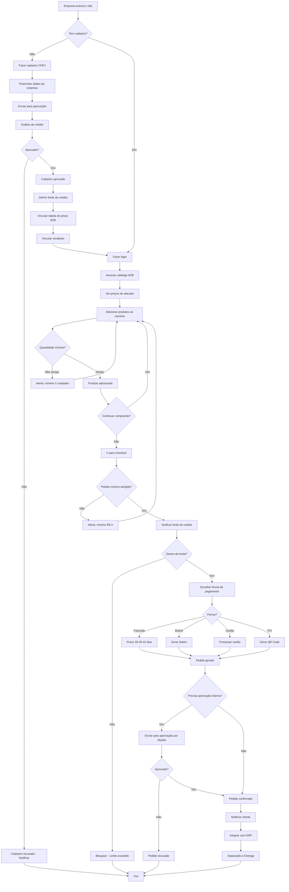
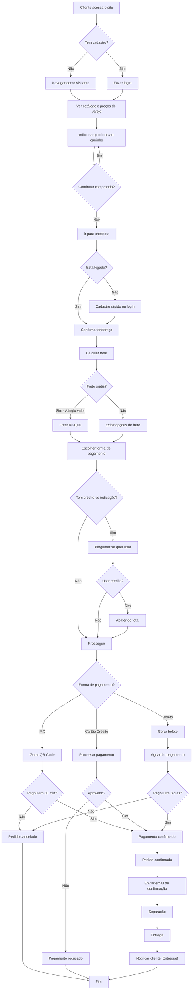

# Fluxogramas - Módulo E-commerce

Este documento contém os fluxogramas de processo do módulo e-commerce.

## 9. Fluxo E-commerce B2B

```mermaid
flowchart TD
    A[Empresa acessa o site] --> B{Tem cadastro?}
    
    B -->|Não| C[Fazer cadastro CNPJ]
    B -->|Sim| D[Fazer login]
    
    C --> E[Preencher dados da empresa]
    E --> F[Enviar para aprovação]
    
    F --> G[Análise de crédito]
    G --> H{Aprovado?}
    
    H -->|Não| I[Cadastro recusado - Notificar]
    H -->|Sim| J[Cadastro aprovado]
    
    J --> K[Definir limite de crédito]
    K --> L[Vincular tabela de preço B2B]
    L --> M[Vincular vendedor]
    
    M --> D
    
    D --> N[Acessar catálogo B2B]
    N --> O[Ver preços de atacado]
    
    O --> P[Adicionar produtos ao carrinho]
    P --> Q{Quantidade mínima?}
    
    Q -->|Não atingiu| R[Alerta: mínimo X unidades]
    Q -->|Atingiu| S[Produto adicionado]
    
    R --> P
    S --> T{Continuar comprando?}
    
    T -->|Sim| P
    T -->|Não| U[Ir para checkout]
    
    U --> V{Pedido mínimo atingido?}
    V -->|Não| W[Alerta: mínimo R$ X]
    V -->|Sim| X[Verificar limite de crédito]
    
    W --> P
    
    X --> Y{Dentro do limite?}
    Y -->|Não| Z[Bloquear - Limite excedido]
    Y -->|Sim| AA[Escolher forma de pagamento]
    
    AA --> AB{Forma?}
    AB -->|Faturado| AC[Prazo 28-35-42 dias]
    AB -->|Boleto| AD[Gerar boleto]
    AB -->|Cartão| AE[Processar cartão]
    AB -->|PIX| AF[Gerar QR Code]
    
    AC --> AG[Pedido gerado]
    AD --> AG
    AE --> AG
    AF --> AG
    
    AG --> AH{Precisa aprovação interna?}
    AH -->|Sim| AI[Enviar para aprovação por alçada]
    AH -->|Não| AJ[Pedido confirmado]
    
    AI --> AK{Aprovado?}
    AK -->|Não| AL[Pedido recusado]
    AK -->|Sim| AJ
    
    AJ --> AM[Notificar cliente]
    AM --> AN[Integrar com ERP]
    AN --> AO[Separação e Entrega]
    
    I --> AP[Fim]
    Z --> AP
    AL --> AP
    AO --> AP
```

---

## 10. Fluxo E-commerce B2C

```mermaid
flowchart TD
    A[Cliente acessa o site] --> B{Tem cadastro?}
    
    B -->|Não| C[Navegar como visitante]
    B -->|Sim| D[Fazer login]
    
    C --> E[Ver catálogo e preços de varejo]
    D --> E
    
    E --> F[Adicionar produtos ao carrinho]
    F --> G{Continuar comprando?}
    
    G -->|Sim| F
    G -->|Não| H[Ir para checkout]
    
    H --> I{Está logado?}
    I -->|Não| J[Cadastro rápido ou login]
    I -->|Sim| K[Confirmar endereço]
    
    J --> K
    
    K --> L[Calcular frete]
    L --> M{Frete grátis?}
    
    M -->|Sim - Atingiu valor| N[Frete R$ 0,00]
    M -->|Não| O[Exibir opções de frete]
    
    N --> P[Escolher forma de pagamento]
    O --> P
    
    P --> Q{Tem crédito de indicação?}
    Q -->|Sim| R[Perguntar se quer usar]
    Q -->|Não| S[Prosseguir]
    
    R --> T{Usar crédito?}
    T -->|Sim| U[Abater do total]
    T -->|Não| S
    
    U --> S
    
    S --> V{Forma de pagamento?}
    V -->|PIX| W[Gerar QR Code]
    V -->|Cartão Crédito| X[Processar pagamento]
    V -->|Boleto| Y[Gerar boleto]
    
    W --> Z{Pagou em 30 min?}
    Z -->|Sim| AA[Pagamento confirmado]
    Z -->|Não| AB[Pedido cancelado]
    
    X --> AC{Aprovado?}
    AC -->|Sim| AA
    AC -->|Não| AD[Pagamento recusado]
    
    Y --> AE[Aguardar pagamento]
    AE --> AF{Pagou em 3 dias?}
    AF -->|Sim| AA
    AF -->|Não| AB
    
    AA --> AG[Pedido confirmado]
    AG --> AH[Enviar email de confirmação]
    AH --> AI[Separação]
    AI --> AJ[Entrega]
    AJ --> AK[Notificar cliente: Entregue!]
    
    AB --> AL[Fim]
    AD --> AL
    AK --> AL
```

---

