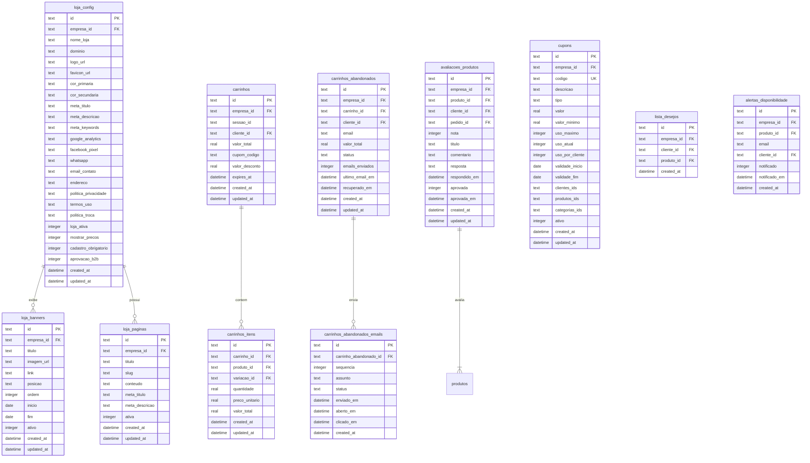

# 🛒 MÓDULO 9: E-COMMERCE

## Diagrama

```mermaid
erDiagram
    loja_config ||--o{ loja_banners : exibe
    loja_config ||--o{ loja_paginas : possui
    carrinhos ||--o{ carrinhos_itens : contem
    carrinhos_abandonados ||--o{ carrinhos_abandonados_emails : envia
    avaliacoes_produtos ||--|{ produtos : avalia
    
    loja_config {
        text id PK
        text empresa_id FK
        text nome_loja
        text dominio
        text logo_url
        text favicon_url
        text cor_primaria
        text cor_secundaria
        text meta_titulo
        text meta_descricao
        text meta_keywords
        text google_analytics
        text facebook_pixel
        text whatsapp
        text email_contato
        text endereco
        text politica_privacidade
        text termos_uso
        text politica_troca
        integer loja_ativa
        integer mostrar_precos
        integer cadastro_obrigatorio
        integer aprovacao_b2b
        datetime created_at
        datetime updated_at
    }
    
    loja_banners {
        text id PK
        text empresa_id FK
        text titulo
        text imagem_url
        text link
        text posicao
        integer ordem
        date inicio
        date fim
        integer ativo
        datetime created_at
        datetime updated_at
    }
    
    loja_paginas {
        text id PK
        text empresa_id FK
        text titulo
        text slug
        text conteudo
        text meta_titulo
        text meta_descricao
        integer ativa
        datetime created_at
        datetime updated_at
    }
    
    carrinhos {
        text id PK
        text empresa_id FK
        text sessao_id
        text cliente_id FK
        real valor_total
        text cupom_codigo
        real valor_desconto
        datetime expires_at
        datetime created_at
        datetime updated_at
    }
    
    carrinhos_itens {
        text id PK
        text carrinho_id FK
        text produto_id FK
        text variacao_id FK
        real quantidade
        real preco_unitario
        real valor_total
        datetime created_at
        datetime updated_at
    }
    
    carrinhos_abandonados {
        text id PK
        text empresa_id FK
        text carrinho_id FK
        text cliente_id FK
        text email
        real valor_total
        text status
        integer emails_enviados
        datetime ultimo_email_em
        datetime recuperado_em
        datetime created_at
        datetime updated_at
    }
    
    carrinhos_abandonados_emails {
        text id PK
        text carrinho_abandonado_id FK
        integer sequencia
        text assunto
        text status
        datetime enviado_em
        datetime aberto_em
        datetime clicado_em
        datetime created_at
    }
    
    cupons {
        text id PK
        text empresa_id FK
        text codigo UK
        text descricao
        text tipo
        real valor
        real valor_minimo
        integer uso_maximo
        integer uso_atual
        integer uso_por_cliente
        date validade_inicio
        date validade_fim
        text clientes_ids
        text produtos_ids
        text categorias_ids
        integer ativo
        datetime created_at
        datetime updated_at
    }
    
    avaliacoes_produtos {
        text id PK
        text empresa_id FK
        text produto_id FK
        text cliente_id FK
        text pedido_id FK
        integer nota
        text titulo
        text comentario
        text resposta
        datetime respondido_em
        integer aprovada
        datetime aprovada_em
        datetime created_at
        datetime updated_at
    }
    
    lista_desejos {
        text id PK
        text empresa_id FK
        text cliente_id FK
        text produto_id FK
        datetime created_at
    }
    
    alertas_disponibilidade {
        text id PK
        text empresa_id FK
        text produto_id FK
        text email
        text cliente_id FK
        integer notificado
        datetime notificado_em
        datetime created_at
    }
```

---

