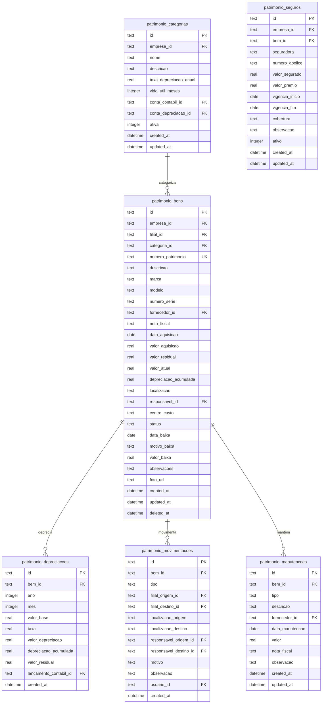

# 🏢 MÓDULO 14: PATRIMÔNIO

## Diagrama

```mermaid
erDiagram
    patrimonio_categorias ||--o{ patrimonio_bens : categoriza
    patrimonio_bens ||--o{ patrimonio_depreciacoes : deprecia
    patrimonio_bens ||--o{ patrimonio_movimentacoes : movimenta
    patrimonio_bens ||--o{ patrimonio_manutencoes : mantem
    
    patrimonio_categorias {
        text id PK
        text empresa_id FK
        text nome
        text descricao
        real taxa_depreciacao_anual
        integer vida_util_meses
        text conta_contabil_id FK
        text conta_depreciacao_id FK
        integer ativa
        datetime created_at
        datetime updated_at
    }
    
    patrimonio_bens {
        text id PK
        text empresa_id FK
        text filial_id FK
        text categoria_id FK
        text numero_patrimonio UK
        text descricao
        text marca
        text modelo
        text numero_serie
        text fornecedor_id FK
        text nota_fiscal
        date data_aquisicao
        real valor_aquisicao
        real valor_residual
        real valor_atual
        real depreciacao_acumulada
        text localizacao
        text responsavel_id FK
        text centro_custo
        text status
        date data_baixa
        text motivo_baixa
        real valor_baixa
        text observacoes
        text foto_url
        datetime created_at
        datetime updated_at
        datetime deleted_at
    }
    
    patrimonio_depreciacoes {
        text id PK
        text bem_id FK
        integer ano
        integer mes
        real valor_base
        real taxa
        real valor_depreciacao
        real depreciacao_acumulada
        real valor_residual
        text lancamento_contabil_id FK
        datetime created_at
    }
    
    patrimonio_movimentacoes {
        text id PK
        text bem_id FK
        text tipo
        text filial_origem_id FK
        text filial_destino_id FK
        text localizacao_origem
        text localizacao_destino
        text responsavel_origem_id FK
        text responsavel_destino_id FK
        text motivo
        text observacao
        text usuario_id FK
        datetime created_at
    }
    
    patrimonio_manutencoes {
        text id PK
        text bem_id FK
        text tipo
        text descricao
        text fornecedor_id FK
        date data_manutencao
        real valor
        text nota_fiscal
        text observacao
        datetime created_at
        datetime updated_at
    }
    
    patrimonio_seguros {
        text id PK
        text empresa_id FK
        text bem_id FK
        text seguradora
        text numero_apolice
        real valor_segurado
        real valor_premio
        date vigencia_inicio
        date vigencia_fim
        text cobertura
        text observacao
        integer ativo
        datetime created_at
        datetime updated_at
    }
```

---

