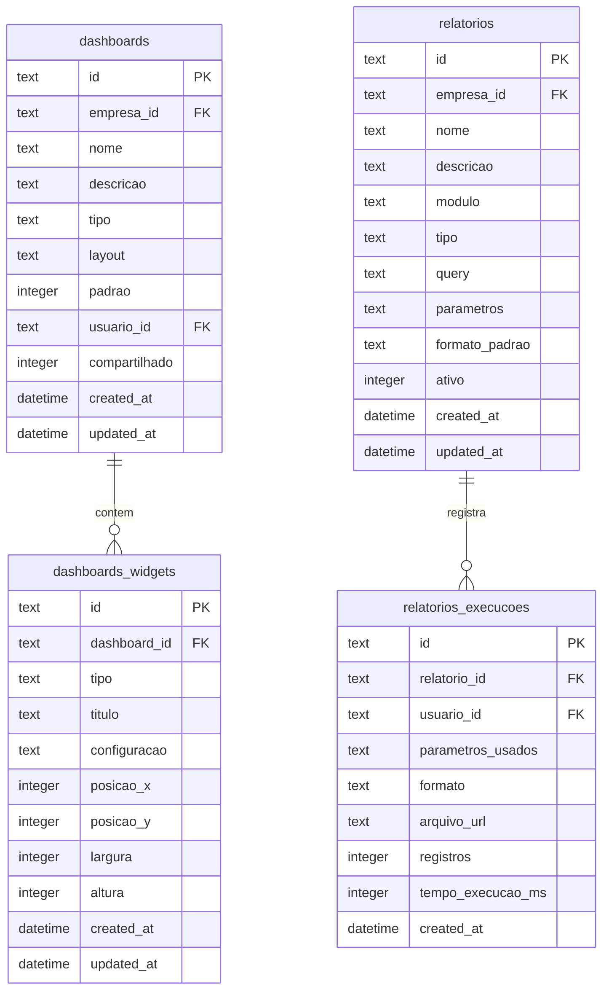

# 📊 MÓDULO 10: BI

## Diagrama

```mermaid
erDiagram
    dashboards ||--o{ dashboards_widgets : contem
    relatorios ||--o{ relatorios_execucoes : registra
    
    dashboards {
        text id PK
        text empresa_id FK
        text nome
        text descricao
        text tipo
        text layout
        integer padrao
        text usuario_id FK
        integer compartilhado
        datetime created_at
        datetime updated_at
    }
    
    dashboards_widgets {
        text id PK
        text dashboard_id FK
        text tipo
        text titulo
        text configuracao
        integer posicao_x
        integer posicao_y
        integer largura
        integer altura
        datetime created_at
        datetime updated_at
    }
    
    relatorios {
        text id PK
        text empresa_id FK
        text nome
        text descricao
        text modulo
        text tipo
        text query
        text parametros
        text formato_padrao
        integer ativo
        datetime created_at
        datetime updated_at
    }
    
    relatorios_execucoes {
        text id PK
        text relatorio_id FK
        text usuario_id FK
        text parametros_usados
        text formato
        text arquivo_url
        integer registros
        integer tempo_execucao_ms
        datetime created_at
    }
```

---

